# 物理AI 敲赛博木鱼：SO-ARM101、LeRobot 与 VLA 的知识总结和经验分享

> 这次我们用 SO-ARM101 和 π0 尝试让机械臂完成抓棒、敲木鱼和放回。本文围绕这次实践，整理机器人学习的基本概念，以及环境、数据、训练和部署中的经验。
>
> 实验环境：Linux 机器人工作站（本实验为 NVIDIA DGX Spark）、Python 3.12、LeRobot 0.6.1、SO-ARM101 主从臂、两路 USB 摄像头。训练在 Featurize GPU 实例上完成，Mac 用于管理、上传和保存结果。

文章按主题梳理原理与实践，具体迭代顺序见[实验记录](02-experiment-log.md)。文中的命令是结合本次环境整理的参考示例；历史配置、已验证结果和后续改进设想会分别注明。

[▶ 观看成品演示视频](assets/demo.mp4)

## 目录

1. [通识：机器人怎样学会一项任务](#1-通识机器人怎样学会一项任务)
2. [环境准备：设备、软件、平台与连接](#2-环境准备设备软件平台与连接)
3. [硬件校准：舵机、主从臂与相机](#3-硬件校准舵机主从臂与相机)
4. [数据采集：示范、验收、合并与传输](#4-数据采集示范验收合并与传输)
5. [模型训练：微调、监控、打包与发布](#5-模型训练微调监控打包与发布)
6. [真机部署验证：离线检查、回放与闭环推理](#6-真机部署验证离线检查回放与闭环推理)
7. [总结：验收标准、故障定位与下一轮改进](#7-总结验收标准故障定位与下一轮改进)

## 1. 通识：机器人怎样学会一项任务

理解这次实验，可以从一条主线开始：**人提供示范，数据保存经验，模型选择动作，软件驱动机械臂。** 下面先梳理其中的原理和分工。

### 1.1 机器人怎样获得操作策略：人工设计、模仿学习与强化学习

策略回答“当前情况下，接下来做什么”。获得策略，一条路线是**人工设计**规则与规划，另一条是**从数据和经验中学习**，其中包括模仿学习和强化学习。它们不是严格互斥的三类：传统系统也可以使用学习到的感知模块，学习策略也需要传统控制与安全程序。

#### 传统方法是怎样控制机器人的

传统方法通常分为感知、规划、状态机和控制：感知识别目标，规划计算路径，状态机选择任务阶段，控制器驱动电机。敲木鱼可以写成：

```text
找到敲棒坐标
→ 机械臂移动到敲棒上方
→ 下降到预设高度
→ 夹爪闭合到预设值
→ 移动到木鱼上方
→ 重复三次“下降—抬起”
→ 回到敲棒放置点并松开
```

位置固定时，可以直接执行一串关节目标。每一步含义明确、便于测试，计数、限速和停机也能写成确定规则。

真实场景中，敲棒会偏移，相机可能被遮挡，接触后还会发生滑动。要适应这些变化，传统方法需要加入定位、重新规划、碰撞检测和异常处理，工程复杂度随之增加。

**传统方法的难点，是把各种现场变化及应对策略明确写出来。** 它适合条件可控、精度和可验证性要求高的流程；面对杂乱、易变的环境，规则维护成本较高。

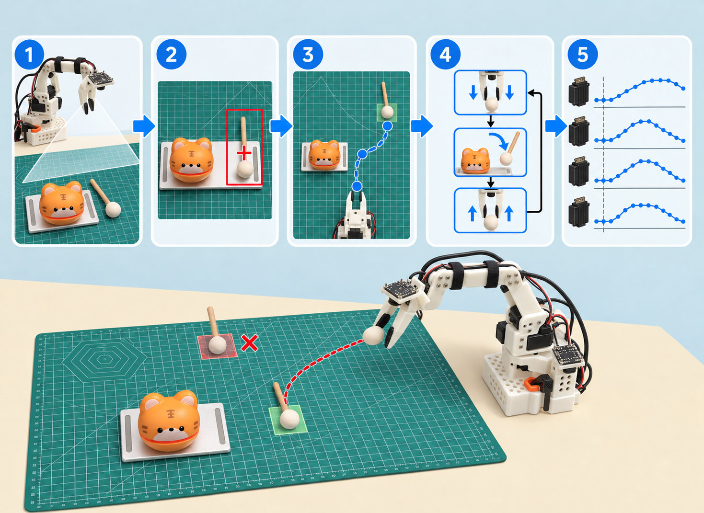

*图：①观察→②定位→③规划→④状态机→⑤控制。红叉表示物体移动后，未重新规划的固定轨迹可能落空；传统方法也可以加入实时反馈。*

#### 模仿学习改变了什么

模仿学习用人的示范训练动作策略。人操作leader，系统同步记录画面、follower状态和目标动作，训练程序据此调整模型参数：

```text
摄像头画面 + 任务文字 + 当前关节状态
                    ↓ 从大量示范中学出的策略
             接下来的一段目标动作
```

在示范覆盖的范围内，模型有机会根据敲棒的新位置调整动作，并学到张爪、下降、闭合和抬升的连续配合，减少手写中间规则。预训练VLA还提供已有的视觉语言表征，供本任务继续微调。

**模型学习的是观测与动作之间的规律。** 这能减轻手写感知—动作规则的负担，但不保证它理解每个动作的因果关系。

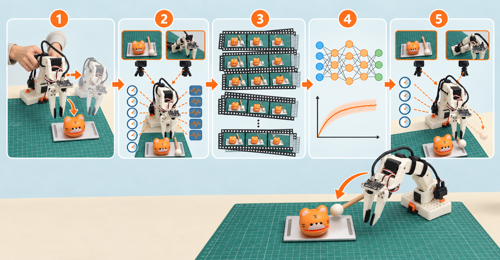

*图：①示范→②同步记录→③积累episode→④训练→⑤视觉动作策略。弯曲箭头表示对位置变化的适应；效果取决于数据覆盖。*

#### 模仿学习又带来了哪些问题

模仿学习的能力边界主要由数据决定，这会带来一组与传统程序不同的风险：

- **只擅长见过的分布**：训练中敲棒只在一个小区域，真机放得太远、光照完全不同或相机移动后，模型可能不知道怎么办。
- **误差会逐步累积**：示范里通常都是正确轨迹；推理时一次轻微偏移会把机器人带到训练很少出现的状态，后续预测可能越来越差，这叫分布偏移或复合误差。
- **失败恢复不会凭空出现**：训练里没有“敲棒掉落后重新寻找并抓取”，模型通常不会因为提示词写了这句话就可靠恢复。
- **数据偏差会被照学**：抓取停留总是很短，模型就可能学到快速闭合后立即抬起；失败演示、时间错位和错误动作标签也会成为监督目标。
- **成功标准不一定等于训练目标**：loss下降只说明模型更接近数据中的动作，不直接保证夹稳、恰好敲三下或最终放回原位。
- **难以提供硬保证**：神经网络对某一画面会输出什么不容易逐条证明，不能把它当作碰撞保护、急停或机械限位。
- **依赖软硬件一致性**：相机布局、关节顺序、坐标标定、动作单位、归一化统计和后处理只要有一处不同，模型就可能输出看似合理但无法正确执行的数值。

改进时先检查数据覆盖、时间同步、动作标签和部署配置，再决定是否补采或延长训练。

#### 强化学习与模仿学习：目标不同，可以结合

**模仿学习主要从“专家怎样做”获得学习信号；强化学习主要从“行动带来多大回报”获得学习信号。** 两者都可以训练动作策略，包括同一个π0模型；区别不在机械臂型号，也不在是否使用摄像头。

| 对比 | 模仿学习（IL） | 强化学习（RL） |
|---|---|---|
| 敲木鱼的例子 | 学习示范者怎样下降、夹棒、抬升和敲击 | 根据夹稳、完成任务、耗时等反馈优化整段操作 |
| 典型训练信号 | 示范中的目标动作 | 奖励与长期回报，不必每步有专家动作 |
| 主要难点 | 示范覆盖不足，偏离后可能不会恢复 | 奖励设计、探索成本、长期结果归因与安全 |
| 运行失败后 | 可补充人工纠错示范再训练 | 可将经验及奖励用于后续策略优化 |

一种组合是：**先用模仿学习获得初始策略，再根据评估结果补充纠错示范，或引入强化学习。** 例如抓起后掉棒，可以由人示范“拿稳再抬升”；若使用RL，则还需要可计算的任务反馈和专门的训练流程，不能只把失败视频重新喂给模型。π*0.6研究了示范、纠错与强化学习的结合，但不是本实验使用的版本。[研究实例](https://www.pi.website/blog/pistar06)

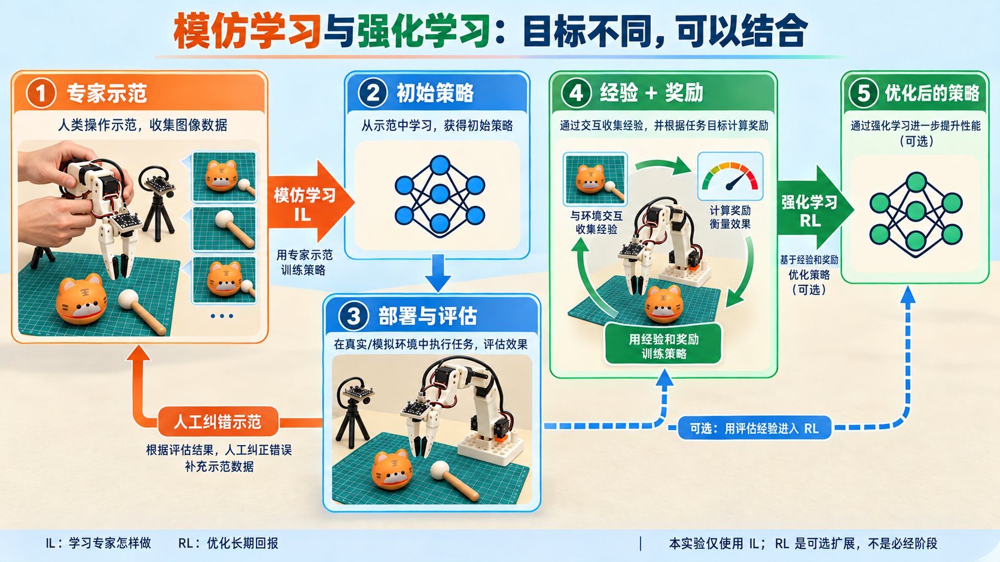

*图：示范可形成初始策略；评估后的人工纠错仍可回到模仿学习，经验与奖励也可用于强化学习。图示是一种组合，不是必须先IL后RL；RL也可以从其他初始化开始或利用已有离线经验。*

**有反馈不等于用了强化学习。** 舵机根据位置误差纠偏是控制闭环；人纠正后提供动作标签仍可属于模仿学习；只有通过相应算法利用奖励优化策略，才是这里说的RL。奖励里的“碰撞扣分”不能代替限位和急停，RL也不保证必然比IL更好。本实验只进行了示范微调，没有部署中自动学习。

#### 人工设计与学习策略如何分工

这次实验把学习策略与传统控制结合起来，分工如下：

| 问题 | 更适合传统程序/控制 | 更适合模仿学习 |
|---|---|---|
| 看画面决定朝哪里寻找、怎样对准敲棒 | 需要组合检测、标定和规划才能完成 | 可从多次视觉—动作示范中学习 |
| 连续完成接近、打开夹爪、抓取、抬升和敲击 | 手写轨迹在场景变化后需要重新规划 | 可学习随观测变化的连续动作 |
| 舵机跟随目标位置 | 闭环电机控制器稳定且高频 | VLA不应替代舵机内部位置环 |
| 限制速度、关节范围和工作区 | 明确规则可检查、可强制执行 | 不能只相信模型“应该不会越界” |
| 恰好计数三次、超时退出、人工急停 | 状态机和安全程序更可靠 | 模型可以产生敲击动作，但不天然是可靠计数器 |
| 掉棒后的恢复 | 可用传感器条件和状态机组织流程 | 只有在训练包含足够恢复示范时才可能学会 |

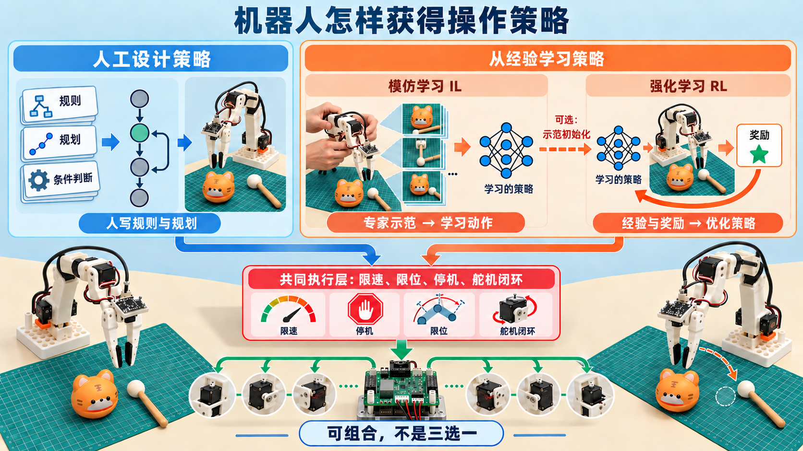

*图：人工设计与从经验学习是两条构建策略的路线；模仿学习、强化学习位于后者之内，也可组合。三条分支都需要执行接口、底层控制与安全约束；图中的RL是可选路线，不是本次实测流程。*

本项目由π0生成动作、LeRobot发送目标、舵机闭环跟踪；限速、限位、超时和停机仍由控制程序负责。进一步可用状态机组织“寻找—抓取—敲击—放回”，在各阶段调用学习策略。

排查也要按层进行：完全不动先查供电和通信，动作数值异常先查标定和后处理，仅在新位置失败再查数据覆盖。

#### 本例采用的学习方式

这次实验使用提前录制的示范进行**离线训练**。真机运行时参数保持不变；要从失败中改进，需要补采并重新训练。

VLA是其中一类模型，三个字母对应：

- **Vision，视觉**：摄像头提供物体、夹爪和环境的信息。
- **Language，语言**：任务文字告诉模型这次要做什么。
- **Action，动作**：模型输出可进一步转换成控制指令的数值。

本实验还输入关节状态，告诉模型机械臂当前姿态。π0是策略模型，LeRobot是软件框架，SO-ARM101是执行硬件。[π0官方说明](https://huggingface.co/docs/lerobot/pi0)

#### 概念地图：IL、RL、LLM、VLM、VLA、VLN与世界模型

这些名字常一起出现，但**不在同一个分类维度上**：模仿学习、强化学习回答“怎么学”；LLM、VLM、VLA侧重“模型处理什么、输出什么”；VLN是一类任务；世界模型则预测环境如何变化。它们可以组合，并不是互相替代的七种方案。

| 分类角度 | 概念与全称 | 通俗理解 | 典型输入 → 输出 |
|---|---|---|---|
| 学习方法 | IL：Imitation Learning，模仿学习 | 从专家示范中学习如何行动 | 示范数据 → 行为策略 |
| 学习方法 | RL：Reinforcement Learning，强化学习 | 根据行动后果，学习怎样获得更高的长期回报 | 交互经验、奖励 → 行为策略 |
| 模型类别 | LLM：Large Language Model，大语言模型 | 处理语言，生成回答、计划或结构化内容 | 文本上下文 → 文本等 |
| 模型类别 | VLM：Vision-Language Model，视觉语言模型 | 将图像与语言联系起来 | 图像/视频、文本 → 描述、回答或匹配结果等 |
| 模型类别 | VLA：Vision-Language-Action，视觉语言动作模型 | 根据所见和指令选择动作 | 视觉、语言、机器人状态等 → 动作 |
| 任务领域 | VLN：Vision-and-Language Navigation，视觉语言导航 | 按照视觉观察和语言指令到达目的地 | 观察、导航指令、历史等 → 导航决策 |
| 预测模型 | World Model，世界模型 | 预测环境接下来会怎样，尤其是行动的后果 | 状态/观察历史、动作等 → 未来状态或观察 |

表中的输入输出是典型形式，不是严格边界；前两行描述训练过程，其余行描述模型运行或任务求解。现代模型也可能跨越多个类别。

##### 用敲木鱼理解：说清步骤、看懂场景和做出动作是三件事

假设把任务拆成几个模块：LLM可以提出“找棒→抓棒→敲击→放回”的计划；VLM可以帮助识别“这是敲棒，那是木鱼”；VLA则根据当前画面和关节状态，给出接下来机械臂和夹爪的目标值。**能说出正确步骤、认出物体，不等于能稳定抓住敲棒。**

若再加一个动作条件世界模型，它可以尝试预测“这样下降，夹爪会碰到托盘还是夹住敲棒”；预测是否足够准确，还需验证。本例的机械臂固定在桌面上，不需要VLN。只有扩展到“走到另一张桌子旁再敲木鱼”这样的移动任务，才涉及导航。VLN可以用学习策略，也可以组合地图、规划和控制模块，并不要求使用VLA。[VLN任务的原始定义](https://arxiv.org/abs/1711.07280)

这些是便于理解的分工，不表示实际系统必须各装一个独立模型。本实验也没有额外接入LLM规划器或世界模型。

##### 模仿学习与强化学习：训练方法可以作用于同一个VLA

模仿学习中常见的**行为克隆（BC，Behavior Cloning）**，就是用“当时的观测与指令→专家动作”训练策略。本例用示范微调π0，属于这一思路；π0通过流匹配学习动作分布，而不是简单逐帧背下轨迹。模仿学习还包括其他方法，不能全部等同于行为克隆。

强化学习关注的则是**一连串行动最终带来多少回报**。例如把“夹稳、完成三次敲击、放回”作为任务反馈，策略不必逐步复制人，但需要解决奖励设计、数据效率和安全探索等问题。把碰撞设为扣分，也不等于有了可靠的碰撞保护。[强化学习基本概念](https://spinningup.openai.com/en/latest/spinningup/rl_intro.html)

两者可以结合：先从示范获得初始能力，再用纠错示范或强化学习改进。纠错示范仍可用于模仿学习，不必叫强化学习；强化学习也不一定在线试错，**离线强化学习**可以利用已有经验和奖励训练。[离线强化学习说明](https://arxiv.org/abs/2005.01643)

对本例尤其重要的是：**离线训练不等于离线强化学习；多跑几次推理也不会自动更新模型。** 我们做的是示范微调，没有加入奖励优化或在线学习。掉棒后不会恢复，首先应检查部署链路并补充相关示范，而不是直接认为“必须换成RL”。

##### LLM、VLM、VLA：可复用能力，不是必经的三级进化

一种常见构建方式是，在语言模型上加入视觉能力，再加入动作生成模块。π0利用预训练VLM的表征，并通过流匹配生成连续动作序列；它不是像聊天一样只输出“向左一点”。[π0模型说明](https://www.pi.website/blog/pi0)

但这不是唯一结构：VLM也可以采用图文对比学习，例如CLIP，并不一定是“会看图的聊天模型”。同样，给VLM增加一句动作文字，还需要明确动作空间、训练数据和执行接口，才能真正控制机器人。[CLIP原论文](https://arxiv.org/abs/2103.00020)

##### VLA与世界模型：一个选动作，一个预测后果

可以先不用公式，记住两个问题：

- **策略模型：**“根据现在看见的情况和任务，接下来做什么？”
- **动作条件世界模型：**“如果执行这个动作，接下来可能发生什么？”

一种可组合的决策流程是：提出候选动作→预测各自后果→评价并选择→实际执行→根据新观察重新决策。世界模型可以用于规划或在预测环境中训练策略；例如Dreamer就在学得的世界模型中学习行为。但世界模型可以通过预测数据训练，不必依赖奖励，强化学习也可以不使用世界模型。[Dreamer研究](https://danijar.com/project/dreamerv3/)

**世界模型不一定生成视频，可能只预测内部状态表示；视频逼真也不等于物理后果可靠。** 对抓棒而言，还要检查动作是否影响预测、几何与接触是否一致、长时间预测是否漂移。策略和预测模型也可以共享网络，二者不是绝对隔离的架构。

本例的π0直接生成动作，没有在执行前显式模拟多个方案。后文1.7节的状态转移描述的是“真实系统怎样运动”；只有另外学习一个预测器，才是在这里讨论的意义上建立世界模型。

##### 研究如何组合这些能力，我们又用到了哪一层

不必把机器人研究理解成“新名字淘汰旧名字”。值得关注的是几种组合：

- **视觉语言预训练＋机器人示范：**复用语义表征，再学习动作；本例采用的就是这条路线。“通用”是目标，不代表任意场景都能可靠完成任务。
- **示范＋纠错与部署反馈：**让策略学到失败后的处理。例如π*0.6研究了示范、人工纠错和强化学习的结合；它是后续研究，不是本次使用的π0版本。[π*0.6研究说明](https://www.pi.website/blog/pistar06)
- **高层规划＋低层策略与控制：**将长任务组织与实时执行分开；执行层仍可用VLA，底层仍需舵机闭环与安全约束。
- **预测＋规划或策略训练：**利用世界模型评估动作后果，但增加了预测误差和计算成本，并非每个任务都值得加入。

这些路线都依赖数据覆盖和可靠性评估。对这次桌面操作，更有用的定位是：**用模仿学习微调一个VLA（π0），通过LeRobot连接观测和动作，由SO-ARM101的舵机执行；没有使用RL、VLN或显式世界模型。** 先把这条链路做好，再根据失败原因决定是否增加新模块。

### 1.2 SO-ARM101主从臂：从机械结构到摄像头

**SO-ARM101是一套开放设计的桌面机械臂平台，不是一台自带视觉智能的完整机器人。** 结构件、电机、控制板和线缆组成能运动的本体；加上计算机、摄像头和软件，才形成这里的机器人学习系统。它可以按开源设计打印结构件、采购零件组装，也有商家提供套件或成品。不同套件的电源、板卡、支架和附件可能不同，不能只凭“SO101”这个名字假定配置完全一致。[硬件项目与零件清单](https://github.com/TheRobotStudio/SO-ARM100)

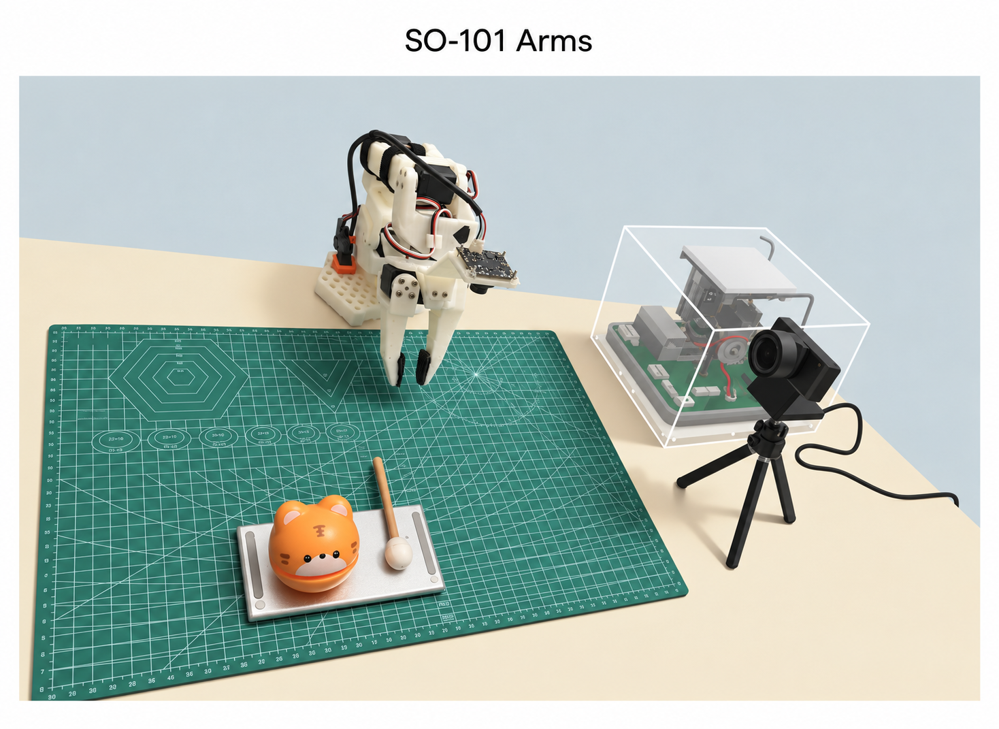

*图：木鱼任务场景。构图沿用本实验场景图，机械臂、夹爪、相机和任务物体参照本机实拍修正。此为教学插图，尺寸和布局不用于安装定位。*

#### （1）机械结构：五个运动关节，加一个夹爪开合

从桌面往末端看，可以把它想成“底座→肩→上臂→肘→前臂→腕→夹爪”。连杆和支架承担结构连接，关节改变相邻部件的角度，末端夹爪负责抓住物体。桌面夹具或固定底座不是可有可无的附件：底座一旦滑动，相机和模型所依赖的空间关系也会变化。

本实验每条臂使用六个舵机通道，名称和分工如下；编号对应当前LeRobot硬件配置，首次组装仍应按设置程序逐个确认：

| 电机ID | 软件关节名 | 直观作用 |
|---|---|---|
| 1 | `shoulder_pan` | 底座附近左右转向，把整条臂朝向目标 |
| 2 | `shoulder_lift` | 肩部抬起或放下上臂 |
| 3 | `elbow_flex` | 肘部伸屈，配合肩部改变末端位置 |
| 4 | `wrist_flex` | 腕部俯仰，调整夹爪向下或向前的倾斜 |
| 5 | `wrist_roll` | 腕部绕自身轴线旋转，调整夹持方向 |
| 6 | `gripper` | 打开或闭合夹爪 |

因此本文的“六维动作”是**五个机械臂关节值＋一个夹爪开合值**，不是末端可以独立控制完整三维位置和三维朝向的“六自由度工业臂”。它也不能到达任意位置或以任意角度抓取；连杆长度、关节范围、桌面和自碰撞共同限定工作区。上述关节对应关系也可在[LeRobot的SO follower实现](https://github.com/huggingface/lerobot/blob/v0.6.1/src/lerobot/robots/so_follower/so_follower.py)中核对。

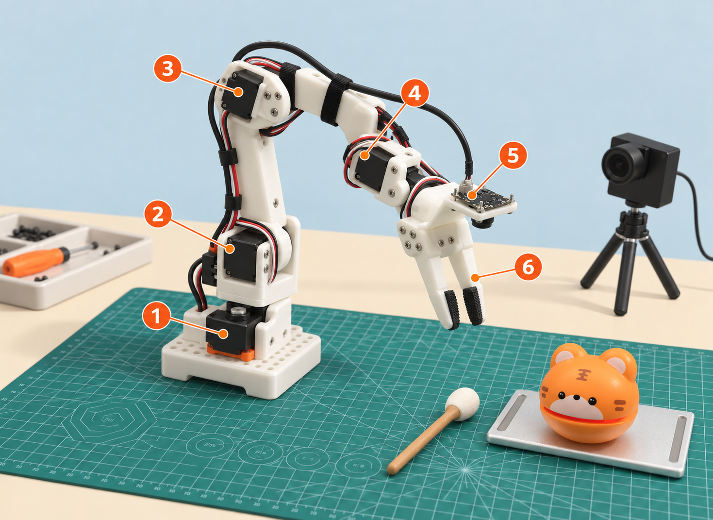

*图：从底座到夹爪的六个控制通道，以及本实验腕部相机和固定侧视相机的大致位置。示意图用于理解结构，不代表精确尺寸、零位或可达工作区。*

#### （2）电机：这里用的是带反馈的总线舵机

##### 什么是舵机

普通直流电机通电后只会按电压和极性旋转，本身并不知道“已经转到哪里”。**舵机（servo）是一套闭环执行器**：把电机、减速齿轮、位置编码器和控制电路装在一起。上位机给它一个目标位置`q*`；编码器测得当前位置`q`；内部控制器根据两者的误差不断增减驱动力，直到接近目标。这里的“舵”来自早期控制方向舵的用途，不表示它只能用于舵面。

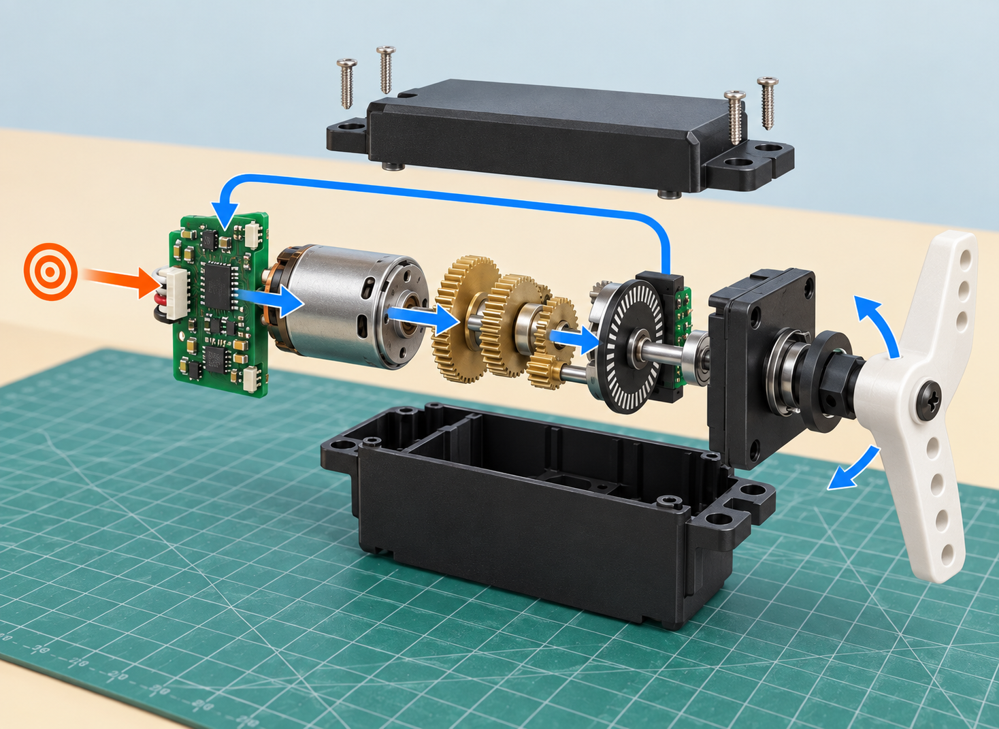

*图：机器人工作站只需周期性更新目标，舵机内部仍会根据编码器反馈持续纠偏。它能保持位置，但转矩、速度和散热能力有限；发生碰撞或顶死时不会自动规划绕行。*

本实验的软件配置使用Feetech STS3215系列位置舵机。它与玩具中只有三根线、用脉宽控制角度的简单RC舵机不同：这里通过数字总线读写寄存器，可以写目标位置、速度或扭矩开关，也能读取当前位置和错误状态。它有几个对机器人学习很重要的特点：

- **可读位置**：训练数据中的`observation.state`来自follower舵机反馈，而不是从相机猜出来。
- **可保持位置**：扭矩开启后会抵抗外力去追目标；这不等于绝对不动，负载、回差和控制参数都会造成误差或抖动。
- **减速后转矩较大、速度较低**：齿轮把电机的高速低转矩转换成适合机械臂的低速高转矩，同时也带来齿隙、摩擦和不可完全复现的跟随误差。
- **能力有边界**：速度、转矩、电流、温度、电压和机械行程都有限。保护寄存器不是碰撞传感器，软件限幅也不是完整的安全系统。
- **掉电不一定保持姿态**：关扭矩或断电后关节可能在重力下下坠；校准和停机都要先托住机械臂。

##### 六个舵机如何共用一条总线

“总线”可以理解为多个舵机共用一条通信通道，通过不同ID区分。控制板发出的报文同时经过整条线，但只有地址匹配的舵机处理它。线缆可以沿机械臂逐级串接，不必每个关节单独拉一根USB线到电脑。

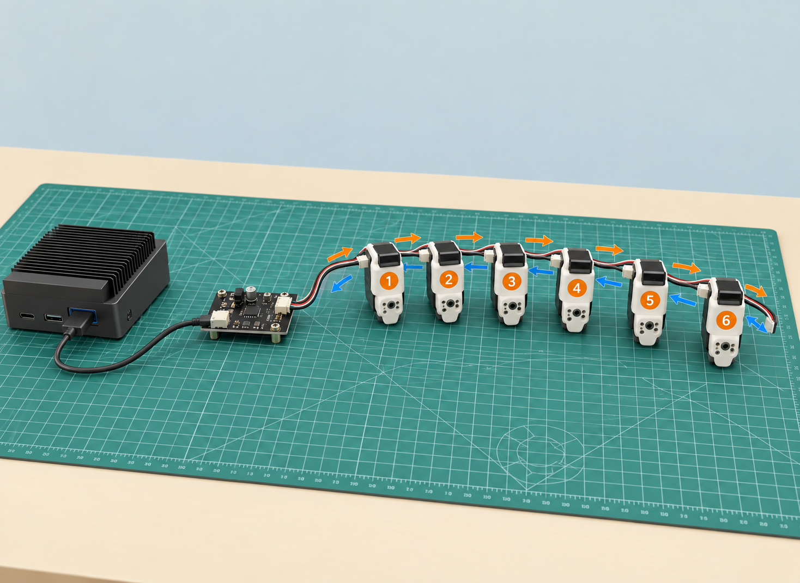

*图：ID回答“发给谁”，寄存器回答“读写什么”，数值才回答“设成多少”。通信波特率是报文传输速度，不是关节运动速度。*

一次真机控制可简化成六步：

1. π0或遥操作程序产生六维软件动作。
2. LeRobot根据标定把角度/夹爪开合量转换成各舵机能够接收的计数。
3. 机器人工作站经USB控制板向各ID的`Goal_Position`写目标。
4. 每个舵机的内部控制器驱动电机和齿轮去跟随目标。
5. LeRobot读取`Present_Position`，得到新的关节状态。
6. 新状态连同新画面进入下一次控制循环。

所以需要同时区分三种“快慢”：VLA生成新动作块的推理速度、上位机读写舵机的控制频率、舵机内部位置环的响应。本文的30 Hz是期望的上位机控制频率，**不是π0每秒独立做30次完整大模型推理，也不是舵机的转速。** `init_safe_speed.py --speed 300`写的是舵机速度寄存器基线，不会改变模型训练数据的FPS。

##### 为什么必须调零和标定

舵机编码器首先给出的是一圈内的原始计数。舵盘安装齿位、连杆装配角度、电机旋转方向和机械行程都可能不同，因此“原始计数2000”本身并不等于某个通用的机械臂姿态。两台外观看起来一样的臂，在相同物理姿态下也可能读出不同计数。

口语里的“调零”，在LeRobot这里其实包含一整套**坐标标定**：

- `homing_offset`把选定的中间姿态对齐到编码器的半圈参考附近；
- `range_min`和`range_max`记录安全机械行程两端；
- `drive_mode`字段保留传动方向约定；0.6.1的SO校准程序当前写入0，不会通过扫描自动判断装反；
- 运行时再把原始计数映射为软件角度，或映射为−100～100/0～100的规范范围。

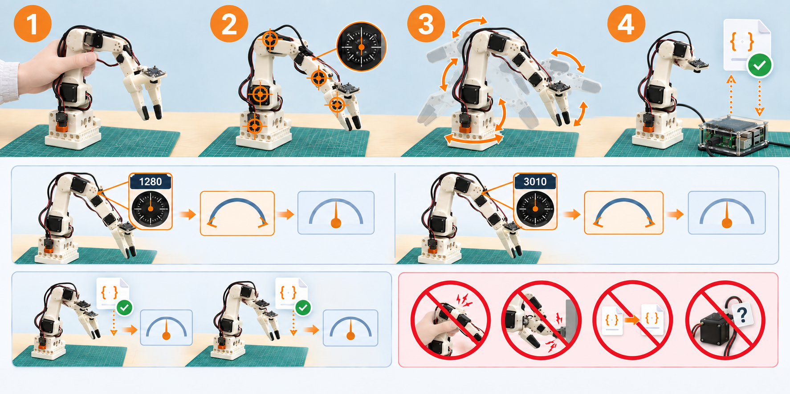

*图：上排依次为支撑摆位、建立中心参考、扫描安全行程、保存复用。中排的1280/3010为示例计数：同姿态经各自标定后可得到可比较的软件角度。下排提示分别标定主从臂，避免带扭矩硬掰、撞限位、复制其他臂配置，以及混淆设置ID与坐标标定。*

在本文锁定的LeRobot 0.6.1中，`use_degrees=true`时，前五个关节的软件0°按记录行程的中点计算；STS3215一圈按4096个位置计数处理，角度由“当前位置相对行程中点的计数差”换算。夹爪不使用角度，而是把记录的闭合/张开两端映射到0～100。具体转换可在[0.6.1 MotorBus实现](https://github.com/huggingface/lerobot/blob/v0.6.1/src/lerobot/motors/motors_bus.py)中核对。

这解释了为什么调零错误会比普通误差严重：同一个模型输出可能被换算成完全不同的物理姿态，leader和follower也会失去对应关系。**模型不能从错误标定中自动推断真实关节角度；给模型输出额外加“零位补偿”只能遮住症状，还可能把其他姿态推向机械限位。**

官方SO101方案的follower使用六个1/345传动配置的STS3215；leader则按关节使用1/191、1/345和1/147等不同传动配置，兼顾承托和手动操纵的手感。它们是设计方案，不等于本次逐台拆机核验的结果；购买与装配以实际型号和清单为准。[官方电机配置说明](https://huggingface.co/docs/lerobot/so101)

主臂和从臂长得相似，但职责不同：人移动leader来示范，follower实际拿敲棒。传动配置、机械阻力以及两边夹爪/手柄结构不一定相同，因此必须分别标定。自主推理时，模型替代人的动作输入，leader通常不参与；若做人工接管或继续补采，才需要相应遥操作设备。

#### （3）控制板：电脑与舵机总线之间的桥梁

这里说的“控制板”主要是**总线舵机适配/控制板**：一侧连接电脑USB，一侧连接舵机总线，并按板卡设计接入外部电源。电脑通过串口发送通信报文，板卡把它们接到舵机能够通信的总线上。每条臂通常各接一块板，因此会出现leader和follower两个串口设备。它不是运行π0的GPU，也不是负责识别画面的视觉处理器。

这里有三层分工：**机器人工作站上的策略决定目标，控制板负责通信，舵机内部控制器负责跟随。** 串口可见只能说明USB设备被识别，供电、ID、通信和扭矩仍可能有问题。

板卡品牌和版本可能变化，本次没有通过USB芯片信息确认具体PCB型号，不能把某一种商家的板卡照片当成本机实物。若使用官方指南提到的Waveshare板卡，应按该板说明核对USB通信通道跳线；不要把其设置套用到其他板上。[官方连接与排查说明](https://huggingface.co/docs/lerobot/so101)

#### （4）供电与线缆：通信线不等于动力电源

USB主要承担电脑与板卡之间的通信，舵机运动需要按套件要求接入匹配的外部供电。USB插好但机械臂“像没上电”，应分别排查电机供电、总线通信和扭矩状态，而不是立即怀疑模型。

STS3215存在不同电压版本，主从臂的配置也可能不同。**不要因为插头能插上，就认为电压、极性和电流能力都匹配；更不要凭“功率大一点更好”直接更换更高电压电源。** 电源选型以实际电机、板卡和供应商说明为准。[硬件项目的供电版本说明](https://github.com/TheRobotStudio/SO-ARM100)

布线时留足关节运动余量，避免电线被夹爪夹住或被腕部缠绕；底座固定后再做标定和采集。断电、关扭矩可能导致悬空的臂下坠，因此停机也需要支撑与现场监护，不只是拔掉USB。

#### （5）摄像头：给模型看的传感器，不是舵机反馈

摄像头是本实验为视觉任务配置的传感器，不是所有SO101套件都必然附带同样的双相机。这里使用两路USB RGB相机，采集设置为1920×1080、30 FPS、MJPG；这是本实验配置，并非SO101的统一硬件规格。

| 相机 | 安装位置与用途 | 局限和注意事项 |
|---|---|---|
| `wrist`腕部相机 | 随末端运动，近距离观察敲棒、夹爪和抓取区域 | 视角会变化，靠近时可能遮挡；支架和线缆不能妨碍腕部 |
| `side`固定相机 | 从固定位置观察木鱼、敲棒及机械臂的整体关系 | 安装松动或重新摆放会改变训练时的视角 |

两路相机提供互补信息，但**双RGB相机不自动等于双目深度系统**：本实验没有据此建立标定好的立体测距流程，也不应把画面直接解释为精确三维坐标。相机负责提供图像；关节当前位置来自舵机反馈，这两类观测不能互相替代。

| 腕部相机历史调试画面 | 固定侧视相机历史调试画面 |
|---|---|
| 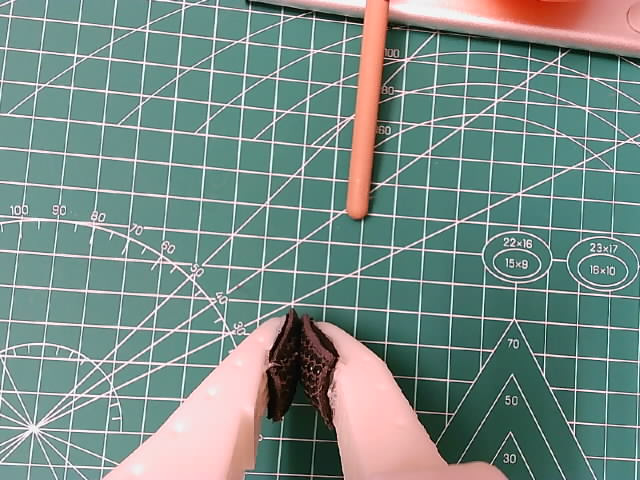 | 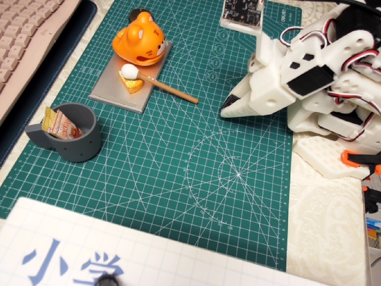 |

*图：本项目实际双相机视角的历史快照。腕部画面强调夹爪附近细节，侧视画面提供全局位置关系。文件名中曾出现的`/dev/video0`、`/dev/video2`只是当时的临时编号；重插USB后编号可能变化，不能拿它当永久身份。*

#### （6）控制主机：运行LeRobot、相机和π0

本实验的机器人工作站选用NVIDIA DGX Spark。它运行Linux、LeRobot、摄像头驱动和真机π0推理，通过USB连接两块舵机控制板与两路相机。主机负责把图像、任务文字和关节状态送进模型，再把模型动作交给硬件驱动；控制板只转发舵机通信，不能代替主机运行VLA。

采集和部署必须在靠近机器人、能稳定连接USB设备的主机上完成；训练则可以搬到Featurize等远端GPU，因为训练只读取已经保存的数据，不需要实时连接机械臂。主机GPU不足会影响推理速度，但不会改变舵机ID；USB断连或设备权限错误也不能靠换更大的模型解决。

下面是功能连接示意，不是具体板卡的针脚接线图：

```text
leader舵机总线   ↔ leader控制板   ↔ USB ↔ 机器人工作站
follower舵机总线 ↔ follower控制板 ↔ USB ↔ 机器人工作站
wrist相机、side相机               → USB → 机器人工作站
匹配的外部电源                  → 按各臂板卡要求给舵机供电
```

采集时，机器人工作站读取leader输入，向follower下发目标，同时保存follower状态和两路图像；自主运行时，机器人工作站把图像、状态和任务交给π0，处理其输出，再经同一控制接口驱动follower。训练发生在GPU计算机上，不发生在这些舵机控制板上。

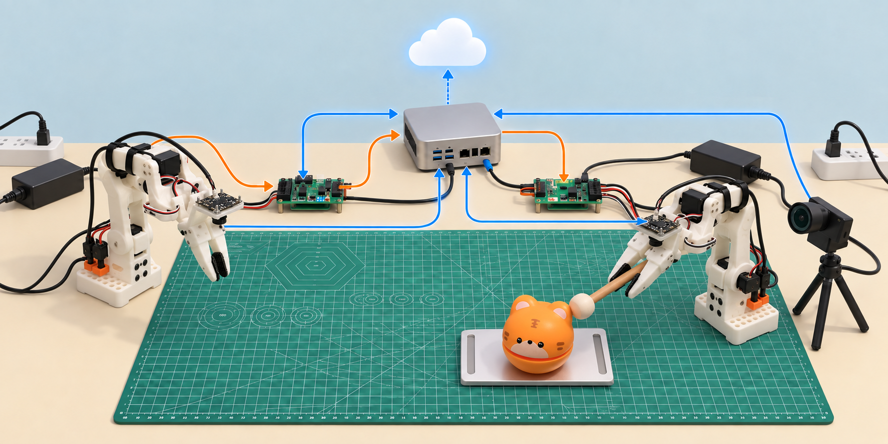

*图：实线表示控制或观测信号，虚线表示训练数据和模型文件的流转。电源只给硬件供能，不携带策略；控制板负责通信，不负责运行VLA。*

### 1.3 “学习”发生在哪里，“控制”又发生在哪里

#### π0是什么，与本文训练的模型有什么关系

**π0（读作“pi-zero”）是Physical Intelligence提出的视觉语言动作模型（VLA）。** 它将预训练的视觉语言能力与动作生成模块结合起来，根据图像、任务文字和机器人自身状态，生成接下来一段连续动作。它不是LeRobot的别名，也不是专门为敲木鱼设计的程序。[π0原始介绍](https://www.pi.website/blog/pi0)

日常说“模型”时，容易把结构和权重混在一起。**结构**是计算怎样组织，**权重**是训练学出的参数；同一种结构，加载不同权重，表现也会不同。本例可以分成三层：

| 名称 | 指的是什么 | 与本实验的关系 |
|---|---|---|
| π0模型 | 一种VLA的结构与方法 | 我们选用的策略类型，由LeRobot提供相应实现 |
| `lerobot/pi0_base` | 已经预训练好的π0基础权重 | 训练起点，不是从随机参数开始；官方将其定位为供具体任务微调的基础模型 |
| 本文的敲木鱼模型 | 用本机示范继续训练后保存的π0权重 | 面向本例相机、机械臂和任务的微调版本；部署时应加载这一份，而不是基础权重 |

基础权重已有从预训练获得的视觉语言表征和机器人动作经验，但不能据此保证它直接适应我们的夹爪、视角和敲木鱼流程。[基础模型说明](https://huggingface.co/lerobot/pi0_base)

```text
已有的π0基础权重 + 本机采集的80条示范
                     ↓ LeRobot执行微调，更新模型参数
              本任务的π0检查点
                     ↓ 配齐tokenizer、处理器、统计与配置
              部署用的敲木鱼模型包
```

所以，本文的“训练模型”主要是**微调已有模型，而不是从零训练一个新的基础模型**。训练时，程序反复取出示范中的观测和目标动作，计算损失并调整可训练参数，让动作预测更适合这批数据；并不是把视频放进目录，模型就自动记住了操作。

本实验V3配置没有开启“冻结视觉编码器”或“只训练动作专家”，因此也不是仅给固定模型外挂一个任务脚本。V1、V2、V3是本项目的实验编号，不是官方π0的三个版本；它们的训练步数、数据标签等差异见实验记录。V3的起点仍是`pi0_base`，不能因配置里残留的旧仓库名称就认为它从V2权重续训。[历史V3训练配置](../evidence/v3-train-config.json)

真机运行时使用微调后固定的参数，根据新画面重新预测动作，不再读取示范轨迹逐条回放，也不会边运行边自动学习。最终能力仍要通过实际任务验证，微调完成不等于已经稳定学会。

#### π0内部怎样把“所见”变成“动作”

可以先抓住两个部分：**视觉语言主干提供画面与指令的表征，动作专家结合这些信息和关节状态，生成一段动作。** “表征”就是网络内部用来计算的一组数字，不是先写出一段中文分析；“动作专家”也是神经网络，不是人工编写的抓取规则。

π0的视觉语言主干基于PaliGemma。图像经视觉编码器变成特征，任务文字经tokenizer变成词元，再由网络处理。动作专家通过注意力机制利用这些视觉语言信息，并处理机器人状态和正在生成的动作。它不需要先输出“敲棒坐标是某某”，再调用一段手写抓取程序。[π0论文第IV节与附录B](https://www.pi.website/download/pi0.pdf)

```text
腕部、侧面图像 → 视觉编码 ┐
                         ├→ 视觉语言主干提供条件信息 ─┐
任务文字 → tokenizer ────┘                           │
当前关节状态 ────────────────────────────────────────┤
随机动作数组 + 当前生成进度 ─────────────────────────┤
                                                     ↓
                                     动作专家反复计算修正量
                                                     ↓
                                          一段连续动作目标
                                                     ↓
                                后处理 → 控制程序 → 舵机
```

这里的箭头表示信息依赖，不是两个模型用文字互相对话。更关键的问题是：**为什么动作从随机数组开始，又怎样变成有用的目标？**

##### 流匹配：学习把随机数逐步变成合适的动作

π0采用**流匹配（flow matching）**生成连续动作。可以把它理解为：在模型内部先放一张填满随机数的“动作表”，再根据画面、指令和状态，反复调整整张表，最后得到模型认为合适的动作序列。

这不是让机械臂先乱动再纠正。**随机数和中间结果都留在计算机里，生成完成并经过后处理的目标才会发送。** 它也不是模拟动作后果、比较哪条路径最安全，而是在学习到的动作分布中生成结果。

| 阶段 | 模型内部做什么 | 是否改变模型权重 |
|---|---|---|
| 训练 | 取一段示范动作，与随机噪声按随机比例混合；让网络根据观测和混合程度，预测对应的变化方向与幅度 | 是，根据预测误差更新参数 |
| 推理 | 从随机噪声开始，反复用网络预测的修正量更新动作数组，最终生成动作块 | 否，只计算和更新动作数组 |

因此，训练的loss主要衡量流匹配预测与训练目标的偏差，不是直接给“抓棒成功”打分。流匹配中的“变化速度”指**动作数组在生成过程中的变化**，不是舵机的物理转速；生成进度也不是机械臂运行了几秒。[LeRobot 0.6.1实现：`forward`与`sample_actions`](https://github.com/huggingface/lerobot/blob/v0.6.1/src/lerobot/policies/pi0/modeling_pi0.py)

##### 动作块：一次生成一小段，再由软件逐步执行

本实验保存的V3配置中，`chunk_size=50`、`num_inference_steps=10`。两者含义不同：前者是**一次预测50个动作时刻**，后者是**生成这段动作时做10次内部更新**，不是机械臂只动10次。[本次训练配置](../evidence/v3-train-config.json)

对我们的SO-ARM101，可以把最终有效输出看作一张“50行、每行6个目标值”的表：每行告诉五个关节转到哪里、夹爪张开多少。模型内部可使用补齐后的更宽动作维度，部署时只取本机有效通道。若按30 Hz发送，50行约覆盖1.67秒；这是动作时域，不是算出它所需的时间，也不是整项任务的长度。

例如夹爪已在敲棒上方时，合适的动作块可能包含下降、闭合或抬升的一小段衔接；这不是模型保证输出的固定阶段。生成一整段有助于表达动作间的配合，也减少每个控制时刻都完整推理的开销。

但一次预测依据的是当时的观测，**预测出来的后续动作不会因为物体移动就自行刷新**。执行多少行后重新观察和预测，由运行配置决定；异步推理可以与执行重叠，但不能让旧动作自动适应新画面。这也解释了为什么掉棒后，机械臂可能仍继续一段原有动作。

#### 训练更新参数，推理使用参数

微调时，本机示范改变的是上述网络的可训练参数，让生成的动作更适合我们的视角和操作。推理时，参数固定，变化的是输入观测和生成出来的动作块。后处理再将输出还原为实际目标量纲，舵机负责跟踪；π0既不直接输出电机电流，也不替代底层位置闭环。

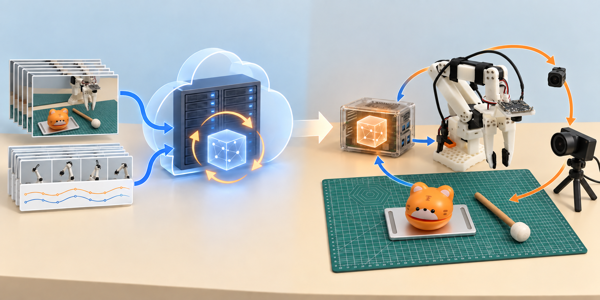

*图：训练循环读取已经采好的观测与目标动作并更新模型参数；真机推理只加载固定参数，反复执行“观察→预测→发送动作→重新观察”的闭环。*

推理形成“观察→预测→执行→再观察”的**闭环**：模型生成动作，后处理还原目标值，舵机跟踪目标，新图像和关节反馈再进入模型。

策略选择动作，舵机控制器跟踪目标，两者的运行频率不同。模型可一次生成一段动作，由软件逐帧发送。

### 1.4 每个组件的生态位：谁负责什么，谁不负责什么

#### LeRobot是什么：把硬件、数据和模型接起来的软件工具箱

**LeRobot是Hugging Face及社区开发的开源机器人学习框架。** “框架”可以理解为一套可复用的软件：它提供设备接口、数据格式、策略模型实现，以及采集、训练和部署工具，让这些环节按共同约定协作。[LeRobot官方介绍](https://huggingface.co/docs/lerobot/index)

以敲木鱼为例，即使已有机械臂和π0模型，两者也不能直接配合。还需要程序读取相机和关节、保存同步数据、组织训练样本，并将模型输出交给舵机。LeRobot承担了其中大量通用工作：

| 环节 | LeRobot提供什么 | 本例怎样使用 |
|---|---|---|
| 连接与遥操作 | 机器人、舵机、相机和遥操作设备接口，以及标定工具 | 读取leader，让follower跟随 |
| 记录数据 | 将视频、关节读数、动作与时间索引组织为统一数据集 | 保存双相机画面和敲木鱼示范 |
| 训练策略 | 数据加载、模型实现、训练循环与checkpoint保存 | 用示范微调π0 |
| 部署运行 | 模型加载、前后处理及动作执行接口 | 将实时观测送入π0，再把目标发给follower |

因此，“用LeRobot训练”还需要说明**训练哪种策略**：π0是我们选用的模型，LeRobot也包含ACT等其他策略。换模型通常仍可复用部分设备和数据工具，但输入要求、动作表示与配置需要重新核对。

LeRobot安装在计算机上：机器人工作站用它连接硬件、采集和推理，云端训练机用它读取数据并训练。HF Hub则是保存、分享数据与模型的在线仓库；本地工件齐全后，运行LeRobot不必始终连接Hub。

这次写的`collect-data.sh`等项目脚本是在LeRobot之上封装参数和批次管理。框架省去了大量重复开发，但设备标定、示范质量、环境兼容和发布包一致性仍需要我们处理；后文的经验也主要发生在这些衔接处。

#### 各组件在本例中的分工

| 层次 / 组件 | 在整个系统中的作用 | 不应误以为它会做什么 |
|---|---|---|
| 人与任务设计 | 定义成功标准，提供示范，布置场景，监督真机安全 | 只提供一句提示词就能省去示范与验收 |
| SO-ARM101 leader | 采集阶段的人机输入设备，把人的操作转成控制意图 | 它不是训练模型，也不是自主推理必须保留的“大脑” |
| SO-ARM101 follower | 通过关节和夹爪执行动作，并返回自身状态 | 机械结构本身不会自动识别木鱼或理解文字 |
| wrist / side 摄像头 | 腕部视角看近处抓取，固定视角看整体关系；共同提供观测 | 看见目标就等于模型一定会抓，也不意味着已经获得精确三维坐标 |
| 标定与硬件驱动 | 把软件里的关节数值与具体电机位置、方向、范围对应起来，负责通信 | 标定不能替模型学会任务；模型也不能自动弥补任意错误标定 |
| LeRobot | 连接设备、组织数据、调用训练和部署流程，把各部分接起来 | 它不是某一种策略模型，也不会保证任意数据都能训练成功 |
| 数据集 | 保存图像、状态、目标动作、任务及时间关系，是模仿学习的经验来源 | 视频文件单独存在就构成完整训练集，或文件完整就代表示范质量高 |
| π0策略模型 | 根据观测与任务生成动作，微调后形成这次任务的策略 | 它不是硬件急停、可靠的三次计数器或天然完备的失败恢复程序 |
| tokenizer与前后处理器 | 将文字和观测整理成模型输入，并把输出还原为正确的动作量纲 | 权重文件可以脱离这些配套配置单独使用 |
| PyTorch / CUDA / GPU | 提供张量计算、训练参数更新和推理所需的计算能力 | 显卡更大就一定能修复标签、标定或动作单位错误 |
| 运行与监控工具 | 保存日志、查看进度、分析故障；Codex在实验中辅助编写脚本与整理证据 | 日志没有报错就等于机械臂成功完成任务 |

再看本实验中容易混淆的机器、平台和SaaS服务。SaaS可以先理解为“通过网页或网络API使用的在线软件”；它与租用GPU不是同一件事。

| 名称 | 类型 | 本流程中负责什么 | 是否必需 |
|---|---|---|---|
| 机器人工作站（本例为NVIDIA DGX Spark） | 本地Linux主机 | 连接机械臂和相机、采集数据、最终真机推理 | 需要兼容主机，可按算力和接口需求选型 |
| Mac | 管理/中转电脑 | 操作网页、传文件、保存结果和绘图 | 可替换；不在实时控制链里 |
| Featurize | 云GPU算力平台 | 临时租用GPU实例微调π0 | 可换其他有合适GPU的云或本地服务器 |
| Hugging Face Hub（HF） | 模型与数据托管SaaS | 私有仓库保存、版本化和分发数据/模型 | 可替换；完整下载后推理可离线 |
| Weights & Biases（W&B） | 实验跟踪SaaS | 查看loss、学习率、显存和run状态 | 可选；本实验后来改用本地日志和CSV |
| Foxglove | 机器人数据可视化工具/服务 | 按channel查看图像和机器人消息 | 可选；消息类型不一致会导致可视化报错，不等于采集一定失败 |
| Rerun | 本地优先的多模态可视化工具 | 查看图像、关节值和时间序列，帮助调试采集或推理 | 可选；关闭展示通常不影响数据本身 |
| Git/GitHub | 代码版本管理工具/托管服务 | 保存脚本和文档变更，不适合直接提交大模型权重 | Git推荐；托管平台可替换 |
| Codex | 本次使用的开发协作工具 | 辅助编写脚本、诊断日志和整理文档 | 不是机器人运行依赖，也不代替现场安全判断 |

HF存工件，W&B记录实验，Foxglove/Rerun展示数据。判断系统是否正常应查对应的日志和文件；网页没有曲线不一定表示训练停止，退出终端也不会自动退还云实例。

选择平台前先明确：机械臂连接哪台主机、在哪里训练、工件保存在哪里、如何查看指标，以及部署时能否离线加载。

### 1.5 从示范到部署：各环节怎样衔接

| 阶段 | 要做的事 | 进入下一步前，应拿到的结果 |
|---|---|---|
| ① 定义任务 | 写清初始条件、操作范围、成功与失败标准 | 例如“抓起、不掉落、恰好三下、放回”，而不只是“机械臂动了” |
| ② 打通硬件 | 连接、标定，检查相机与遥操作 | 人能稳定、安全地带着从臂完成动作 |
| ③ 采集示范 | 同步记录观测与动作，覆盖计划内的位置和变化 | 多条清楚、完整、语义一致的演示 |
| ④ 验收数据 | 检查文件、索引、时间对齐、动作单位和演示质量 | 可读取的训练集，以及与训练演示分开的验收场景 |
| ⑤ 微调模型 | 选择基础模型，训练，记录配置、loss与检查点 | 可追溯的训练结果；不是仅有一张下降曲线 |
| ⑥ 打包与离线验证 | 保存权重、tokenizer、处理器与统计，检查实际输出 | 在不驱动机器人时也能确认加载路径、输入和动作量纲正确 |
| ⑦ 部署与真机验收 | 接入实时相机和状态，从短测试逐步到完整任务 | 现场观察与日志共同支持的成功/失败记录 |
| ⑧ 分析与再迭代 | 区分硬件、数据、模型、处理器和场景问题 | 针对性修复或补采，再训练、再验收，而不是盲目加步数 |

例如抓起后掉棒，先检查夹持、闭合量和遮挡，再判断是否需要补充“拿稳再抬升”的示范。

### 1.6 实验中容易混淆的四件事

1. **训练结束 ≠ 任务学会。** loss用于观察优化，最终要看独立场景中的任务成功率。
2. **轨迹回放 ≠ 视觉推理。** 回放执行已记录动作；推理根据当前观测产生新动作。
3. **能加载权重 ≠ 能正确控制。** 关节顺序、标定、tokenizer、归一化统计和处理器必须一起匹配。
4. **流程跑通 ≠ 所有场景稳定。** 学会固定场景后，还需检验位置变化、遮挡、滑落和其他未充分示范的情况。

下面沿着环境、校准、采集、训练和部署，展开这次实践中的选择与认识。

### 1.7 数据、动作与模型文件：本例中的具体含义

#### 先看本例：一次示范究竟留下了什么

人移动主臂（leader），从臂（follower）跟随并实际抓取敲棒。系统按时间同步记录以下内容；一整次演示叫一个episode，其中每个采样时刻叫一帧。

| 记录内容 | 本例中的含义 | 用途 |
|---|---|---|
| 腕部、侧面两张图像 | 夹爪附近细节与桌面全局 | 判断敲棒、木鱼与夹爪的相对关系 |
| `observation.state` | follower的五个关节角度＋夹爪开合量 | 告诉模型当前姿态 |
| `action` | 告诉从臂：五个关节各转到哪个角度，夹爪张开多少 | 示范者希望机械臂接下来摆出的姿态 |
| `task`或任务索引 | “找到木鱼、拿起敲棒、敲三下、放回、回位” | 指定任务 |
| 时间戳、episode与帧索引 | 哪次演示、哪个时刻 | 对齐画面、状态与后续动作 |

这里的“六维”就是**六个数**，按固定顺序分别表示：底座转向、肩部抬升、肘部弯曲、腕部俯仰、腕部旋转，以及夹爪开合。前五个数是目标角度，最后一个是夹爪开合量（本例0表示闭合端，100表示张开端）。它们共同表达“希望机械臂摆成什么姿态”，不是“抓起敲棒”这样的一句指令；抓取需要连续发送很多组这样的数。

一帧可以理解为：**“当时看见什么、手臂在哪里、人希望它接下来摆成什么姿态。”** 训练将当前观测与随后一段动作配对，学习连续操作。这里先按原始采集的action解释；本实验V3曾将标签改为follower未来4帧的位置，具体区别见下文“为什么既有state又有action”。

本实验80个episode共包含50,596个双相机观测时刻；30 FPS表示每秒约30帧。

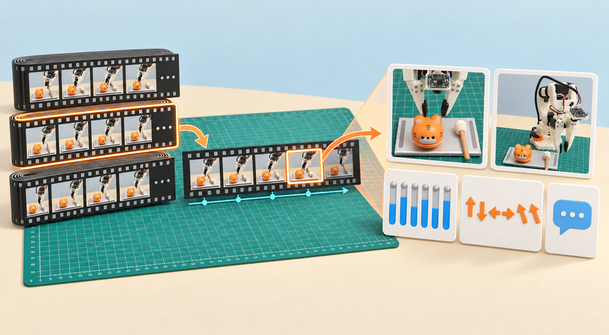

*图：一次episode由按时间排列的许多frame组成；训练样本不是只有一张照片，而是把双路图像、当前状态、任务文字和目标动作按时间对齐。*

训练、部署和诊断必须保持同一顺序、方向、量纲和标定。本文显式使用`robot.use_degrees=true`；其他版本/旧数据若用的是−100到100范围映射，不能直接混用。[0.6.1关节归一化实现](https://github.com/huggingface/lerobot/blob/v0.6.1/src/lerobot/robots/so_follower/so_follower.py)

#### 用状态空间理解：现在怎样，动作后会怎样

**状态空间**是系统所有可能状态的集合；**状态转移**描述系统在动作作用下如何随时间变化。对机械系统，完整状态通常还包含速度；本任务还涉及敲棒位置、运动和接触情况。[状态与动力学的基础说明](https://underactuated.mit.edu/intro.html)

因此，数据字段`observation.state`只是可测到的关节姿态，不能等同于整个场景的完整状态。关节角度相同，敲棒也可能分别处于“夹稳”和“正在滑落”两种情况；摄像头补充外部信息，但遮挡和接触力仍可能不可见。

可把本系统简写为：

```text
观测 o[t] = 两路图像 + follower关节读数
目标 a[t] = 策略根据观测和任务选出的动作
下一状态 x[t+1] = F(当前状态 x[t], 下发目标 a_sent[t], 扰动)
```

这里的`F`表示包含舵机控制器在内的真实系统如何运动；摩擦、负载和滑动都会影响结果。π0主要学习“选什么动作”的策略，并不在本流程中显式学习或求解`F`。实际一次预测的是动作块，上式只取其中一帧说明。

#### 模型的数字怎样变成机械臂运动

```text
相机与关节反馈 → 前处理 → π0预测动作块
       ↑                       ↓
    实际运动              后处理还原目标值
       ↑                       ↓
舵机内部位置闭环 ← USB控制板 ← 限幅、标定转换与发送
```

后处理将归一化输出还原为关节角度和夹爪开合量；控制程序按配置限幅，再根据标定换算为舵机计数，经USB控制板写入目标位置。舵机用编码器反馈纠正位置误差，带动连杆运动。程序随后读取新画面和新位置，继续预测。

例如某关节当前读数为20°，策略要求22°，下一帧反馈可能只到20.8°。这三个数分别是**当前测量、目标命令、执行结果**，不必相等（数值仅为示例）。本例的action是位置目标，电机驱动力由舵机内部控制器产生。

“寻找→抓取→敲击”则是人为划分的**任务阶段**，与关节、速度等物理状态不同。可以用状态机显式管理这些阶段；本文的π0主要从示范中学习动作衔接，没有一张手写阶段跳转表。

#### 为什么既有state又有action

`state[t]` 是“现在在哪里”，`action[t]` 是“接下来要求去哪里”。舵机有延迟、负载和跟随误差，两者不必相等。标准遥操作采集中的 action 是经过机器人控制链处理的指令，不能简单理解为未经转换的主臂原始电机计数。

把 `action[t]` 直接改成同一时刻 `state[t]`，很容易把监督目标变成“保持当前位置”。本实验 V3 额外尝试了：

```text
action[t] = follower_state[min(t + 4, 本 episode 最后一帧)]
```

即学习约 133 毫秒后的实际位置。它是一个**实验性重标注方案，不是所有遥操作数据都必须这样修复**。它改变了动作语义，需要重新计算 action 统计，并在部署中保持一致。不能跨 episode 取下一条的状态；也不能直接复制视频目录后只改一个标签文件便宣布完成。

原始action与future4重标注代表不同的监督目标；我们没有通过消融实验证明后者更优。V3方案及旧脚本局限见[实验记录](02-experiment-log.md#6-第三轮训练改用-follower-未来状态)。

#### 整个系统如何串起来

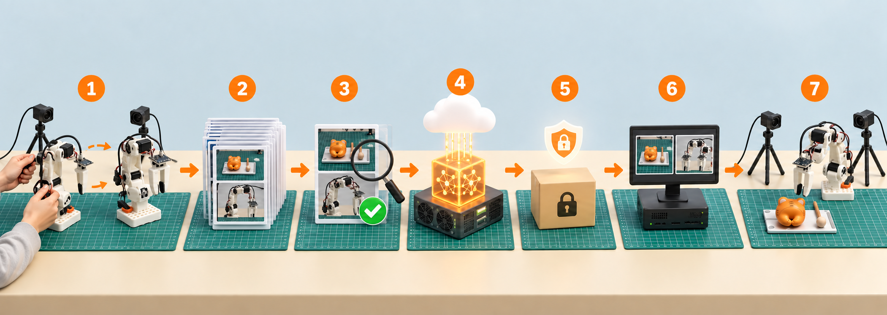

模型对输入做归一化，输出通常也在归一化空间中。例如训练时：

```text
z = (目标关节值 - 均值) / 标准差
部署时：目标关节值 = z × 标准差 + 均值
```

因此 **模型输出 0 不一定表示机械臂回到零位，而可能表示该关节训练动作的均值**。只有经过正确后处理，它才是可以下发给舵机的目标。

#### 训练时和运行时到底有什么不同

一次参数更新叫一个**step**；batch2表示每步使用两个采样起点。训练会从episode中反复抽取动作片段。

默认动作块50帧，在30Hz下约覆盖1.67秒。部署时可只执行其中一部分，再根据新观测更新计划。

tokenizer负责把任务文字变成模型理解的数字序列；前处理负责输入格式和归一化；后处理负责把模型输出还原成真实控制量。三者缺一或版本不一致，可能让一个已经训练好的模型表现得像“没有学会”。

是否恰好敲三下，需要通过重复任务试验验收。

### 1.8 几个常见疑问

- **有摄像头，为什么还要关节state？** 图像告诉模型外部场景，state告诉模型机械臂自身姿态；相同画面下，手臂当前位置不同，下一步动作也可能不同。
- **VLA是不是先识别木鱼，再调用一段写死程序？** 不一定。本文的π0直接根据视觉、文字和状态生成动作；也可以另做检测器加规则控制，但那是另一种系统设计。
- **只训练“敲木鱼”一个任务，还需要语言吗？** 训练与部署仍要使用一致任务文本，因为它属于模型输入。只有一个任务时语言区分作用较小，但不能在部署时随意改写成完全不同语义。
- **是不是演示越多、step越大就越好？** 不是。错误标定、错位图像和失败示范会被一起放大；训练更久也可能更贴合固定机位而不泛化。
- **模型文件是不是就是一个巨大的权重？** 权重是核心，但没有匹配的config、tokenizer、前处理、后处理和统计，可能无法加载或输出错误量纲。

## 2. 环境准备：设备、软件、平台与连接

这套系统的环境问题分散在USB设备、权限和GPU软件栈中。我们把“设备是否可访问”和“LeRobot、CUDA是否可用”分开检查，避免把连接故障误认为模型问题。

### 本文使用的路径名称

不同电脑的用户名和目录结构不同。本文不写某个人机器上的绝对路径，而用下面这些名称表示目录；运行命令前，将右侧示例值改成自己的目录。尖括号形式用于文字说明，Shell命令中使用对应的环境变量。

| 文中名称 | Shell变量 | 表示什么 | 示例值 |
|---|---|---|---|
| `<MAC_PROJECT_ROOT>` | `MAC_PROJECT_ROOT` | Mac上的本文项目目录 | `/path/to/so-arm101` |
| `<MAC_TRANSFER_ROOT>` | `MAC_TRANSFER_ROOT` | Mac中转数据目录 | `/path/to/qiaomuyu-transfer` |
| `<MAC_MODEL_ROOT>` | `MAC_MODEL_ROOT` | Mac保存模型的父目录 | `/path/to/models` |
| `<ROBOT_PROJECT_ROOT>` | `ROBOT_PROJECT_ROOT` | 机器人工作站上的本文项目目录 | `/path/to/so-arm101` |
| `<ROBOT_LEROBOT_ROOT>` | `ROBOT_LEROBOT_ROOT` | 机器人工作站的LeRobot环境与工作目录 | `/path/to/lerobot` |
| `<ROBOT_DATA_ROOT>` | `ROBOT_DATA_ROOT` | 机器人工作站的数据集父目录 | `<ROBOT_LEROBOT_ROOT>/datasets` |
| `<ROBOT_MODEL_ROOT>` | `ROBOT_MODEL_ROOT` | 机器人工作站的模型父目录 | `<ROBOT_LEROBOT_ROOT>/models` |
| `<CLOUD_WORK_ROOT>` | `CLOUD_WORK_ROOT` | 云训练机的工作目录 | `/path/to/cloud-work` |
| `<CLOUD_DATA_ROOT>` | `CLOUD_DATA_ROOT` | 云训练机的数据目录 | `/path/to/cloud-data` |
| `<CLOUD_PROJECT_ROOT>` | `CLOUD_PROJECT_ROOT` | 云训练机上的本文项目目录 | `<CLOUD_WORK_ROOT>/so-arm101` |
| `<CLOUD_VENV_ROOT>` | `CLOUD_VENV_ROOT` | 云训练机的Python虚拟环境 | `<CLOUD_WORK_ROOT>/lr312` |

每台机器在新终端中先定义自己需要的变量，例如：

```bash
# [Mac]
export MAC_PROJECT_ROOT=/path/to/so-arm101
export MAC_TRANSFER_ROOT=/path/to/qiaomuyu-transfer
export MAC_MODEL_ROOT=/path/to/models

# [机器人工作站]
export ROBOT_PROJECT_ROOT=/path/to/so-arm101
export ROBOT_LEROBOT_ROOT=/path/to/lerobot
export ROBOT_DATA_ROOT="$ROBOT_LEROBOT_ROOT/datasets"
export ROBOT_MODEL_ROOT="$ROBOT_LEROBOT_ROOT/models"

# [云训练机]
export CLOUD_WORK_ROOT=/path/to/cloud-work
export CLOUD_DATA_ROOT=/path/to/cloud-data
export CLOUD_PROJECT_ROOT="$CLOUD_WORK_ROOT/so-arm101"
export CLOUD_VENV_ROOT="$CLOUD_WORK_ROOT/lr312"
```

`/path/to/...`是占位写法，不能原样执行。`/dev/ttyACM1`一类设备节点和`/usr/bin`一类系统路径不属于项目工作目录，仍按系统实际值使用。

### 2.1 设备选择与搭配

| 类别 | 最小准备 | 购买/开机前最容易漏掉的检查 |
|---|---|---|
| 机器人本体 | 已组装的SO-ARM101 leader、follower | 两条臂的电机型号、减速比和结构件是否与配置匹配 |
| 供电与通信 | 两块控制板、对应电源和USB线 | 电压版本、极性、电流能力；USB线是否支持数据而不只是充电 |
| 视觉 | 腕部相机、固定侧视相机及牢固支架 | Linux/UVC兼容性、是否有唯一序列号、1080p 30 FPS能否稳定输出 |
| 任务场景 | 稳固底座、木鱼、不会轻易滚走的敲棒 | 机械臂全行程内没有人手、衣物、线缆和易碎物 |
| 本地主机 | 一台能连接USB设备并运行CUDA/PyTorch的Linux主机 | CPU架构、GPU支持、USB带宽和本地磁盘空间 |
| 训练算力 | 有足够显存和磁盘的本地或云GPU | π0权重、优化器和视频解码会同时占资源；不能只看显卡名称 |
| 工件存储 | 本地备份及可选的HF私有仓库 | 原始数据、训练checkpoint和最终发布模型不是同一份备份 |
| 安全措施 | 稳固桌面、支撑方式、可快速断开的电源 | `Ctrl+C`只是程序中断，不是独立硬件急停 |

本实验用过RTX A6000和PRO 6000 96GB。选型前确认本地主机能采集、训练显存够用，以及数据和模型有足够存储空间。

### 2.2 软件环境的分层与兼容性

软件分层如下：Linux/驱动识别硬件，CUDA/PyTorch负责GPU计算，LeRobot负责机器人流程，Python虚拟环境隔离依赖。按层检查：

| 层 | 最小自检 | 失败时不要做什么 |
|---|---|---|
| NVIDIA驱动/GPU | `nvidia-smi`能显示GPU | 不要先反复重装LeRobot |
| Python虚拟环境 | `which python`指向预期`.venv` | 不要把系统pip与虚拟环境pip混用 |
| PyTorch/CUDA | `torch.cuda.is_available()`为True | 不要继续启动π0长训练 |
| LeRobot | 版本正确，三个CLI的`--help`可运行 | 不要默认最新版本与0.6.1命令兼容 |
| FFmpeg/PyAV | 能解码一段实际MP4 | 不要把所有视频错误都归因于模型 |

Mac 不承担本例中的 GPU 训练，也不直接使用 Linux `/dev` 设备路径。本例的DGX Spark采用ARM64架构，云实例通常是 x86_64；**不要把一台机器的 `.venv` 拷到另一台上**。

在已有、可用的机器人工作站环境中使用原环境，不要先重装CUDA。本实验部署在`<ROBOT_LEROBOT_ROOT>`。新Linux环境可从下面开始：

本例的机器人工作站使用`source "$ROBOT_LEROBOT_ROOT/activate.sh"`进入环境。这个入口还设置FFmpeg/CUDA共享库路径，单独激活`.venv`并不等价。只读核验时的版本为torch 2.11.0+cu130、torchvision 0.26.0+cu130、transformers 5.5.4、PyAV 15.1.0、TorchCodec 0.11.1+cu130，详细记录见[环境核验](../evidence/spark-readonly-audit.md)。

```bash
# [Linux；首次安装] 系统软件需要管理员权限。
sudo apt-get update
sudo apt-get install -y python3.12-venv python3.12-dev build-essential ffmpeg v4l-utils
python3.12 -m venv "$ROBOT_LEROBOT_ROOT/.venv"
source "$ROBOT_LEROBOT_ROOT/.venv/bin/activate"
python -m pip install --upgrade pip
# 先按本机 GPU/架构安装并验证 PyTorch；DGX Spark 使用 NVIDIA 适配发行环境。
python -c 'import torch; print(torch.__version__, torch.cuda.is_available())'
# 已有 CUDA PyTorch 检查通过后安装；不要无条件升级 torch。
python -m pip install 'lerobot[pi]==0.6.1' pyserial deepdiff pynput evdev python-xlib
python -m pip check
python -c 'import importlib.metadata as m; import torch; print(m.version("lerobot")); print(torch.cuda.get_device_name(0))'
lerobot-record --help
lerobot-train --help
lerobot-rollout --help
```

如果系统源没有 Python 3.12，先解决 Python 安装；不要把缺失的系统包当成 LeRobot 故障。TorchCodec/FFmpeg 共享库不匹配时先尝试 PyAV 解码，不要不停升级所有依赖。历史 ARM64 特殊依赖见实验记录。

上面的新机命令块**假设已经按该机器的GPU、驱动和CPU架构安装了匹配的PyTorch**；不同CUDA和ARM/x86组合不能给出一条永远正确的安装命令。新机器应先使用[PyTorch官方安装选择器](https://pytorch.org/get-started/locally/)生成命令，直到CUDA自检为True，再安装LeRobot。本文主线机器人工作站已有验证环境，应直接使用`activate.sh`，不走这条新机分支。

本项目的[环境检查补齐脚本](../scripts/ensure-featurize-pi0-env.sh)用于云端已有 CUDA 环境，先 `--help` 查看选项，再运行。它会安装缺失依赖，不负责安装 NVIDIA 驱动。脚本中 W&B 库的可导入检查不代表必须启用 W&B 服务。

### 2.3 平台账号与凭据管理

本例用Featurize接收数据和提供算力，用HF保存私有模型。W&B、Foxglove和Rerun承担监控或展示工作，属于可选组件。

在真正训练前逐项确认：

| 检查 | 判断依据 | 常见误判 |
|---|---|---|
| Featurize数据集 | 网页显示上传完成，并能得到有效下载命令 | 进度条出现就认为已可下载 |
| Featurize实例 | 镜像、GPU、磁盘和计费状态都确认 | 关闭浏览器或终端就认为实例已退还 |
| HF登录 | `hf auth whoami`显示预期账号，目标仓库是private | 把token写进脚本、截图或Git仓库 |
| W&B | 需要时能创建run；不用时明确`wandb.enable=false` | 页面没曲线就贸然重复启动训练 |
| 本地日志 | 日志路径可写，训练后能提取CSV | 认为用了W&B才有loss记录 |

账号令牌属于密码。优先用平台CLI的交互登录或受限的秘密管理功能，不把token写进`collect-data.sh`、`lab.env.example`、Markdown、截图或镜像。若令牌曾出现在聊天、终端历史或公开文件中，应撤销并重新生成。

### 2.4 本地与云端的项目配置

在 Mac 上执行，替换真实 SSH 主机名：

```bash
export MAC_PROJECT_ROOT=/path/to/so-arm101
export ROBOT_PROJECT_ROOT=/path/to/so-arm101
cd "$MAC_PROJECT_ROOT"
rsync -av --exclude=.git --exclude=lab.env --exclude='.venv*' --exclude=reports \
  ./ "oopslink@ROBOT_HOST:$ROBOT_PROJECT_ROOT/"
```

在 机器人工作站 上：

```bash
export ROBOT_PROJECT_ROOT=/path/to/so-arm101
export ROBOT_LEROBOT_ROOT=/path/to/lerobot
cd "$ROBOT_PROJECT_ROOT"
source "$ROBOT_LEROBOT_ROOT/activate.sh"
cp config/lab.env.example config/lab.env
nano config/lab.env
source config/lab.env
```

配置中的 `YOUR_HF_USERNAME` 必须换成自己的用户名。示例 serial number 来自本次设备，另一套设备必须重填。以后的 机器人工作站 命令默认在项目根目录，并已执行 `source config/lab.env`。

`rsync`结束后在机器人工作站执行`ls scripts config docs`，确认目录齐全；再执行`git diff`或比较哈希确认传输的是预期版本。不要把Mac虚拟环境、含密钥的`lab.env`和大型`reports`缓存一起复制。看到100%进度只表示文件传完，不表示脚本依赖已安装。

### 2.5 设备路径漂移与权限问题

Linux把串口和相机也表示成`/dev`下面的文件。所谓“端口”不是网络端口，而是程序访问控制板或摄像头的设备路径。本节只做识别和权限检查，不会给舵机下发动作。

```bash
# [机器人工作站] 只读检查
ls -l /dev/serial/by-id/
ls -l /dev/v4l/by-id/
readlink -f "$FOLLOWER_PORT"
readlink -f "$LEADER_PORT"
id
ls -lL "$FOLLOWER_PORT" "$LEADER_PORT" "$WRIST_CAMERA" "$SIDE_CAMERA"
v4l2-ctl --list-devices
v4l2-ctl -d "$WRIST_CAMERA" --list-formats-ext
v4l2-ctl -d "$SIDE_CAMERA" --list-formats-ext
```

`/dev/ttyACM0`、`/dev/ttyACM1` 会随插拔顺序变化。`by-id` 根据设备身份固定；没有唯一序列号时可考虑固定 USB 拓扑的 `by-path` 或按设备属性写 udev 规则。不要给两个主从设备写同一个匹配规则。

Ubuntu 通常需要 `dialout` 和 `video` 组：

```bash
sudo usermod -aG dialout,video "$USER"
# 注销再登录，重新激活环境、source config/lab.env，再运行 id 确认。
test -r "$FOLLOWER_PORT" && test -w "$FOLLOWER_PORT" && echo 'serial permission OK'
```

不要把 `chmod 777 /dev/ttyACM1` 当成永久方案。若设备被占用，先检查 `fuser "$FOLLOWER_PORT"`，识别具体进程后正常退出；不要批量杀掉所有 Python 程序。

这一节做好的判断标准是：`readlink -f`能解析四个设备变量，两个串口可读写，两路相机支持计划使用的分辨率和帧率，USB重插后`by-id`路径仍指向正确设备。常见失败包括把leader和follower写反、两个同型号相机没有唯一序列号、用户加入用户组后没有重新登录，以及预览程序仍占用相机。

### 2.6 环境问题的排查依据

- [ ] 电源规格按真实舵机和板卡核对，不是凭插头或商品图猜测。
- [ ] `source "$ROBOT_LEROBOT_ROOT/activate.sh"`后能导入torch和lerobot，CUDA可用。
- [ ] `config/lab.env`已填写本机真实路径，示例占位符全部替换。
- [ ] leader/follower串口不会因USB重插而互换，当前用户具备读写权限。
- [ ] wrist/side相机身份稳定，并支持计划使用的格式、分辨率和帧率。
- [ ] HF/Featurize等必需账号可用，凭据没有进入项目或截图。
- [ ] 本地磁盘能容纳逐帧PNG、编码视频和至少一份备份。

任何一项无法确认，就停在环境准备；不要靠“先跑一下看看”让机械臂带电运动。

## 3. 硬件校准：舵机、主从臂与相机

校准建立的是软件数值与真实硬件之间的对应关系。它直接影响数据质量：关节读数、夹爪方向、焦点或视野不一致，都可能让训练顺利结束而真机表现异常。

每一项都按四个问题阅读：它是什么、为什么要做、做错会怎样、怎样验收。硬件校准通过之前不要开始批量采集。

### 3.1 舵机ID、调零与坐标标定

电机ID设置和坐标标定容易被混淆，两者作用不同：

| 操作 | 改什么 | 什么时候做 |
|---|---|---|
| `lerobot-setup-motors` | 给总线上的电机设置唯一ID及所需通信配置 | 首次组装或明确更换/重置电机后 |
| `lerobot-calibrate` | 记录homing offset和关节行程，保存坐标映射 | 首次组装、拆装舵盘/连杆、更换舵机或标定文件丢失/失配后 |

重启机器人工作站、USB设备节点从`ttyACM0`变为`ttyACM1`、移动摄像头或执行速度初始化，都**不是**重新设置电机ID或重新调零的理由。已有能正常遥操作的设备不要每次重做。首次装机遵循套件和[官方SO-101组装/校准步骤](https://huggingface.co/docs/lerobot/so101)。

#### 仅首次设置电机ID

设置ID会写入舵机配置。清空工作区，只把提示要求的那一个舵机接到控制板；如果多个仍为同一默认ID的舵机同时在线，程序无法可靠区分写给谁。

```bash
# [机器人工作站；首次设置，有硬件配置写入]
lerobot-setup-motors --robot.type=so101_follower --robot.port="$FOLLOWER_PORT"
lerobot-setup-motors --teleop.type=so101_leader --teleop.port="$LEADER_PORT"

# 每出现一次提示：断电/断开后，只连接提示名称对应的单个舵机，再继续。
```

完成后再按机械结构顺序接回整条总线。不要为了排查“模型不动”随意重写ID；ID错乱属于通信配置问题，不属于模型问题。

### 3.2 为什么主从臂需要分别标定

同一套示范系统存在两条机械臂：leader表达人的控制意图，follower执行并反馈真实状态。分别标定的目标不是让两个原始编码器计数完全相同，而是让相同物理姿态在软件坐标中具有可对应的方向和量纲。否则人把leader向上抬，follower可能幅度不对、方向不对或撞向行程端点，采下来的action/state关系也会失真。

#### 给follower建立坐标

开始前卸下负载、让夹爪空着、固定底座并清出整个工作区。校准程序会关闭扭矩，悬空的机械臂可能立即下坠，所以一只手要先托住连杆，另一人最好守在电源旁。然后执行：

```bash
# [机器人工作站；会关闭扭矩并写入舵机标定]
lerobot-calibrate \
  --robot.type=so101_follower --robot.port="$FOLLOWER_PORT" --robot.id="$FOLLOWER_ID"
```

按终端提示完成，不要只看到命令启动就松手：

1. 提示移动到`middle of its range of motion`时，逐个判断每个关节从一端到另一端的**机械行程中点**，把关节放在中间附近；夹爪也放在开合行程中间。这里不是木鱼任务的起始姿态，也不是把所有连杆摆成一条直线。
2. 托稳机械臂后按Enter。LeRobot读取此刻计数，并写入homing offset，使它靠近编码器半圈参考。
3. 程序开始记录范围后，按提示一次只移动一个关节，从一个安全机械极限平滑移动到另一个，再返回中间。夹爪完整张开和闭合。接近硬限位时不要猛撞、扭结构件或用工具加力。
4. 确认所有**终端要求扫描的关节**都覆盖完整行程，再按Enter结束。0.6.1的SO follower实现会把`wrist_roll`作为整圈范围处理，因此以当前终端提示为准，不要自行给它制造多圈缠线。
5. 记下`Calibration saved to ...`打印的JSON路径。文件应包含六个关节的`id`、`drive_mode`、`homing_offset`、`range_min`和`range_max`。

#### 单独标定leader

leader不是follower标定文件的复制品。用同样方法托住leader、摆到各自行程中间、扫描完整范围：

```bash
# [机器人工作站；会关闭扭矩并写入舵机标定]
lerobot-calibrate \
  --teleop.type=so101_leader --teleop.port="$LEADER_PORT" --teleop.id="$LEADER_ID"
```

`FOLLOWER_ID`和`LEADER_ID`应是各自稳定的名字，并建议采用不同、容易辨认的命名。LeRobot以后根据设备类型和ID寻找对应标定文件；不要把别人的JSON直接复制过来。

### 3.3 怎样观察标定效果

把终端显示的两个JSON路径记录在实验笔记中，并分别检查、备份和计算哈希：

```bash
# 将三个名称设置为终端实际打印的路径和自己的备份目录。
export FOLLOWER_CALIBRATION=/path/to/follower-calibration.json
export LEADER_CALIBRATION=/path/to/leader-calibration.json
export CALIBRATION_BACKUP_ROOT=/path/to/calibration-backup
python -m json.tool "$FOLLOWER_CALIBRATION"
python -m json.tool "$LEADER_CALIBRATION"
sha256sum "$FOLLOWER_CALIBRATION" "$LEADER_CALIBRATION"
mkdir -p "$CALIBRATION_BACKUP_ROOT"
cp "$FOLLOWER_CALIBRATION" "$CALIBRATION_BACKUP_ROOT/"
cp "$LEADER_CALIBRATION" "$CALIBRATION_BACKUP_ROOT/"
```

随后执行[3.5节遥操作验收](#35-遥操作验收)，先在行程中间做小幅运动。相同物理姿态下，leader与follower对应关节的数值和方向应基本一致；夹爪应同向开合，且不能在正常姿态突然跳向极限。再缓慢接近各端检查完整行程，不要一上来运行模型。

0.6.1把“当前中间姿态”对齐到12位编码器半圈附近，然后记录最小/最大值。如果第一步摆的并非真实机械中点，编码器0/4095回绕点可能落入正常行程，记录出的范围会看似合理却漏掉一段。表现为正常手动姿态读数突然跨界，或连接时关节冲向一端。出现这种情况应立即停机、托住机械臂，检查标定文件和当时的中间姿态；优先按真实中点重新标定并小幅复验，**不要直接手改JSON或取消保护后试撞**。

下面两条是前文命令的紧凑汇总，便于已经理解流程后查找：

```bash
# [机器人工作站；按终端提示摆到中点并扫描关节范围]
lerobot-calibrate --robot.type=so101_follower --robot.port="$FOLLOWER_PORT" --robot.id="$FOLLOWER_ID"
lerobot-calibrate --teleop.type=so101_leader --teleop.port="$LEADER_PORT" --teleop.id="$LEADER_ID"
```

机器没移动不代表软件一定加载了同一文件。排查时比对路径、哈希、设备ID、关节顺序和`use_degrees`模式，而不是仅靠记忆。

### 3.4 相机布局与对焦的影响

相机校准在这里不是做精密三维测量，而是把**安装位置、朝向、画面身份、分辨率、对焦和曝光行为**稳定下来。模型会把这些画面当作任务坐标的一部分；相机支架移动几厘米、wrist/side名称交换或自动对焦持续“拉风箱”，都可能造成训练与部署输入分布不同。

两路视角分工如下：

- `wrist`应在接近敲棒时看清夹爪两指、敲棒柄和接触区域；机械臂抬升或旋腕后不能只剩地板、臂壳或被线缆遮住。
- `side`应覆盖起始姿态、木鱼、敲棒、主要运动路径和放回区域；固定支架不能随着桌面振动改变角度。
- 两路都要保留有用信息。两个相机摆在几乎相同位置通常只会得到重复画面，不会自动产生可靠深度。

“定焦”容易被误解。这里主要指**确定合适的对焦距离后锁住对焦行为**，不是把图像永远拍成一个固定焦距参数。带电动对焦的UVC相机通常可以关闭连续自动对焦，再设置`focus_absolute`；手动镜头则需要旋转镜头筒或对焦环并锁紧。有些廉价相机完全不暴露对焦控制，此时不能照抄下面的参数。

```bash
# [机器人工作站；只读列出相机实际支持的控制项]
v4l2-ctl -d "$WRIST_CAMERA" --list-ctrls
v4l2-ctl -d "$SIDE_CAMERA" --list-ctrls

# [机器人工作站；下面是模板，确认控件存在、替换VALUE并删除行首#后才执行]
# VALUE先从控件报告的min/max/step/default中选中间值，再边看画面边小步调整。
# v4l2-ctl -d "$WRIST_CAMERA" --set-ctrl=focus_automatic_continuous=0
# v4l2-ctl -d "$WRIST_CAMERA" --set-ctrl=focus_absolute=VALUE
# v4l2-ctl -d "$SIDE_CAMERA" --set-ctrl=focus_automatic_continuous=0
# v4l2-ctl -d "$SIDE_CAMERA" --set-ctrl=focus_absolute=VALUE

# [机器人工作站；图形桌面] 每条命令关闭窗口后再执行下一条。
ffplay -f v4l2 -input_format mjpeg -video_size 1920x1080 -framerate 30 "$WRIST_CAMERA"
ffplay -f v4l2 -input_format mjpeg -video_size 1920x1080 -framerate 30 "$SIDE_CAMERA"
```

若控件名称不是`focus_automatic_continuous`，使用`--list-ctrls`显示的真实名称；没有对应控件就不要强设。`VALUE`是占位符，不能原样运行。调整时把机械臂断开控制或安全托住，分别观察回位、接近、夹持、抬起和敲击位置，不要只对着空桌面判断清晰度。

用下面的验收表判断，而不是凭“摄像头能亮”通过：

| 检查项 | 好的表现 | 坏的表现及影响 |
|---|---|---|
| 身份 | `wrist`和`side`与配置一致，重插后仍一致 | 两路交换后模型会把全局图当近景，输入语义错位 |
| 可见范围 | 任务五个阶段的关键物体与夹爪都至少在一路清楚可见 | 抓取时敲棒出画、夹爪遮挡接触点，模型缺少决策依据 |
| 清晰度 | 敲棒边缘、夹爪尖和木鱼轮廓在主要工作距离可辨 | 严重虚焦或运动模糊会抹掉小物体和接触状态 |
| 稳定性 | 支架、分辨率、方向和裁切固定，无周期性拉焦 | 画面漂移让同一动作对应不同视觉坐标 |
| 曝光/白平衡 | 明暗变化有限，木鱼和敲棒颜色不过曝、不全黑 | 自动曝光剧烈跳变会增加无关视觉变化 |
| 时间连续性 | 预览平稳、没有长时间冻结或大量掉帧 | 图像和动作时间错位，训练会学到错误对应关系 |

确认木鱼、敲棒和夹爪在任务关键阶段可见，画面没有交换，曝光没有大幅跳动。关闭预览后再采集，避免设备竞争。建议把最终支架位置、相机序列号、对焦控件值和四个关键姿态的截图记入实验记录；相机重装后重新执行本节验收。

固定 side 相机初期**不要每条都挪**。先保持部署视角稳定，主要变化木鱼和敲棒在安全工作区的位置。要提高视角鲁棒性，可在批次之间做小范围有记录的变化，每个新视角都采足演示；不要制造训练和部署完全不同的视角。腕部相机的安装方式也应稳定。

### 3.5 遥操作能帮助确认什么

遥操作是校准后的综合体检：人的leader动作经过软件映射到follower。如果这一步不能稳定完成一次慢速空载动作，后续采集到的就不是可靠示范。遥操作通过也只证明硬件控制链基本正确，不证明相机、数据保存或模型已经正确。

```bash
lerobot-teleoperate \
  --robot.type=so101_follower --robot.port="$FOLLOWER_PORT" --robot.id="$FOLLOWER_ID" \
  --teleop.type=so101_leader --teleop.port="$LEADER_PORT" --teleop.id="$LEADER_ID"
```

先空载小幅移动，再检查夹爪开合方向。若反向、跳动、顶死、持续过载或不能跟随，先修硬件/标定，不进入数据采集。

建议按“单关节→组合动作→任务路径”递进检查：先让leader每次只动一个关节，确认follower对应关节同向、幅度连续；再做抬升、伸展、旋腕和夹爪组合；最后不用录制，慢速完成一次抓敲棒路径。好的表现是没有突然跳变、长时间抖动、异常声音或过载错误，夹爪能覆盖需要的张开/闭合范围。任何一项失败，都应记录是哪个关节、哪个姿态和哪条日志，再回到3.1–3.4对应层排查。

### 3.6 校准阶段常见疑问

- **每次开机都要调零吗？** 不需要。结构、电机和标定文件都没变化时应复用已验证标定；开机先做小幅验收。
- **机械臂没拆过，为什么姿态还是不对？** 可能加载了不同`robot.id`对应的文件、角度模式变化、端口接反，或模型/数据使用了另一套关节语义。
- **中间姿态需要非常精确吗？** 应尽量接近每个关节真实机械行程中点；明显偏向一端可能引入回绕问题。它不是任务回位姿态。
- **扫行程是不是要使劲撞到硬限位？** 不是。缓慢覆盖可用范围即可，强行顶死会损伤结构或触发过载。
- **相机清楚一次就不用管了吗？** 支架、焦点、曝光或设备顺序变化后都要重新验收；但相机变化不要求重做舵机标定。

## 4. 数据采集：示范、验收、合并与传输

采集最终留下80条演示。回看这一阶段，文件能保存只是起点；视频解码、索引连续、动作单位和示范质量都影响后续训练。

### 4.1 什么样的演示更有学习价值

一次episode是一条从明确起点到明确终点的完整示范。模仿学习不会自动知道哪段动作“重要”；如果80条示范中抓住后的停留都一闪而过，模型看到的稳定夹持样本也会很少。相反，大量无意义等待会让“保持不动”占据数据分布。

从稳定起始姿态开始，尽快自然抬升；对准敲棒，明确张开夹爪；下降，闭合，确认夹持后再抬起；敲击三次，每次分离明确；放回，松开，回位。不要在开头长时间等待，也不要用极短的张爪动作一闪而过。

针对抓取不稳，一个后续改进方向是留出约0.5–1秒的抓取确认过程，时长以真实夹持为准，效果尚待验证。滑落后重新寻找则需要相应示范或接管策略，单纯延长运行时间不会让模型自动学会恢复。

本实验每批10条，实际完成80条。若扩充到原计划的150条，一种后续分配设想是：50条基准、50条位置变化、30条抓取与放回难点、20条受控恢复。这不是本次数据的实际组成。验证集宜按episode或场景划分，避免相邻帧同时进入训练集和验证集。

每条保存前问五个问题：开头是否从约定姿态开始；腕部和侧视画面是否看见关键动作；夹爪是否明确张开、闭合并稳定抓住；敲击是否恰好三下且每下分离；敲棒是否放回且机械臂回位。失败示范不要混进“成功任务”数据；若要训练恢复，应单独设计恢复任务和标签，而不是把偶然失败当作多样性。

### 4.2 为什么采用独立批次录制

分批不是为了改变训练算法，而是降低一次编码失败、断电或误操作影响的范围。这里一批10条，每批拥有独立目录，验收通过后才继续。第一次运行先确认当前目录、环境变量、磁盘和四个设备路径：

```bash
# [机器人工作站] 使用 POSIX sh，不依赖 pipefail。
cd "$ROBOT_PROJECT_ROOT"
source "$ROBOT_LEROBOT_ROOT/activate.sh"
source config/lab.env
test -r "$WRIST_CAMERA" && test -r "$SIDE_CAMERA"
test -r "$FOLLOWER_PORT" && test -w "$FOLLOWER_PORT"
df -h "$LAB_ROOT"
unset HF_HUB_OFFLINE TRANSFORMERS_OFFLINE
# 首先一批十条：
sh scripts/collect-data.sh --batches 1 --episodes-per-batch 10

# 第一批检查合格后，从第2批继续到第8批，总共80条：
sh scripts/collect-data.sh --batches 8 --episodes-per-batch 10 --start-batch 2

# 如果计划总共150条，则到第15批：
# sh scripts/collect-data.sh --batches 15 --episodes-per-batch 10 --start-batch 9
```

`--batches 8 --start-batch 2` 是录第 2–8 批，不是再录 8 批。每批是独立数据集，文件夹名以 `_batch_001` 等结尾。已有目录会报错，不覆盖旧数据。

要看画面添加 `--display`，默认关闭展示。此脚本保留实验使用的采集参数：30 FPS、单条最多 35 秒、重置 10 秒、双路 1080p MJPG 输入、CPU H.264 编码。完整参数已经写在[脚本](../scripts/collect-data.sh)中，不需要再拼一大段命令。

独立批次把异常影响限制在较小范围。值得关注的是每批是否正常退出、目录是否保留，以及相机断连、舵机过载或保存错误；预览画面正常并不能说明这些环节都正常。

### 4.3 保存与编码时机

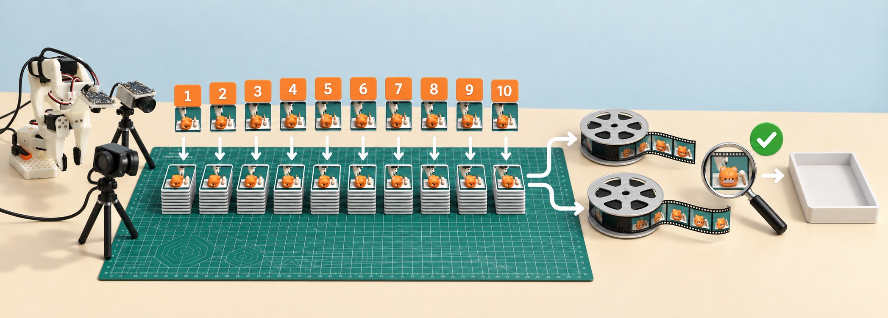

*图：采集阶段优先异步保存逐帧PNG；累计10条后暂停采集，统一编码两路视频并验收，再进入下一批。独立批次把一次故障的影响限制在较小范围。*

```text
采 episode 0…9：异步写 PNG → 第10条结束：统一编码两路视频 → 校验 → 下一批
```

这里“不实时压缩”指不实时编码视频；PNG 自身也是图像压缩格式。后台写图不等于零 I/O 开销。1080p 双路原始中间帧会占很多空间，定期 `df -h "$LAB_ROOT"`。

正常退出时，不足十条的尾批也会尝试编码。日志 `remaining 7 episodes, 0 to 6` 表示只有七条已保存 episode；旁边 `Batch encoding 10 videos` 可能显示配置批量大小，不能据此认为有十条成功演示。以最终 metadata 和视频验收为准。

目前脚本在编码阶段会等待；它没有实现“编码上一批同时采下一批”。后续可用独立 worker 与持久化任务队列优化，但要先确保帧写完、原子提交和失败重试，不应简单在 finalize 后面加 `&`。

编码阶段GPU或机械臂暂时闲着是当前设计的正常现象。不要在同一数据目录同时启动第二个record进程，也不要在编码器仍读取PNG时移动或清理临时帧。判断编码完成要看进程正常退出、视频存在且能解码、metadata已更新三项，而不是只看日志出现`Encoding`。

**本实验环境有一项不能遗漏的已安装补丁。** 批编码曾在`self._meta.episodes[start_episode]`处报None。机器人工作站现有`dataset_writer.py`在读取索引前先调用`self._meta._close_writer()`，再用`load_episodes(self._root)`刷新内存元数据，避免读取仍处于缓冲/未刷新状态的episode信息。不能假设在另一台机器只安装同版本号就自动具有此补丁。首次在新环境采一小批，确认最终编码和验收通过，再扩大规模。补丁片段和适用范围见[核验记录第4节](../evidence/spark-readonly-audit.md#4-找到的批编码补丁)；不要在正在采集的进程里修改库文件。

### 4.4 键盘与中断

LeRobot 录制常用：右箭头提前结束当前 episode/重置阶段，左箭头丢弃并重录当前条，Esc 结束采集。以当前版本终端提示为准。远程 SSH/headless 下全局键盘监听可能不可用，先用一条短演示验证；不要在听不到按键时连续按退出键。

按 Esc 后等待编码和正常退出。不要用 `kill -9` 结束正在保存的数据。对于异常中断，只能在检查后判断可保留多少条。

旧单数据集模式支持 `sh scripts/collect-data.sh --resume`，但它不是“跳到第20条”的万能开关，也不能和独立批次参数混用。批次 1、2 完整时从 batch 3 开始最简单；半批失败应先备份和检查，不能删了重录来掩盖丢失。

“按键没反应”可能与窗口焦点、中文输入法或SSH键盘监听有关。浏览器终端还容易把按键送进其他输入框。紧急停机仍依靠现场断电手段，不能等待Python处理Esc。

### 4.5 数据质量：文件完整与动作有效是两回事

```bash
# [机器人工作站] 单个、多个、范围都支持。
python scripts/check-data.py 1 --base-root "$BASE_DATASET_ROOT" --repo-prefix "$BASE_REPO_ID"
python scripts/check-data.py 1 3 5-8 --base-root "$BASE_DATASET_ROOT" --repo-prefix "$BASE_REPO_ID"
python scripts/check-data.py 1-8 --base-root "$BASE_DATASET_ROOT" --repo-prefix "$BASE_REPO_ID"
```

脚本检查 metadata、episode/frame 连续性、Parquet、视频引用、遗留 PNG，并抽样解码每条的中间帧。**`[OK]` 不是每一帧已完整解码，更不是任务成功标签**。再人工看开头、抓取、三次敲击、放回与结尾。需要逐文件完整解码可执行：

```bash
find "${BASE_DATASET_ROOT}_batch_001/videos" -name '*.mp4' -exec \
  ffmpeg -v error -xerror -i {} -f null - \;
```

还应比对视频中的夹爪开合时刻与 state/action 时间序列，检查是否错位。成功回放一条只能证明该条的部分控制链工作，不代表所有数据都没问题。

每批至少抽看第一条、最后一条和一条随机episode的完整双路视频，再重点看所有异常或过短episode。`[OK]`解决“数据结构是否像数据集”，人工复核解决“这是不是我要模型模仿的行为”；两者缺一不可。

### 4.6 合并数据时，索引也要一起处理

```bash
python scripts/merge_batches.py \
  --base-root "$BASE_DATASET_ROOT" --repo-prefix "$BASE_REPO_ID" --batches 8 \
  --output "$MERGED_ROOT" --repo-id "$DATASET_REPO_ID"
```

脚本调用 LeRobot 聚合 API，保留原批次，重建合并索引，禁止覆盖已有目标。这里保留各视频文件而不再拼成长视频，减少不必要的再次处理。合并必须同时更新 episode、frame、任务、视频引用和统计；目录拷贝不是数据集合并。[官方数据工具](https://huggingface.co/docs/lerobot/using_dataset_tools)

```bash
python - "$MERGED_ROOT" "$DATASET_REPO_ID" <<'PY'
import sys
from lerobot.datasets.lerobot_dataset import LeRobotDataset
d = LeRobotDataset(sys.argv[2], root=sys.argv[1], video_backend='pyav')
print('episodes', d.num_episodes, 'frames', len(d), 'fps', d.fps)
for i in (0, len(d)//2, len(d)-1):
    x = d[i]
    print(i, x['observation.state'].shape, x['action'].shape,
          x['observation.images.wrist'].shape, x['observation.images.side'].shape)
PY
```

对本次原数据应是 80 episodes / 50,596 frames / 30 FPS / 两路视频。新采集的帧数当然可以不同。

本实验机器人工作站上实际保留的原合并数据名为`qiaomuyu_search_dual_v1_80_fixed`，V3重标注版为`qiaomuyu_search_dual_v1_80_follower_future4`；本文`qiaomuyu_80`是新流程的示例名，不要混淆。只读数据核验遍历了V3全部50,596行，确认同episode的future4映射、全局action均值和标准差都匹配；这不替代视频与任务质量检查。

判断合并是否完整，可对照原批次核对episode和frame总数、连续索引、双路解码、任务引用及统计。原批次提供回溯依据，确认合并结果前应保留。

### 4.7 打包上传Featurize：先数据，后开收费机器

```bash
# [机器人工作站] 已有 MP4 再 ZIP 压缩收益有限，-0 存储模式更快。
cd "$(dirname "$MERGED_ROOT")"
zip -0 -r qiaomuyu_80.zip "$(basename "$MERGED_ROOT")"
sha256sum qiaomuyu_80.zip
```

```bash
# [Mac] 按实际目录调整远程路径。
export MAC_TRANSFER_ROOT=/path/to/qiaomuyu-transfer
export ROBOT_DATA_ROOT=/path/to/remote-datasets
mkdir -p "$MAC_TRANSFER_ROOT"
scp "oopslink@ROBOT_HOST:$ROBOT_DATA_ROOT/qiaomuyu_80.zip" "$MAC_TRANSFER_ROOT/"
shasum -a 256 "$MAC_TRANSFER_ROOT/qiaomuyu_80.zip"
```

在已登录 Featurize 的浏览器进入“我的数据集”，点击上传区的“点击此处”，选这个合并 ZIP；等待传输完成，完善名称/描述/可见性，确认列表显示可下载。**不是选 batch_005.zip，也不是只看进度条开始走就启动实例。** 用 Codex 操作 UI 时先切换英文输入法；不要把一段 URL 和终端命令连在同一行。

然后选择可用的目标机型，镜像 `LeRobot Pi0 training Env`。本实验 V1/V2 用 A6000，V3 因缺货使用 PRO 6000 96GB。实例启动后在网页终端执行平台给的新数据集下载命令：

```bash
# [Featurize；把占位值替换成刚上传的数据集ID]
mkdir -p "$CLOUD_DATA_ROOT/qiaomuyu-import"
cd "$CLOUD_DATA_ROOT/qiaomuyu-import"
featurize dataset download YOUR_DATASET_UUID
ls -lh
# 使用下载命令实际输出的 ZIP 路径，解压到一个新的目录。
unzip qiaomuyu_80.zip -d "$CLOUD_DATA_ROOT/"
```

再次核对 ZIP 哈希及解压后的 `meta/info.json`。如果平台下载文件名不同，不能照抄不存在的文件名。

可选上传 HF 数据集备份，在机器人工作站项目根目录重新加载配置，执行：

```bash
source config/lab.env
unset HF_HUB_OFFLINE TRANSFORMERS_OFFLINE
hf auth login
python - <<'PY'
import os
from huggingface_hub import HfApi
api = HfApi()
repo = os.environ['DATASET_REPO_ID']
api.create_repo(repo_id=repo, repo_type='dataset', private=True, exist_ok=True)
assert api.dataset_info(repo).private, 'Existing dataset is not private'
api.upload_folder(repo_id=repo, repo_type='dataset', folder_path=os.environ['MERGED_ROOT'])
print('dataset commit:', api.dataset_info(repo).sha)
PY
```

不要把 token 写进 shell 脚本或截图。HF备份不是Featurize上传成功的证据，两个目标应分别核验。

传输完成的判断标准是三端可核对：机器人工作站生成包的哈希、Mac中转包的哈希一致；Featurize实际下载并解压后能读取80 episodes/两路视频。网页显示“已上传”只证明平台收到了文件，不证明ZIP内部是合并数据或可训练数据。

### 4.8 数据阶段常见疑问

- **80条是80帧吗？** 不是，是80个完整episode；本实验对应50,596个双相机时刻。
- **失败一次要不要保留？** 成功任务数据中应丢弃；若专门训练恢复，需重新设计任务边界和标签。
- **side相机要不要每条都挪？** 初次先固定。需要视角泛化时按批次有计划地变化，并为每种视角采足数据。
- **编码时能否同时采下一批？** 当前脚本不能；需要独立worker、任务队列和原子提交，不能只在命令后加`&`。
- **检查脚本显示OK就能训练吗？** 不能。它主要验证结构和抽样解码，仍需人工看动作是否完整、同步和成功。
- **能直接把八个目录压成一个ZIP吗？** 那是文件打包，不是LeRobot数据集合并；episode和视频索引必须重建。

## 5. 模型训练：微调、监控、打包与发布

训练经历了多轮迭代，也让我们重新认识了“模型成果”：除了权重，还包括配置、tokenizer、处理器、统计和训练记录。后来的关键故障就出在这些配套文件上。

### 5.1 云镜像与实际训练环境的差距

云镜像提供了起点，但实例上的驱动、依赖、数据路径和磁盘仍会影响训练能否启动。下面是我们整理的检查入口。

以下参考命令假设项目脚本已通过Featurize文件页面上传到`<CLOUD_PROJECT_ROOT>`，并在网页终端执行：

```bash
export CLOUD_WORK_ROOT=/path/to/cloud-work
export CLOUD_DATA_ROOT=/path/to/cloud-data
export CLOUD_PROJECT_ROOT="$CLOUD_WORK_ROOT/so-arm101"
export CLOUD_VENV_ROOT="$CLOUD_WORK_ROOT/lr312"
cd "$CLOUD_PROJECT_ROOT"
bash scripts/ensure-featurize-pi0-env.sh --help
bash scripts/ensure-featurize-pi0-env.sh
# 使用脚本报告的解释器激活环境；本实验为下面这个路径。
source "$CLOUD_VENV_ROOT/bin/activate"
nvidia-smi
python -m pip check
python -m pip freeze > "$CLOUD_WORK_ROOT/requirements-freeze.txt"
```

检查 CUDA 可用、真实 GPU 型号、空闲磁盘和可导入的 π0。已有工作环境中的 torch 不应随意升级。需要 HF 访问权限时交互执行：

```bash
unset HF_HUB_OFFLINE TRANSFORMERS_OFFLINE
hf auth login
hf auth whoami
```

若 PaliGemma tokenizer 的官方仓库需要许可，先在浏览器同意对应许可。W&B 在本文默认禁用，既不要求充值，也不需要 API key。

再从训练机实际打开数据，而不是只执行`ls`：

```bash
# [Featurize；替换用户名，路径应与4.7节的实际解压结果一致]
export DATASET_REPO_ID=YOUR_HF_USERNAME/qiaomuyu_80
export DATA_ROOT="$CLOUD_DATA_ROOT/qiaomuyu_80"
python - "$DATA_ROOT" "$DATASET_REPO_ID" <<'PY'
import sys
from lerobot.datasets.lerobot_dataset import LeRobotDataset
d = LeRobotDataset(sys.argv[2], root=sys.argv[1], video_backend="pyav")
print("episodes", d.num_episodes, "frames", len(d), "fps", d.fps)
x = d[0]
print(x["observation.state"].shape, x["action"].shape)
print(x["observation.images.wrist"].shape, x["observation.images.side"].shape)
PY
```

这些检查分别确认GPU型号、CUDA、依赖、数据可读性、磁盘空间和基础模型访问权限；任何一项异常都可能阻止训练。

### 5.2 从实验整理出的训练配置

以下为可复用训练基线。先定义本节的路径名称和用户名，并使用新输出目录。[历史V3配置](../evidence/v3-train-config.json)已将原机器路径匿名化，仅供追溯。

```bash
# [Featurize；已激活环境]
export DATASET_REPO_ID=YOUR_HF_USERNAME/qiaomuyu_80
export DATA_ROOT="$CLOUD_DATA_ROOT/qiaomuyu_80"
export RUN_DIR="$CLOUD_WORK_ROOT/outputs/qiaomuyu_pi0_30000"
export RUN_LOG="$CLOUD_WORK_ROOT/qiaomuyu_pi0_30000.log"
export RUN_PID="$CLOUD_WORK_ROOT/qiaomuyu_pi0_30000.pid"
export METRICS_FILE="$CLOUD_WORK_ROOT/metrics.csv"
export MODEL_REPO_ID=YOUR_HF_USERNAME/qiaomuyu_pi0
export WANDB_MODE=disabled
test ! -e "$RUN_DIR" && test ! -e "$RUN_LOG" || { echo 'Choose a new run path'; exit 1; }
nohup lerobot-train \
  --dataset.repo_id="$DATASET_REPO_ID" --dataset.root="$DATA_ROOT" \
  --dataset.video_backend=pyav \
  --policy.type=pi0 --policy.pretrained_path=lerobot/pi0_base \
  --policy.repo_id="$MODEL_REPO_ID" --policy.push_to_hub=false \
  --policy.device=cuda --policy.dtype=bfloat16 \
  --policy.gradient_checkpointing=true --policy.compile_model=false \
  --policy.freeze_vision_encoder=false --policy.train_expert_only=false \
  --output_dir="$RUN_DIR" --job_name=qiaomuyu_pi0_30000 \
  --steps=30000 --batch_size=2 --num_workers=4 \
  --log_freq=10 --save_freq=5000 --save_checkpoint=true \
  --wandb.enable=false --env_eval_freq=0 --eval_steps=0 \
  > "$RUN_LOG" 2>&1 &
echo $! > "$RUN_PID"
```

参数采用 π0 官方训练接口；gradient checkpointing 用额外计算换显存，bf16 是数值格式，batch size 是每步的样本数。`compile_model=false` 降低首次排查复杂度，验证稳定后再单独测试编译性能。保存频率 5000 是本文的磁盘折中，不是已经测出的最优值。[π0 官方训练参数](https://huggingface.co/docs/lerobot/pi0)

理解训练量时，有四个容易混淆的数字：

| 名词 | 含义 | 容易误解成什么 |
|---|---|---|
| frame | 一次带时间戳的观测/动作记录 | 一条完整演示 |
| episode | 从起点到终点的一次完整示范 | 一张图片 |
| batch size | 一次参数更新使用多少个训练样本起点 | 数据集总批次数 |
| step | 优化器完成一次参数更新 | 机械臂执行一步或看完一个episode |
| checkpoint | 某个step保存的模型及可能包含的训练状态 | 已经可以部署的最终发布包 |

30000 steps会反复抽取数据片段。训练太短可能拟合不足，太久可能过拟合；是否继续应结合独立验证和真机成功率。

完整训练会保存配置；立刻归档 `train_config.json`、`pip freeze`、基础模型版本和数据哈希。若要严格复现基础模型，先下载指定 commit 到本地，再把 `--policy.pretrained_path` 指向该目录，不能用浮动的 `main` 当成固定版本。

日志出现实际step后，确认只有一个训练PID。`nohup`可让进程在终端关闭后继续，但实例关机仍会中断训练。

### 5.3 loss怎么看、如何本地记录

```bash
tail -n 35 "$RUN_LOG"
ps -p "$(cat "$RUN_PID")" -o pid,etime,%cpu,%mem,args
nvidia-smi --query-gpu=name,utilization.gpu,memory.used,memory.total,temperature.gpu --format=csv
python scripts/metrics_from_log.py "$RUN_LOG" "$METRICS_FILE"
```

脚本不依赖 W&B，可随时重新运行读取完整日志。它保留显示步数；日志中 `8K` 等缩写只得到近似步数，并标记 `step_is_approximate`。不要用“第几行×10”无条件推算精确步数，续训或缺行会错。需要精确实验曲线时，应在训练 logger 记录未缩写的整数 step，而不是事后猜。

loss 的短期波动并不自动意味着训练失败。π0 的动作生成训练含随机性；要结合趋势、学习率、梯度范数、速度、显存和独立任务成功率。loss 在归一化训练空间中，不能读作“夹爪误差 0.1 毫米”。

每小时检查进程、日志更新时间、step 增长及 GPU。OOM 通常是显存不足；NaN 是数值异常；“GPU 低利用率”也可能是解码/磁盘瓶颈。不要发现停止就立刻再启动第二份训练。

健康训练应持续增加step，loss和梯度为有限数，显存稳定，checkpoint正常保存。loss没有通用及格线，任务能力需另行验证。

### 5.4 中断后续训

先确认原进程已退出，找到**包含 training_state 的完整 checkpoint**。示例从第 5000 步恢复，实际路径以 `find "$RUN_DIR/checkpoints" -name train_config.json` 为准：

```bash
lerobot-train \
  --config_path="$RUN_DIR/checkpoints/005000/pretrained_model/train_config.json" \
  --resume=true --batch_size=1 --wandb.enable=false \
  > "$CLOUD_WORK_ROOT/qiaomuyu_resume.log" 2>&1
```

这是 OOM 后改 batch 1 的恢复示例，不是常规重复启动命令。确认日志中的恢复步数、优化器和调度器加载成功；更改 batch 会改变后续优化轨迹。只有 `model.safetensors` 的最终发布包不能精确恢复优化器训练。

恢复前保留原日志并记录停止原因。进程尚在但长期无step时，先查GPU、I/O和日志；确认旧训练状态已加载且步数接续增长，才算续训成功。

### 5.5 训练结束不等于发布完成

早期的一次误会来自`Training 1/1`：它只代表一步测试完成。判断正式训练是否结束，需要结合`End of training`、实际步数和checkpoint，目录名里的30000不能作为依据。

发布包至少应包含：

```text
release/
  config.json
  model.safetensors
  train_config.json
  policy_preprocessor.json
  policy_postprocessor.json
  前后处理配置所引用的 *.safetensors 统计文件
  tokenizer/                 官方同款 tokenizer 的本地文件
  training.log
  metrics.csv
  SHA256SUMS
```

**tokenizer 可以从对应官方模型下载；训练模型的 postprocessor 必须来自本次训练，不能用官方空模板覆盖。** “官方”只说明来源，不说明适合当前动作分布。下图是这次实验最关键的教训：

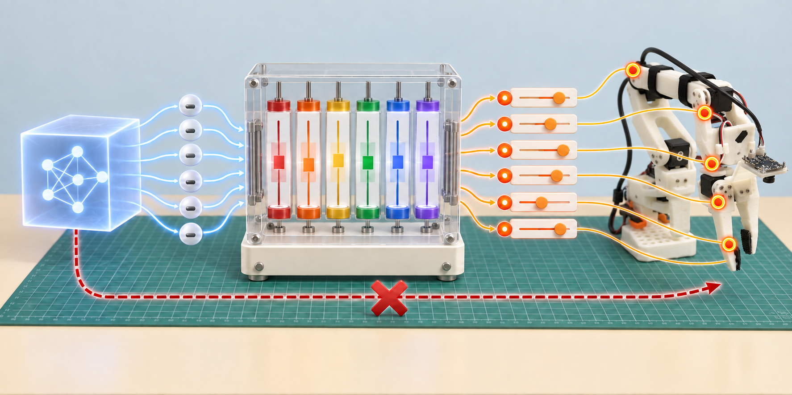

后处理缺少本次action统计时，归一化输出可能被当成真实关节值，表现为模型能加载却停在零位附近。因此发布验证必须检查数值转换。

### 5.6 下载tokenizer、保留训练处理器

```bash
# [Featurize；联网阶段]
export TOKENIZER_DIR="$CLOUD_DATA_ROOT/pi0_tokenizer"
python - <<'PY'
import os
from transformers import AutoTokenizer
t = AutoTokenizer.from_pretrained('google/paligemma-3b-pt-224')
t.save_pretrained(os.environ['TOKENIZER_DIR'])
PY
```

这里应与训练时使用的 tokenizer 一致，并记录其 revision；若训练用的是其他 tokenizer，不要机械照抄 PaliGemma 名字。

```bash
# 先生成指标，再使用实际最终 checkpoint 路径。
cd "$CLOUD_PROJECT_ROOT"
python scripts/metrics_from_log.py "$RUN_LOG" "$METRICS_FILE"
export FINAL_CHECKPOINT="$RUN_DIR/checkpoints/030000/pretrained_model"
export RELEASE="$CLOUD_WORK_ROOT/releases/qiaomuyu_pi0_30000"
python scripts/package_release.py \
  --checkpoint "$FINAL_CHECKPOINT" --tokenizer "$TOKENIZER_DIR" \
  --output "$RELEASE" --log "$RUN_LOG" --metrics "$METRICS_FILE"
python scripts/verify_release.py "$RELEASE" --load-weights --write-manifest
```

验证脚本不连接机械臂，强制离线，并检查真实后处理流水线：零值是否还原为 action mean，正负单位值是否还原为 mean±std，二维/动作块输出是否有限。本检查适用于本实验六维、绝对动作、MEAN_STD 配置；其他动作表示应另写对应测试，不能硬改断言让它过。

它验证“能加载、统计被正确使用”，不验证“会抓敲棒”。后面仍需数据帧预测和真机验收。该脚本用于防止发布配置回归；现有记录只核验了磁盘配置和历史日志，没有重新执行其GPU/模型集成测试。

发布包必须包含匹配的tokenizer和训练处理器。复用旧处理器前，须验证特征顺序、配置和统计一致。

### 5.7 上传私有HF仓库并核验

```bash
unset HF_HUB_OFFLINE TRANSFORMERS_OFFLINE
python - <<'PY'
import os
from huggingface_hub import HfApi
api = HfApi()
repo = os.environ['MODEL_REPO_ID']
api.create_repo(repo_id=repo, repo_type='model', private=True, exist_ok=True)
assert api.model_info(repo).private, 'Existing repository is not private; stop before upload'
api.upload_folder(repo_id=repo, repo_type='model', folder_path=os.environ['RELEASE'],
                  ignore_patterns=['.cache/**'])
info = api.model_info(repo)
print('private:', info.private, 'commit:', info.sha)
print('\n'.join(api.list_repo_files(repo_id=repo, repo_type='model')))
PY
```

记录返回的 commit hash。下载到新目录再校验，可发现上传遗漏。不能只看网页出现仓库名就退还实例。旧模型如果修了 postprocessor，必须生成新 manifest、重新上传并记录新 commit，否则 HF 与 机器人工作站 会是两份不一致的“同名模型”。

```bash
# [Mac；新终端，已安装 huggingface_hub CLI 并 hf auth login]
export MAC_MODEL_ROOT=/path/to/models
df -h "$HOME"
export MODEL_REPO_ID=YOUR_HF_USERNAME/qiaomuyu_pi0
export MODEL_REVISION=PASTE_VERIFIED_COMMIT_HASH
hf download "$MODEL_REPO_ID" --revision "$MODEL_REVISION" --local-dir "$MAC_MODEL_ROOT/qiaomuyu_pi0"
cd "$MAC_MODEL_ROOT/qiaomuyu_pi0"
shasum -a 256 -c SHA256SUMS
```

在Mac绘制这次下载的训练指标（在文档项目里执行）：

```bash
export MAC_PROJECT_ROOT=/path/to/so-arm101
cd "$MAC_PROJECT_ROOT"
python3 -m venv .venv-docs
source .venv-docs/bin/activate
python -m pip install matplotlib numpy
python scripts/plot_metrics.py "$MAC_MODEL_ROOT/qiaomuyu_pi0/metrics.csv" reports/training-metrics.png
open reports/training-metrics.png
```

云端训练结束、私有仓库上传并核验成功后，通过 Featurize “退还/释放实例”停止租用；仅退出终端不等于退还。确认页面状态。若制作可复用镜像，只保留环境和脚本；必须先移除镜像中的凭据、缓存登录、shell 历史里的密钥、数据和模型，且不能因此删除仅存的成果。没有完成清理审核的镜像不要分享。

模型发布完成的标准是：记录了不可变commit，私有属性正确，新目录能完整下载，`SHA256SUMS`通过，断网状态下能加载权重、tokenizer及前后处理器，训练日志和指标也可追溯。满足后再退还云实例；不要反过来依赖仍在计费的机器作为唯一备份。

### 5.8 训练阶段常见疑问

- **loss波动是不是训练坏了？** 单点波动很常见；先看整体趋势、NaN/Inf、梯度、学习率和独立验证。
- **W&B没有数据，训练是不是停了？** 不一定。本文禁用W&B，进度以PID、日志、CSV和GPU状态为准。
- **OOM后直接重新运行命令可以吗？** 不可以先盲开第二份；确认旧进程退出，再从完整checkpoint恢复，必要时降batch size。
- **tokenizer应该从旧模型复制吗？** 应使用与基础模型/训练配置一致的官方tokenizer并固定revision；不能随手拿另一份微调模型的目录。
- **官方`policy_postprocessor.json`更可靠吗？** 官方base模板没有本任务action统计，不能覆盖训练生成的后处理器。
- **到30000步就一定完成了吗？** 只表示达到训练预算。还要验证checkpoint、打包、离线加载，并最终看任务成功率。

## 6. 真机部署验证：离线检查、回放与闭环推理

真机表现异常后，离线预测、处理器检查和轨迹回放帮助我们逐层缩小范围。下面整理这些诊断方法及参考命令；会运动的操作仍需要现场监护。

### 6.1 模型传回机器人工作站

部署时传输完整发布目录，并固定HF commit，确保使用同一版本。

```bash
# [Mac] 传整个发布目录，不能只传 model.safetensors。
export MAC_MODEL_ROOT=/path/to/models
export ROBOT_MODEL_ROOT=/path/to/remote-models
rsync -av --progress --exclude=.cache "$MAC_MODEL_ROOT/qiaomuyu_pi0/" \
  "oopslink@ROBOT_HOST:$ROBOT_MODEL_ROOT/qiaomuyu_pi0/"
```

```bash
# [机器人工作站；项目根目录、激活环境、source config/lab.env]
(cd "$MODEL_ROOT" && sha256sum -c SHA256SUMS)
python scripts/verify_release.py "$MODEL_ROOT" --load-weights
```

发布目录里的 tokenizer 相对路径应相对模型目录解释，而不是碰巧相对当前终端目录。离线脚本已显式转换成绝对路径；下面真机命令也从模型目录启动，以兼容历史的 `./tokenizer` 配置。不要加载微调 config 后又按里面残留的 base pretrained_path 去加载基础权重。

模型传到机器人工作站后，manifest校验、离线加载和日志中的实际权重路径可以共同确认版本。缓存中的旧模型或`pi0_base`也可能正常加载，因此“没有报错”还不够。

### 6.2 离线预测能排查哪些问题

这一步回答“模型和处理器是否能读取一帧真实数据并产生有限动作”，不回答“闭环是否安全”。它不连接控制板，适合先发现tokenizer路径、图像键名、关节维度和动作量纲错误。

```bash
mkdir -p reports
HF_HUB_OFFLINE=1 TRANSFORMERS_OFFLINE=1 python scripts/pi0_dataset_replay.py \
  --model "$MODEL_ROOT" --dataset "$MERGED_ROOT" --repo-id "$DATASET_REPO_ID" \
  --episodes 1 --frames 0,30,60,90,120,150,180,240,300,360,420,480 \
  --device cuda --output reports/episode1_predictions.json
```

这叫“录制数据帧离线预测”，不是物理仿真。它从真实图片预测动作，并与记录目标比对，不连接机械臂。检查分关节误差和夹爪开合时机；训练集拟合好也不能保证新场景成功。

真正仿真还需机械臂模型、碰撞和质量参数、夹爪接触、木鱼/敲棒资产、相机内外参和与真机一致的动作接口。把 MP4 播放出来不是仿真，直接把真实图片送给策略也不是闭环仿真。首次排查优先离线预测，更容易定位单位/处理器错误。

好的输出应维度正确、没有NaN/Inf、还原后的六个动作处于训练数据和机械行程的合理范围，并随不同帧产生有意义变化。离线预测长期接近完全常数时，先核对实际加载权重、图像输入、任务文字和postprocessor；不要立刻给所有关节硬加偏置。

### 6.3 真机回放如何帮助定位问题

回放直接发送数据集中记录的动作，用来验证“这份数据的动作语义能否在当前标定下重现”。它不调用π0、不看当前相机，也不会寻找被挪动的木鱼，因此只能在与该episode接近的安全初始状态下执行。

执行前清空工作区，并将机械臂和物体摆到接近该episode初始状态。

```bash
# [机器人工作站；会运动] 先摆在能承托的姿态，现场有人准备断电。
# 初始化会短暂关闭扭矩，悬空时可能下坠；300是原始速度寄存器值，不是度/秒。
python scripts/init_safe_speed.py --port "$FOLLOWER_PORT" --speed 300
lerobot-replay \
  --robot.type=so101_follower --robot.port="$FOLLOWER_PORT" --robot.id="$FOLLOWER_ID" \
  --robot.use_degrees=true \
  --robot.num_read_retries=10 --robot.disable_torque_on_disconnect=false \
  --dataset.repo_id="$DATASET_REPO_ID" --dataset.root="$MERGED_ROOT" \
  --dataset.episode=1 --dataset.fps=30 --play_sounds=false
```

结束后可能保持扭矩，不要直接用手扳动。先支撑机械臂，再按现场停机流程断电。不要把80条连续回放作为第一次验收，也不要随意关闭软件幅度保护来“试试能不能动”。

一条回放平滑且大致重现示范，说明数据动作、关节顺序、单位和当前标定基本相容；它仍不能证明视觉策略正确。回放从第一帧就猛跳、方向相反或夹爪异常时，应停在这一层排查，禁止继续做模型闭环推理。

### 6.4 RTC推理与真机表现

确认离线校验和一条回放都通过，相机没有占用，敲棒和木鱼归位。下面用 RTC 异步动作块推理，先 10 秒受监督测试，确认方向/幅度正常后把 `DURATION` 改 30；需要观察掉落后的表现可改 60，但不要把延时当恢复能力。

```bash
# [机器人工作站；会运动] 必须先阅读本节全部说明。
export PROJECT_ROOT="$ROBOT_PROJECT_ROOT"
export DURATION=10
mkdir -p "$PROJECT_ROOT/reports"
export RUN_TAG=$(date +%Y%m%d-%H%M%S)
export LEROBOT_TRACE_LOG="$PROJECT_ROOT/reports/rollout-$RUN_TAG.jsonl"
python "$PROJECT_ROOT/scripts/init_safe_speed.py" --port "$FOLLOWER_PORT" --speed 300
cd "$MODEL_ROOT"
HF_HUB_OFFLINE=1 TRANSFORMERS_OFFLINE=1 \
python "$PROJECT_ROOT/scripts/pi0_trace_run.py" \
  --strategy.type=base --policy.path="$MODEL_ROOT" \
  --inference.type=rtc --inference.rtc.execution_horizon=10 \
  --inference.rtc.max_guidance_weight=10.0 \
  --robot.type=so101_follower --robot.port="$FOLLOWER_PORT" --robot.id="$FOLLOWER_ID" \
  --robot.use_degrees=true --robot.max_relative_target=5.0 \
  --robot.num_read_retries=10 --robot.disable_torque_on_disconnect=false \
  --robot.cameras="$CAMERAS" --task="$TASK" \
  --device=cuda --fps=30 --duration="$DURATION" \
  --return_to_initial_position=false --display_data=false --play_sounds=false \
  2>&1 | tee "$PROJECT_ROOT/reports/rollout-$RUN_TAG.log"
```

参考命令明确禁用退出自动回位，避免在未检查路径时产生额外动作；这与部分历史实验的自动回位设置不同。初测还设置`max_relative_target=5.0`，将目标限制在当前位置附近（前五关节5°、夹爪5个归一化单位），它会改变实际发送的动作，**不保证防撞**。若持续触发，先检查requested/actual和动作量纲，不要为追求完整流程直接取消限制；现场评估后再单独调整。退出后保持当前姿态/扭矩，现场支撑后安全停机。不要把本节参数误称为历史每次试验完全相同的原命令。

RTC 的核心是执行当前动作块时提前计算下一块，并约束衔接；它不修复坏标签、错误统计或掉落恢复缺失。[官方 RTC 说明](https://huggingface.co/docs/lerobot/rtc) 30 Hz 是目标下发频率，不代表 π0 每秒独立完成30次完整推理。首次加载/预热可能比真正执行时间更长，应看“开始控制”日志，而不是从敲回车就计时。

先观察动作方向和抓取前段，确认正常再延长至完整流程。每次停稳后复盘；延长时间无法修复错误动作或缺失的恢复能力。

诊断日志含 requested、sent、actual、Torque_Enable 和原始位置寄存器。注意 `delta=requested-actual` 是跟随差，不是相邻指令跳变；`actual` 是最近观测缓存，退出阶段可能陈旧。要证明动作块跳变，需要连续带时间戳的 target 序列，不能只看每秒一条的大 delta。

不启动机器人也能看历史诊断图。项目已经归档一份60秒运行记录，可在Mac项目根目录绘制：

```bash
.venv-docs/bin/python scripts/plot_hardware_trace.py \
  evidence/spark/qiaomuyu_pi0_v3_fixed_postprocessor_hardware_trace_60s.jsonl \
  reports/historical-60s.png --max-step 1740
open reports/historical-60s.png
```

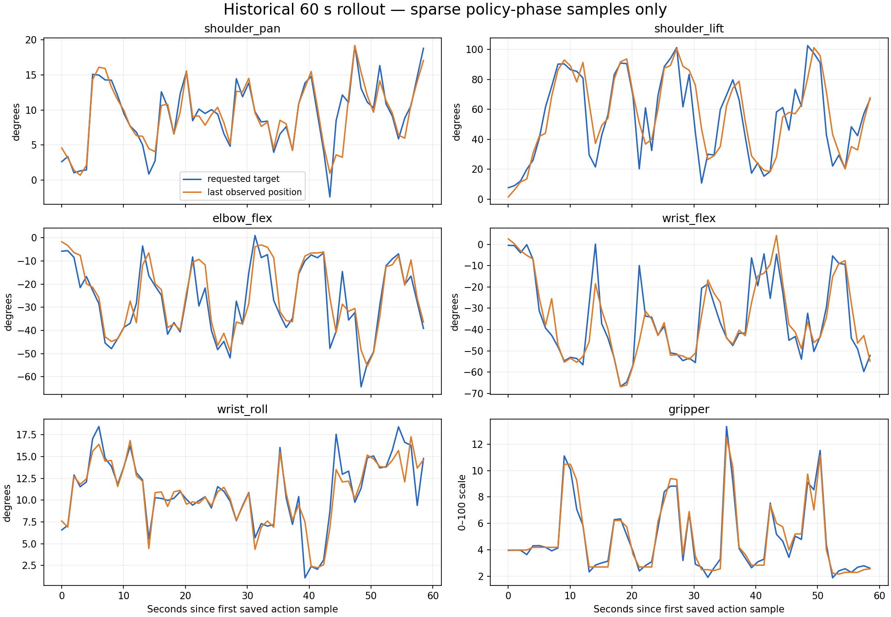

*图：从已归档的60秒JSONL诊断记录生成。它适合观察请求值、实际发送值和舵机反馈的关系，但不能单凭曲线证明抓取或敲击成功。*

`1740`来自对应文本日志对策略阶段和退出回位阶段的划分，不是所有运行通用的阈值。该工具只读JSONL，不导入机器人驱动；它不会使机械臂运动。

### 6.5 当前效果与尚未完成的验证

每次记录：模型 commit、数据版本、相机位置、起始姿态、运行时长、是否找准、是否抓起、是否掉落、是否正好三下、是否放回。第一轮可做10次固定场景，再做10次轻微位置变化，分别统计。

修复后观察到整个流程基本可以完成，但后续仍出现抓起掉落、没找到敲棒。没有严格重复试验的成功率，因此不能写成“稳定100%成功”。

分别记录接近、夹持抬升、敲三下、放回松开和回位的结果，据此定位薄弱阶段。

### 6.6 部署阶段常见疑问

- **模型加载要一两分钟，是卡住了吗？** 首次构建和预热可能很慢；看日志是否仍推进、GPU显存是否变化，以及是否已出现“开始控制”。
- **机械臂完全不动就是模型输出0吗？** 还可能是扭矩未开、串口错误、动作被错误后处理、加载了旧权重或程序尚未进入控制阶段。
- **输出0是否等于物理零位？** 不一定。归一化空间的0通常对应训练动作均值，必须经过正确postprocessor。
- **回放成功是否说明模型训练成功？** 只说明记录动作在当前硬件上可执行；回放没有视觉决策。
- **RTC能修复抓取不流畅吗？** RTC可改善慢速VLA动作块衔接，但不能修复错误标签、缺失抓取停留或错误单位。
- **一次成功能否宣布部署完成？** 不能。固定场景和轻微变化场景都要重复，并按五阶段记录结果。

## 7. 总结：验收标准、故障定位与下一轮改进

### 7.1 故障速查：先定位层次，再决定是否重训

| 现象 | 先查什么 | 正确处理 |
|---|---|---|
| `set: Illegal option -o pipefail` | 脚本解释器 | POSIX脚本用`set -eu`；含Bash语法的用`bash`运行 |
| `h264_nvenc` 打不开 | 编码器构建、驱动与硬件能力 | 本实验用CPU H.264；不是换个GPU名字就一定支持NVENC |
| Foxglove RawImage/CompressedImage冲突 | 同一channel消息类型、旧会话 | 统一压缩设置、重启展示；不需要时关闭display |
| `OfflineModeIsEnabled` | HF离线环境变量 | 下载/鉴权时unset；完整离线验证时再开启 |
| 批编码 `_meta.episodes is None` | 保存/metadata状态、版本 | 保留目录和PNG；检查后恢复，独立批次隔离风险；不承诺一行补丁通用 |
| 停机时id4 Overload | 机械负载、顶死、温度、供电 | 停止动作、支撑检查；保存成功与停机异常分别核验 |
| loss降了但机械臂近乎不动 | 输出量纲、postprocessor、真实加载路径 | 先做零输入→均值测试，检查统计引用，不先加零位补偿 |
| 抬起后抖动 | requested/sent/actual、关节限制、延迟、夹爪 | 分层定位，不仅凭画面断言训练失败 |
| 夹爪抓住后滑落 | 抓取接触、闭合量、示范停留、抬升时机 | 补充稳定夹持及受控恢复示范，不盲目增加夹持力 |
| tokenizer想联网下载 | 文件缺失、相对路径、官方访问权限 | 打包同款tokenizer，显式本地路径，强制离线测试 |
| checkpoint占空间过多 | 优化器状态、多份中间模型 | 保留可续训检查点直到发布核验；只发布推理包不等于可续训包 |

### 7.2 各环节留下什么证据

| 关口 | 必须拿到的证据 | 没通过时回到哪里 |
|---|---|---|
| 设备可用 | 稳定串口/相机路径、权限和供电检查通过 | 2.5连接与权限 |
| 硬件一致 | 单关节遥操作同向连续，相机关键阶段清晰可见 | 第3章硬件校准 |
| 数据可信 | 每批结构检查和人工任务复核均通过 | 4.1–4.5 |
| 合并可读 | episode/frame/视频/统计一致，原批次仍有备份 | 4.6–4.7 |
| 训练健康 | step持续、数值有限、配置/日志/checkpoint可追溯 | 5.1–5.4 |
| 发布完整 | 固定commit、哈希通过、tokenizer和处理器可离线加载 | 5.5–5.7 |
| 真机有效 | 分层验证通过，并在重复独立场景中记录阶段成功率 | 第6章 |

按故障所在层修复：回放方向相反查动作语义和标定，离线加载失败查发布包，各层正常但新场景成功率低再查泛化。

### 7.3 这次实践留下的认识

机械结构决定运动范围，标定连接数值与姿态，相机提供观测，示范决定学习目标，训练更新参数，处理器还原动作，真机验收检验整条链路。

按小规模逐步验收：一条遥操作、一个episode、一批数据、一次短训练、一份离线发布包、一次受监督推理。每一步都留下可查看的结果。

下一轮优先建立独立验收集，补足抓取停留和掉落恢复示范，并在每次发布时检查后处理数值。

详细错误链、真实截图和此次 Codex 协作的反思见[实验记录](02-experiment-log.md)。
