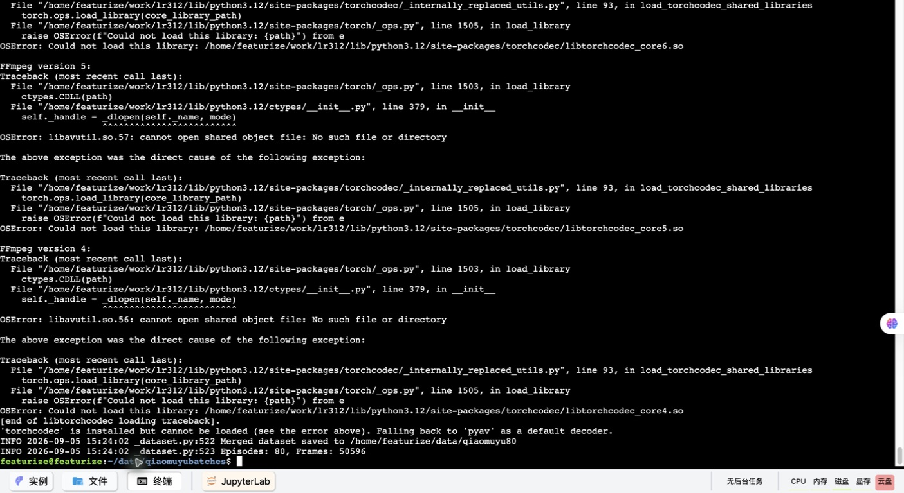
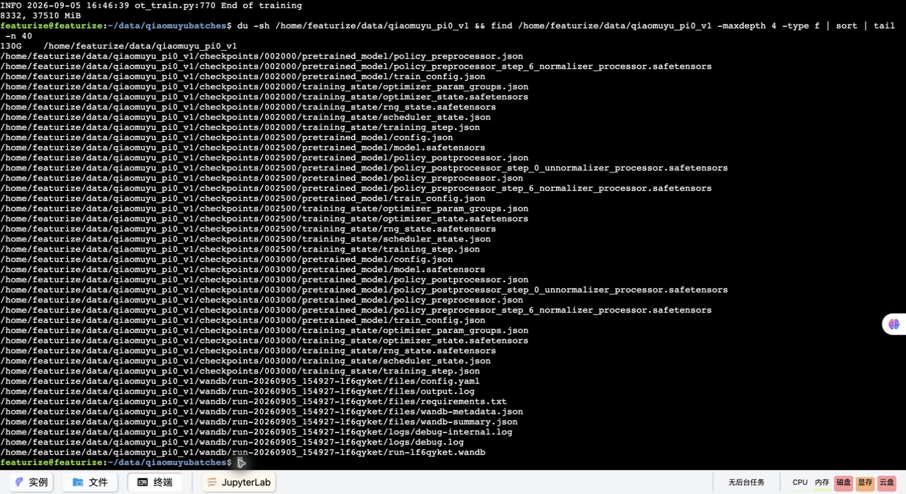
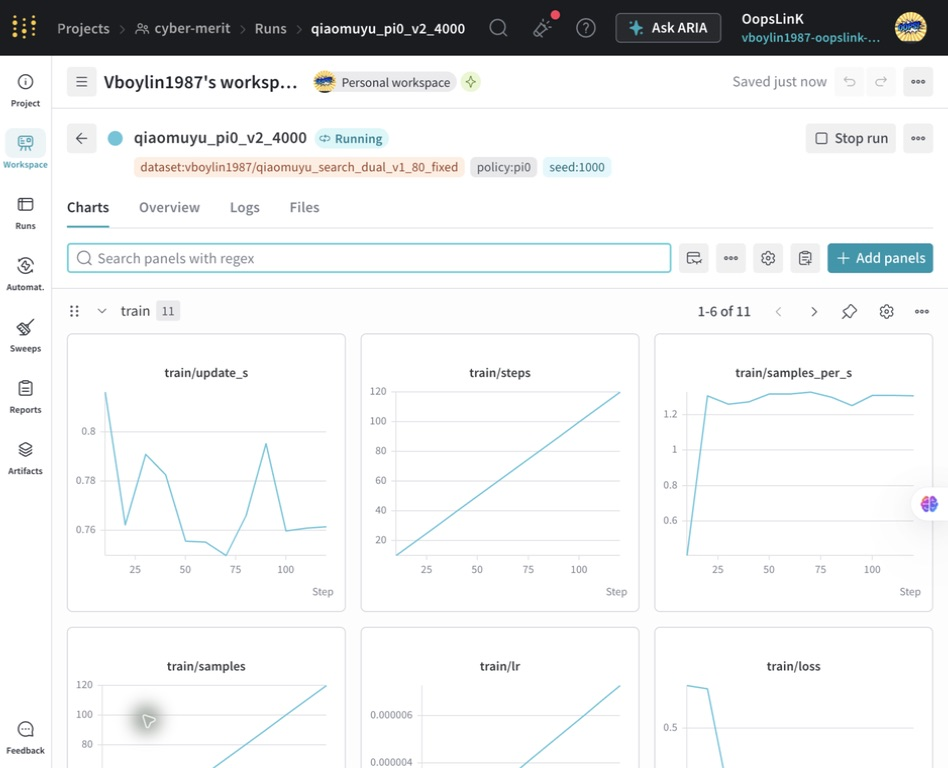
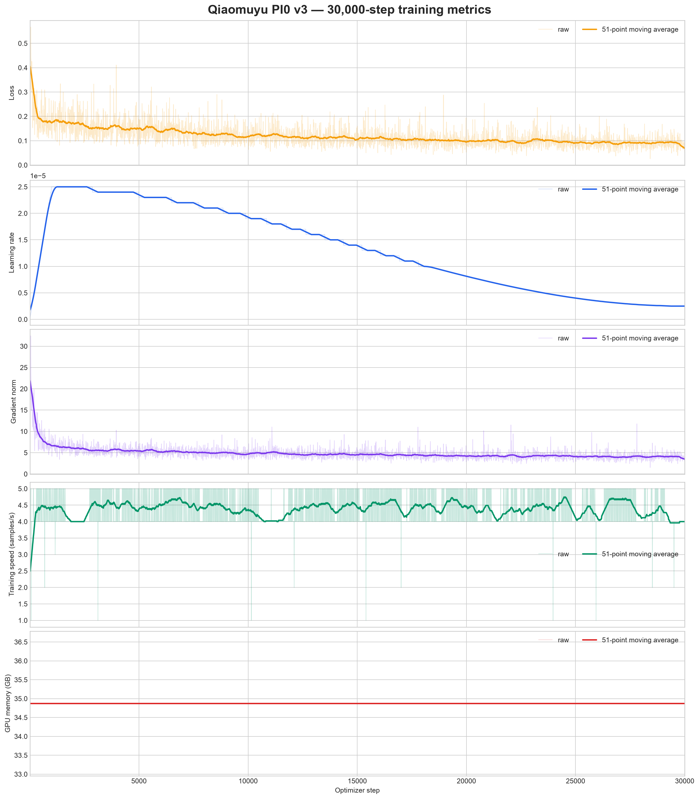

# 实验记录：用 Codex 帮助 SO-ARM101 学会敲木鱼

> 记录日期：2026-09-12。记录依据包括留存脚本、V3发布副本、训练日志/CSV、历史截图和现场观察。这里保留失败与误判，不把迭代过程改写成一次成功的演示。
>
> 结论先行：我们走通了采集、云端微调、发布和真机部署。修复后观察到整个流程基本可以完成，但后续仍有掉棒、找不到敲棒的问题。尚无受控重复试验成功率，不能把“流程跑通”写成“任务已经稳定解决”。

[▶ 观看成品演示视频](assets/demo.mp4)

## 1. 实验目的与系统分工

目标动作链：抬升并观察 → 寻找木鱼和敲棒 → 张开夹爪 → 下降抓取 → 敲木鱼三次 → 放回敲棒 → 回位。

现场操作者负责场景布置、操作主臂采集，以及判断动作是否合理；Codex帮助编写与修改脚本、检查日志和配置、操作云平台界面、跟踪训练、打包传输和分层诊断。Codex不能代替现场观察，也不能从loss或“程序退出0”推断抓取成功。


| 节点 | 承担工作 | 容易混淆的边界 |
|---|---|---|
| SO-ARM101 leader | 人的遥操作输入 | 与 follower 的原始电机值不应直接假定一致 |
| SO-ARM101 follower | 接收关节命令，执行任务 | 需要统一标定、关节顺序和归一化模式 |
| wrist / side 相机 | 提供局部与全局视角 | 能看见目标不等于模型已学会定位/抓取 |
| 机器人工作站（DGX Spark） | 采集、回放、本地推理 | ARM64 软件栈不能照搬 x86 云端虚拟环境 |
| Mac | Codex 操作入口、中转文件、保存图表 | 不应保留脚本中的长期明文凭据 |
| Featurize | GPU 训练 | 数据上传完成后再启动实例；退出终端不等于退还 |
| Hugging Face | 私有数据/模型仓库 | 发布的是完整工件，不只是权重 |

π0 不是一个分步骤的显式状态机。任务文字提供条件，动作模型根据图像和关节状态生成动作块。因此“寻找”“抓取”等阶段能否自然出现，要看训练分布、控制输入和执行反馈，不是提示词里写了就必然完成。

## 2. 迭代总览

以下按事件顺序整理；没有可靠时间戳的真机试验不虚构精确时刻。截图中的服务器日志时区未另行证实，不直接等同于北京时间。

| 阶段 | 实际变化 | 观察到什么 | 应如何理解 |
|---|---|---|---|
| 采集阶段（9月5日起） | 双摄像头，独立批次，每批10条 | 编码、metadata、串口和展示问题 | 先解决工程完整性 |
| V1 | A6000，先1步测试，再3000步 | 初次部署没有完整预期动作 | 1步结束不是正式训练完成；loss不能单独解释失败 |
| V2 | 合并80条，目标由4000延长至30000 | 仍有抬升卡住、抖动、抓取不明显 | 训练量增加未消除整个部署链的可能错误 |
| V3（9月9日训练） | follower未来4帧监督，PRO6000 96GB，batch2，30000步 | 本地指标下降，但最初真机近乎不动 | “权重学坏”当时并非已证实结论 |
| 分层诊断 | 真机回放、数据帧预测、检查处理器 | 找到空postprocessor未绑定训练统计 | 有直接配置与代码证据的根因 |
| 修复后 | 恢复action特征与state_file，短时RTC推理 | 观察到基本能完成流程，仍有掉棒 | 控制链显著改善；泛化与抓取稳定性待量化 |

HF 历史仓库：V1 `vboylin1987/qiaomuyu_search_dual_pi0_v1`，V2 `…_v2`，V3 `vboylin1987/qiaomuyu_search_dual_pi0_v3_follower_future4`。这些是实验标识，不是读者可匿名访问的公开模型。

## 3. 从采集故障到可管理的80条数据

### 3.1 最初想一次采很多，实际先被编码阻塞

初期错误：

```text
Encoder thread for observation.images.wrist crashed
[Errno 22] Invalid argument: avcodec_open2(h264_nvenc)
```

问题发生在图像编码器打开阶段，不等于摄像头没有画面。最终脚本使用 CPU H.264，`preset=ultrafast`、`crf=23`、两条编码线程，先避免依赖 NVENC。我们没有足够证据把它泛化成“所有 DGX Spark 都不支持 H.264 硬编码”；具体能力取决于硬件、驱动和 FFmpeg/PyAV 构建。

随后将采集流程改成“每条只异步保存PNG，累计10条再统一编码”。脚本设置`streaming_encoding=false`、`video_encoding_batch_size=10`，每相机4个写图线程。第10条结束会暂停编码，不足10条正常退出时也会flush。它解决的是实时控制被视频编码占用的问题，而不是实现了完全无阻塞采集。

### 3.2 展示链也会让录制报错

出现过：

```text
TypeError: 'RawImage' object is not an instance of 'CompressedImage'
```

调用链位于 Foxglove 图像日志，不是策略训练。后来采集脚本增加 `--display` 开关，默认关闭，并统一压缩图像模式。启用展示时应保持 channel 类型一致，必要时关闭旧展示会话再启动。诊断图像可视化有价值，但不应让它成为必需采集路径上的单点故障。

### 3.3 shell、离线模式和串口的三个小坑

- `./collect-data.sh: 2: set: Illegal option -o pipefail`：用 `sh` 执行了 Bash 专属选项。脚本改为 POSIX `#!/bin/sh` 和 `set -eu`。
- `OfflineModeIsEnabled`：录制/恢复过程需要查询 HF refs，但环境设置了离线模式。联网阶段解除 `HF_HUB_OFFLINE`；模型工件准备齐全后再用离线模式验证部署。不能用“永久离线”解决所有网络问题。
- `/dev/ttyACM1`总变：主从臂改用`/dev/serial/by-id`。后续保持端口配置不被脚本随意改写，并使用设备身份而非临时枚举编号。

### 3.4 最难受的采集错误：保存到第10条时才崩溃

```text
Batch encoding 10 videos for episodes 0 to 9
chunk_idx = self._meta.episodes[start_episode]["data/chunk_index"]
TypeError: 'NoneType' object is not subscriptable
```

异常随后在 `VideoEncodingManager.__exit__` 和 `finalize()` 中重复，最后出现 `FATAL: exception not rethrown`。这条堆栈说明批处理编码需要的 episode metadata 不可用；但仅凭堆栈不能安全指定某个通用修复语句。

部署代码显示，修复是在`_batch_save_episode_video()`读取episode索引前，先关闭metadata writer，再刷新内存中的episode表：

```python
self._meta._close_writer()
self._meta.episodes = load_episodes(self._root)
# 接下来才读取 self._meta.episodes[start_episode] 的索引。
```

其作用是处理“写入尚在缓冲、读取视图没有刷新”的时序问题；部署文件在写回episode信息后也重新加载该表。留存代码可以证明该修复曾用于本实验，但由于缺少修改前的完整文件，无法复原全部diff，也不能保证这两行适用于其他版本或分片布局。片段及路径已归档在[环境与数据核验记录](../evidence/spark-readonly-audit.md#4-找到的批编码补丁)。

历史对话还提到`/tmp`中的代码：它适合临时诊断，不适合唯一保留的运行补丁。应把最终补丁归档项目，记录原文件哈希、适用版本和回归测试，而不是重启后依赖一个可能消失的临时文件。

可确认的稳健化措施是：每10条建立一个独立数据集，先验收，再下一批。一个批次失败不会让全部150条共用一个写入状态。独立批次是风险隔离，不是对底层 bug 已完全消失的证明。

对“前20条还能保留吗”，正确答案必须依赖目录检查：原始PNG、data Parquet、meta、视频引用和实际可解码情况，而不是只看最后一条日志。没有验证之前不能删除旧目录，也不能盲目 resume。

### 3.5 停机过载与数据完整性分开判断

另一次报错在退出时关闭扭矩：

```text
Failed to write 'Torque_Enable' on id_=4 with '0' after 6 tries.
[RxPacketError] Overload error!
```

这是舵机返回的过载状态，需要检查负载、顶死、温度/供电和姿态。即使录制循环已经打印 Stop recording，也不能因此说硬件没问题。数据是否完整另用检查脚本验收；硬件故障不能靠忽略异常变成正常。

### 3.6 最终数据清单

| 批次 | episodes | frames |
|---|---:|---:|
| 001 | 10 | 5,619 |
| 002 | 10 | 6,311 |
| 003 | 10 | 6,427 |
| 004 | 10 | 5,791 |
| 005 | 10 | 7,495 |
| 006 | 10 | 6,887 |
| 007 | 10 | 6,412 |
| 008 | 10 | 5,654 |
| 合计 | **80** | **50,596** |

30 FPS 下约28.11分钟演示，平均每条约21.08秒。两路画面不是把episode数翻倍，而是同一时刻的两种视角。



图1：9月5日早期合并现场。上半屏是 TorchCodec/FFmpeg 共享库加载失败的回溯；底部显示回退 PyAV 后完成合并，`Episodes: 80, Frames: 50596`。这是合并完成的证据，不是“所有视频已逐帧语义验收”的证据。

## 4. Codex 如何协助云端训练

### 4.1 文件传输：界面动作也需要验收

云端操作使用Compute Use接入已登录的Featurize。实际传输路径是机器人工作站→Mac中转→网页文件选择器→Featurize数据集→训练实例下载。

过程中发现文件选择器选中了`qiaomuyu_search_dual_v1_batch_005.zip`，而目标应是合并后的80条数据。教训是：上传开始不代表上传正确；应核对文件名、哈希和解压后的总数。网页上传需要点击上传区后选择文件，终端输入前还要确认已切换到英文输入法。Codex需要读取当前UI状态，再输入并检查结果，不能把“已经发送按键”当成“命令正确执行”。

另有一次把终端URL与 `pgrep` 命令粘连，shell 报 `No such file or directory`。这不是训练失败，而是操作输入错误，应修正命令边界。

### 4.2 镜像不是万能依赖锁

复用`LeRobot Pi0 training Env`镜像时，仍遇到库缺失、版本和动态链接问题。环境脚本逐项检查LeRobot、torch/torchvision、transformers、accelerate、datasets、draccus、safetensors、sentencepiece、HF Hub、PyAV和CUDA/bf16。

本例DGX Spark上还留有 ARM64 的 TorchCodec 0.11.1 + CUDA13、FFmpeg6.1本地共享库、evdev编译所需Python3.12头文件，以及 deepdiff/pynput/pyserial/python-xlib 的安装记录。它们说明本实验并非仅一条 `pip install lerobot` 就适用于所有机器。云端x86环境和本地ARM环境应分别验收并保存 freeze。

项目保留了云端依赖检查脚本，没有归档历史登录或代理脚本，避免传播密钥及与当前环境无关的修改。

### 4.3 先有1步冒烟，再有正式训练

曾出现进度条100%和`End of training`，但对应截图是`1/1`，只证明一步优化与保存能完成，不是正式3000步目标已完成。判断训练完成应同时看配置steps、实际最后step、退出状态、最终工件和可加载性。



图2：V1的3000步训练结束截图，包含 `003000/pretrained_model` 与 `training_state`，目录当时达到约130G。图中不是V3；它说明为什么后续会关注中间checkpoint和优化器占用。

### 4.4 由W&B改为本地指标

前两轮使用 W&B `cyber-merit` 项目，V2初期运行如下：



图3：V2早期 run，名称仍是4000目标，图中只到约120步，不能据此推断最终30000步表现。

后因W&B费用问题，流程改为在本地保存loss、学习率、梯度范数、速度和显存，随模型上传HF，再在Mac画图。监控规则也随之调整，不再登录或检查W&B，训练恢复时也不创建新run。

训练监控从“看仪表盘有没有曲线”转成“进程+日志更新时间+step+GPU+本地CSV”。每小时检查有无停止、OOM、NaN和超过一小时无进展；没有变化本身不是故障，但没有step进展才需要诊断。

## 5. V3真实训练配置与指标

V3发布副本中包含完整`train_config.json`和3000行指标，已分别归档为[训练配置](../evidence/v3-train-config.json)和[训练CSV](../evidence/v3-training-metrics.csv)。因此下面的参数可以直接从文件核对，而不是根据对话推测。

| 项目 | V3实际配置/日志 |
|---|---|
| 数据 | 80条，50,596帧，follower_future4 |
| GPU | PRO 6000 96GB |
| 模型基础 | `lerobot/pi0_base`，commit `25c379b52ba2ff8788cab921758a3cc3fe3f77f2` |
| 训练步数/batch/seed | 30,000 / 2 / 1000 |
| optimizer | AdamW，lr 2.5e-5，weight_decay 0.01，grad_clip_norm 1.0 |
| scheduler | warmup1000，cosine decay30000，最低lr2.5e-6 |
| 精度/省显存 | bfloat16，gradient_checkpointing=true，compile=false |
| 冻结设置 | freeze_vision_encoder=false，train_expert_only=false |
| 动作块 | chunk_size=50，n_action_steps=50，num_inference_steps=10 |
| 输入 | 双路记录1080p，模型image_resolution为224×224，state6维 |
| 动作表示 | 绝对动作，STATE/ACTION使用MEAN_STD |
| 数据加载 | PyAV，workers2，prefetch4，spawn，persistent_workers=true |
| 图像增强/验证 | image_transforms.enable=false，eval_split=0.0，eval_steps=0 |
| 指标/保存 | 每10步日志；W&B关闭；save_checkpoint=false；最终policy-only导出补丁 |

一个新的记录问题也被发现：配置中的 `policy.repo_id` 仍写V2，`job_name` 仍是 `qiaomuyu_pi0_v2_30000`，但实际数据路径和输出目录已经是V3。由于自动push关闭、后续手动上传指定V3仓库，这不直接证明权重上传错了；却使追踪来源更困难。后续应在启动前校验命名一致性，而不是在文档中悄悄把历史字段改掉。

### 5.1 曲线与数字



图4：真实V3 CSV生成的历史图，不是模拟曲线。浅色为原始日志采样，深色为51点平滑。历史CSV的step根据每10步日志顺序恢复；原始日志含 `30000/30000` 进度和终止行，支持训练确实到达30000。若其他训练存在续训或漏行，不应照搬这种步数恢复方法。

| 指标 | 前100条日志均值 | 后100条日志均值 | 最后一条 |
|---|---:|---:|---:|
| loss | 0.21260 | 0.09023 | 0.052 |
| gradient norm | 9.92293 | 4.05869 | 2.961 |
| samples/s（显示值） | 4.32 | 4.04 | 4 |
| update_s | 0.46543 | 0.48100 | 0.474 |

最后学习率2.5e-6，日志 `mem_gb` 为34.87。不要把这条近乎水平的曲线当成整块显卡实时占用：它是训练logger的显存统计口径，应与 `nvidia-smi` 区分。梯度范数大于配置clip阈值也不能单独说明裁剪失效，需确认记录的是裁剪前还是裁剪后范数。

训练进度日志用时约4小时1分30秒。日志中的训练结束为 `2026-09-09 20:14:27`，policy-only导出完成为 `20:17:46`；这里按服务器日志原样记录，不强行转换未确认的时区。

可以说：优化目标明显下降，后期仍有波动；不能说：独立测试成功率已提高到某个数字。没有独立验证集时，训练曲线主要证明训练在优化，不是证明策略已具备稳健闭环能力。

30,000×2 / 50,596 ≈1.19是“按采样起点数计算的名义数据遍历量”。动作块有重叠、样本含多个未来目标，不能仅凭这个数字宣布严重欠拟合，更不能以此解释已经定位的部署处理器错误。

### 5.2 为省空间禁中间checkpoint的代价

V3实际关闭常规checkpoint，通过训练脚本补丁在末尾保存权重、config和前后处理器。它减少了优化器状态的磁盘占用，但也意味着如果训练中途OOM或实例丢失，未必有可用恢复点。自动化里“从可用checkpoint恢复”是条件式策略，不代表当时一定存在checkpoint。

教程改为每5000步保留检查点，最终只发布推理工件。这是本次复盘后的建议，与历史配置明确区分。

## 6. 第三轮训练：改用 follower 未来状态

实验中提出了一个重要问题：leader只是遥控器，特别是夹爪与follower不完全一致，为什么不直接用follower状态学习？

这促成了V3重标注：保持原始图像、状态和时间，动作改成同一episode未来4帧的follower状态；末尾不足4帧使用该episode最后状态。这样监督的是“稍后实际到达的位置”。

它合理地考虑了实际执行轨迹，但有三个不能忽略的限制：

1. 它不是自动证明标准leader指令监督错误。LeRobot控制链中的action可以已经具有统一关节语义，应检查具体记录位置与映射，而不是根据“两个电机型号/读数不同”直接下结论。
2. future4意味着约133ms，不一定等于所有姿态和负载下的真实延迟。改变offset应做对照实验，不能只凭名字判断优劣。
3. 必须重算统计，并正确处理episode边界及跨Parquet分片的episode。

本地旧 `relabel_follower_actions.py` 按各Parquet内的episode处理；对于跨文件episode可能误把文件边界当episode尾，且没有完整更新所有episode级action统计。因此本项目没有把它包装成给小白的一键推荐工具。V3已生成数据的完整性应以实际校验为准，未来新数据重标注应增加跨文件边界单元测试、全局/逐episode统计一致性测试，始终保留原action版本。

**数据数值核验：** 只读遍历机器人工作站中的V3全部Parquet，跨文件按episode/frame重新组织后检查80条、50,596行；`action[t]`与裁剪到episode末尾的`state[t+4]`最大绝对差为0，重算全局action mean/std与`meta/stats.json`最大差也为0。因此这份V3数据通过了上述数值检查。旧脚本的一般性风险与这份具体数据的检查结果应分别陈述；该核验没有重看全部视频，也没有检查所有episode级统计。

此外，“相机画面+当前state→当前state”不是未来动作学习；这种恒等目标可能使模型倾向保持姿态。这个问题促成了有价值的标签实验，但不能把它简化成“follower当前状态就是目标”。

## 7. 真机不动：为什么最初的诊断走了弯路

V3上机后，观察到整个60秒期间都完全没动，跟没上电一样。随后讨论过零位补偿、起始几秒该抬升、原始数据回放、训练数据是否有大量静止段等。

这些方向各有可能，却需要证据分层：

```text
设备是否能通信/有扭矩？
  → recorded action 能否回放？
  → 策略是否加载微调权重？
  → 输入相机/关节/任务是否一致？
  → 输出是否正确反归一化？
  → sent 与 requested 是否不同？
  → 实际位置是否跟随？
  → 最后才讨论训练覆盖与泛化。
```

### 7.1 大量真机 replay 有价值，但也有边界

通过多次回放episode 0、10、8和1，验证了机械臂能够执行录制轨迹。这帮助排除了“设备根本不能运动”这一大类问题。

但 replay 是开环轨迹，不看当下物体位置修正：回放成功不证明模型能视觉定位，也不证明所有图像—状态时间对齐都正确。重复同一条更多次不会自动增加对其他episode的覆盖。更有效的下一步是离线数据帧预测，再比对输入与输出流水线。

### 7.2 限幅、速度限制、扭矩不能混为一谈

历史运行曾持续触发腕关节安全限幅，随后取消软件幅度限制，并使用`init_safe_speed.py --speed 300`。这些是不同层面的东西：

- 软件目标幅度限制：约束下发目标变化或相对当前位置的范围。
- 舵机速度寄存器：限制舵机运动相关速度参数，300是原始单位，不是300°/s。
- torque enable：电机是否主动保持/驱动，不是完整的防碰撞策略。

初始化脚本先关扭矩，读取当前位置，同步目标到当前位置，再逐电机写速度并读回验证，最后上扭矩。它避免某些陈旧目标导致一上电就冲向旧位置，但关扭矩时悬空机械臂可能下坠，必须支撑。

取消限幅并没有修复归一化空间被错当真实关节值的问题。给零位加补偿也可能只是把错误输入推离静止点，不能作为正确发布的替代方案。

## 8. 关键根因：打包时覆盖了训练 postprocessor

### 8.1 直接证据不是“猜训练没学会”

旧 `package_v3.py` 有这行代码：

```python
# 错误示例：不要复用这段打包逻辑。
shutil.copy2(base / 'policy_postprocessor.json', final / 'policy_postprocessor.json')
```

它把本次训练生成的后处理器覆盖成 `lerobot/pi0_base` 的通用模板。覆盖后的文件包含：

```json
{
  "registry_name": "unnormalizer_processor",
  "config": {
    "eps": 1e-8,
    "features": {},
    "norm_map": {"VISUAL": "IDENTITY", "STATE": "MEAN_STD", "ACTION": "MEAN_STD"}
  }
}
```

不仅 `features` 为空，也没有 `state_file` 指向训练统计。与此同时，目录里实际存在7,544字节的 `policy_postprocessor_step_0_unnormalizer_processor.safetensors`。**统计文件在目录里，不代表运行时会自动用它。**

Mac上留存的发布副本仍可看到这个空配置；同一副本的tokenizer配置还残留云训练机路径。这说明“文件已经下载到Mac”不等于“Mac副本已经同步机器人工作站修复”。该副本仅用于证据核对，没有据此修改模型文件或上传HF。

### 8.2 为什么会变成零位附近


图5：以肩抬升统计做数学示意。模型输出是归一化值，缺失反归一化后会以很小的数值进入控制链，不会自动恢复到真实任务所需的关节范围。

本次action统计为（最后一项夹爪为0–100量纲，其余为角度）：

```text
mean ≈ [-4.972, 45.898, -25.110, -23.083, -0.427, 4.599]
std  ≈ [15.020, 42.691, 25.386, 26.811, 11.316, 3.928]
count = 50596
```

不做反归一化时，z=0仍为0。正确后处理时z=0应变成对应mean。肩抬升的例子相差约45.9°，足以改变“是否明显抬起”的表现。这里的数字只用于说明量纲，不是可以直接执行的安全姿态指令。

### 8.3 如何修复

历史修复保留原训练统计，恢复action特征和引用：

```json
{
  "registry_name": "unnormalizer_processor",
  "config": {
    "eps": 1e-8,
    "features": {"action": {"type": "ACTION", "shape": [6]}},
    "norm_map": {"VISUAL": "IDENTITY", "STATE": "MEAN_STD", "ACTION": "MEAN_STD"}
  },
  "state_file": "policy_postprocessor_step_0_unnormalizer_processor.safetensors"
}
```

完整修复配置留在[证据目录](../evidence/v3-postprocessor-fixed.json)，**它只适用于这次六维绝对动作与对应统计，不能覆盖任意模型**。正常流程应该保存训练自动生成的处理器，而不是每轮手改JSON。

历史验证包括：前后处理action统计一致；(1,6)和(1,50,6)形状的零输入还原到均值；输出有限；更新SHA256SUMS。修复后观察到效果明显改善，整个流程基本可以完成。这支持该错误是重要部署根因，而不是仅凭loss推测。

### 8.4 为什么先前的离线验证漏掉了

旧验证主要确认：权重能载入、tokenizer能载入、几个文件存在。这些检查没有真正运行训练的动作反归一化，也没有验证输出单位，所以一个文件齐全但语义错误的发布包照样通过。

新门禁应包括：

1. 固定微调模型路径，不回退基础权重。
2. tokenizer强制本地加载，不能碰巧用缓存掩盖缺失。
3. 前后处理所有 `state_file` 均存在且真实被加载。
4. 绝对MEAN_STD动作的0、±1映射测试，分shape检查。
5. 真实数据帧预测，分别观察关节与夹爪，最终再真机验收。

本项目提供了新的[发布校验脚本](../scripts/verify_release.py)。它用于防止同类回归，不声称等同于完整模型行为验证。

## 9. RTC、30秒与60秒：改善后还剩什么问题

同步推理中观察到控制频率偏低，因此改试LeRobot RTC。这里要区分“网络产生一整块动作的频率”和“控制循环发送其中一帧的频率”。大模型可以在后台产生下一动作块，机械臂以前一块继续运行；RTC还约束块之间的衔接。[官方 RTC 文档](https://huggingface.co/docs/lerobot/rtc)

但是RTC不能替代正确的反归一化，因此早期“换异步还是一样”完全可能。后来观察到 `indexes_diff` / `real_delay` 等警告，也不能仅凭警告宣布动作卡顿根因。需要看队列、真实延迟和连续target序列。

诊断脚本保存 `requested`、`sent`、`actual`、原始Goal/Present与扭矩。它有两个解释限制：

- `delta` 是 requested减最近actual，不是连续两次requested之差，不能直接叫“动作跳变幅度”。
- actual来自最近一次get_observation缓存。自动回位阶段没有刷新时，差值会失真，不能拿它证明电机一直跟随失败。

历史真机测试从30秒扩展到60秒，观察到敲棒拿起后掉落，之后未能重新找到。延长时间可以观察恢复是否发生，但策略如果没有相应恢复示范，不会因为时间够长就产生有效恢复。相机能看见木鱼也不保证敲棒仍清晰可见、接触正确或视角与训练一致。

修复后仍存在的工作重点是：抓取停留与闭合时序、敲棒滑移、局部遮挡、演示多样性和失败恢复，而不是继续声称“模型永远只输出零”。

### 历史60秒日志的可视化补证

以下可视化来自当时留存的原始日志和JSONL，没有为生成图表而重新运行机器人：


图6：2026-09-10历史运行，取step1至1740的59个稀疏采样点，排除了退出回位阶段。蓝线是requested，橙线是最近观测位置；两点之间连线只是辅助阅读，不代表采到了完整30Hz轨迹。夹爪纵轴单独使用0–100量纲。

该次日志显示21:54:06开始加载，21:55:38策略加载完成，21:55:41开始控制，21:56:41停止推理，21:56:45结束。策略加载约92秒与60秒控制窗口应分开。已保存的策略阶段样本中，requested与sent差值为0、扭矩读数均为1；shoulder_lift实际观测范围约1.5°至101.2°，说明该次运行已经不是“始终输出零位”。这不代表每帧均已检查，也不能仅凭关节曲线确认恰好敲了三下或敲棒未掉。

日志中1911次总写入包含自动回位，不能全部用来计算策略控制频率；`so100_follower`文字来自与`so101_follower`共享的配置注册，不能单凭别名断定硬件接错。详细范围和哈希见[只读核验记录](../evidence/spark-readonly-audit.md)。

## 10. 哪些结论需要纠正或保留不确定性

| 曾经容易得出的判断 | 本次复盘后的准确说法 |
|---|---|
| 数据回放能动，所以训练数据全没问题 | 支持机械执行链可用；不验证所有视觉/时间对齐和泛化 |
| 训练30000步才1.19轮，所以一定没学会 | 是名义样本遍历量；不足以解释已确认的后处理错误 |
| leader/follower不同，所以原动作标签一定错误 | 先检查控制映射和记录语义；future4是实验替代目标 |
| 官方postprocessor一定更正确 | 基础模板不是本次训练统计配置，覆盖可能破坏发布 |
| tokenizer和权重加载成功，就能上机 | 还缺处理器、动作量纲、输入映射与离线行为检查 |
| 30Hz等于模型30次/秒重新看图决策 | 是控制目标频率，模型动作块生成可低得多 |
| 大delta证明RTC块跳变 | 该日志是target与缓存测量差，需要额外时序证据 |
| 六维MAE可以标成角度 | 夹爪单位不同，应分关节报告；混合平均不是统一物理误差 |
| 抓取演示停留短是已确认的唯一剩余原因 | 现场观察支持这个改进方向，仍需接触/时序对照实验 |

## 11. Codex协作模式的经验

### 有效的部分

Codex适合把操作需求逐步固化成可维护脚本：可选resume、可选display、N批×M条、稳定设备路径、按范围检查、日志转CSV、离线预测和动作跟踪。它还帮助在多台机器之间保持任务连续性，并通过Compute Use处理已登录的云网页，减少人工反复搬运命令。

但这些便利必须配合证据：截图核对的是哪个版本，启动的是哪个配置，PID是否仍属于同一进程，最终仓库commit是什么，下载后的统计文件是否真的被引用。

### 走弯路的部分

这次最大的流程失误是发布检查不够深入，导致把工程错误过早解释为训练不足。零位补偿、频率变化和反复replay增加了试验次数，却没有直接检查最关键的输出量纲。

另一个失误是配置和任务命名残留V2，真实工件却属于V3；还有临时补丁未在项目中完整留存，复盘无法给出当时精确diff。AI能加快修改速度，也能更快扩大这些不一致，所以必须把“每轮只改一个因素”和“发布清单”制度化。

### 下一轮建议的协作约定

- 每次动作执行前说明这次改变哪些参数，其余保持不变，使用独立日志名。
- 现场观察与Codex提供的代码、日志证据应分别标注；不能把现场判断虚构成程序测量，也不能用日志替代任务结果。
- 先离线测试输入与动作单位，再申请现场真机窗口；不靠取消保护验证模型。
- 云监控只处理明确异常，不重复启动训练，不创建重复run；改为本地指标后停止所有W&B相关步骤。
- 发布顺序固定：工件校验 → 私有上传 → 固定commit下载核验 → 退还实例 → 本地部署验证。
- 凭据用交互登录或密钥管理。对话中曾明文提供的HF/W&B凭据应轮换；本项目不保存它们，也不复制带凭据的登录脚本。

## 12. 实验归档与后续待办

本项目保存了知识总结、脚本、真实训练CSV/曲线、历史配置和关键修复说明。数据数值、部署配置和历史日志均通过留存文件进行只读核验；这些核验没有启动机器人、摄像头、策略推理或训练实例。

**注意发布一致性：** 机器人工作站现存postprocessor已经修复，SHA256为`1411789f6ed6d69f80edaabc01db7a89bba70167bebd79bfd915021c360b8869`，tokenizer也指向机器人工作站本地模型目录。Mac旧副本仍是空postprocessor。HF是否已同步修复不能由本地目录推断，也没有相应仓库核验记录。不要直接把Mac旧副本覆盖回机器人工作站；下一次正式部署应对比三方文件哈希，建立修复后的新release/commit。

真正“完成实验”意味着链路已打通；下一阶段“把它变成稳定系统”还需要：

1. 归一化处理器回归测试和完整发布manifest。
2. 独立场景的重复成功率，分阶段记录失败。
3. 补充抓取确认、滑落和重新抓取示范。
4. 对原action与future4做受控对比，而不是凭一次体验淘汰某种训练方式。
5. 如做仿真，补齐几何、相机、接触和控制接口，而不是把数据帧预测叫仿真。

原理梳理与参考命令见[知识总结和经验分享](01-beginner-guide.md)，材料来源和校验范围见[证据说明](https://github.com/oopslink/so-arm101/blob/main/evidence/README.md)。
