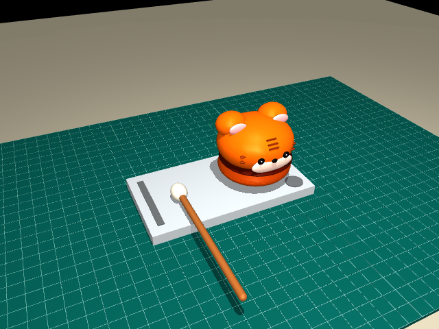
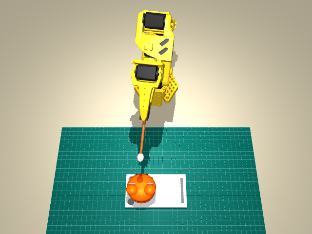
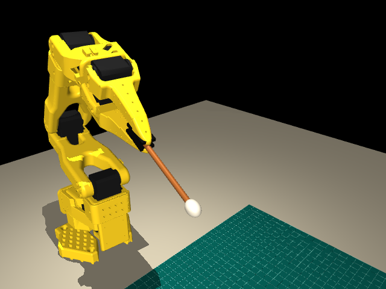
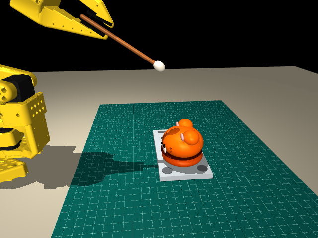
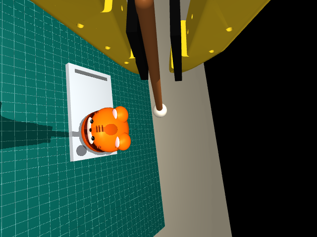

# 使用 MuJoCo 构建 SO-101 木鱼抓握与敲击仿真场景

## 1. 文档目的与建模范围

本文说明如何使用 MuJoCo 构建 SO-101 机械臂敲木鱼的仿真场景，包括建模依据、坐标约定、几何实现、物理参数、相机配置，以及在 macOS 上生成和验证模型的操作方法。读者无需具备机器人学或三维建模经验；文中会在首次使用时解释必要概念。

场景由机械臂、底板、虎头木鱼、木槌、绿色垫板和两个摄像头组成。建模输出分为两类：

| 输出 | 用途 | 物体状态 |
|---|---|---|
| 静态台面模型 | 检查尺寸、外形和静置布局 | 木鱼与木槌固定在设定位置 |
| 接触抓握模型 | 验证夹持、提起、敲击和释放 | 机械臂可运动，木槌为自由刚体 |

接触抓握验证将木杆初始化在夹指之间，由夹爪闭合产生接触力，再执行后续动作。模型不包含从底板接近并拾取木槌的过程，也不模拟木鱼的内部空腔、材料振动或声音。木鱼和底板在动力学模型中固定，敲击不会使它们移动。

本文讨论场景建模与脚本验证。强化学习所需的观测、动作、奖励与训练流程属于上层任务接口，不在本文范围内。



*图 1：按尺寸参数生成的台面模型。木鱼采用基本几何体组合，木槌以静置布局显示。*

## 2. 技术基础与实现结构

### 2.1 MuJoCo 中的模型与状态

MuJoCo 是负责碰撞检测、动力学计算和图像渲染的物理仿真引擎。Python 程序负责生成模型、设置控制目标、推进仿真并读取结果。模型使用 MJCF 描述；MJCF 是一种 XML 格式，可用文本表达形状、位置、关节和执行器。[MuJoCo 建模指南](https://mujoco.readthedocs.io/en/stable/modeling.html)

理解以下对象即可开始建模：

| 对象 | 含义 | 场景中的例子 |
|---|---|---|
| `body` | 刚体节点，定义部件的局部坐标系 | 木槌、夹爪、木鱼 |
| `geom` | 用于显示或碰撞的几何体 | 木杆胶囊体、木鱼椭球壳体 |
| `joint` | 定义刚体相对父节点允许的运动 | 机械臂旋转关节、木槌自由关节 |
| `actuator` | 对关节施加驱动的执行器 | 夹爪位置伺服执行器 |
| `site` | 不参与碰撞的定位标记 | 槌头中心、目标敲击点 |
| `camera` | 图像观察位置和投影设置 | 固定侧相机、臂上相机 |

`body` 按父子关系组成树。没有关节的子刚体相对父节点固定；父节点运动时，它也随之运动。仅把一个物体写成 `body`，不会使它自动获得掉落或滑动的能力。

程序运行时区分两种数据：

- `MjModel` 保存编译后的结构和参数，例如几何尺寸、质量、关节范围。
- `MjData` 保存随时间变化的状态，例如关节位置 `qpos`、速度 `qvel`、执行器控制输入 `ctrl` 和接触结果。

修改几何尺寸或节点结构后需要重新构建模型；正常运行时通过控制输入驱动状态变化。

### 2.2 构建流程

```text
实物尺寸与参考照片
        │
        ▼
tabletop-reference.json ──→ build_tabletop() ──→ 静态台面 MJCF
        │                         │
        │                         ▼
官方 SO-101 MJCF ────────→ build_tiger_model()
                                  │  装配台面、木槌与相机
                                  ▼
grasp-physics.json ──────→ build_grasp_model()
                                  │  配置自由木槌、夹指碰撞与驱动
                                  ▼
                         MjModel + MjData
                                  │
                                  ▼
                         控制、渲染与接触验证
```

静态台面和接触抓握模型共享几何生成代码。接触模型在内存中装配，不以静态生成器输出的 `scene.xml` 作为运行入口。

### 2.3 文件职责

以下路径均相对于仓库根目录：

| 文件或目录 | 职责 |
|---|---|
| [simulation/configs/tabletop-reference.json](../simulation/configs/tabletop-reference.json) | 尺寸、物体位置、台面变换和相机参数 |
| [simulation/configs/grasp-physics.json](../simulation/configs/grasp-physics.json) | 木槌质量、摩擦、夹爪驱动和接触垫参数 |
| [simulation/assets/so101/](../simulation/assets/so101/) | 官方 MJCF、网格、许可证和版本来源 |
| [simulation/assets/tabletop/reference/](../simulation/assets/tabletop/reference/) | 实物参考照片 |
| [tabletop.py](../simulation/wooden_fish/tabletop.py) | 台面几何生成与静态导出 |
| [scene.py](../simulation/wooden_fish/scene.py) | 机械臂、台面与相机装配 |
| [grasp.py](../simulation/wooden_fish/grasp.py) | 接触模型构建、控制及验证 |
| [view.py](../simulation/wooden_fish/view.py)、[play.py](../simulation/wooden_fish/play.py) | 静态查看、动态演示 |
| `simulation/runs/` | 生成的 XML、图片、视频和验证报告 |

配置文件是模型的输入，`runs/` 是可重新生成的输出。持久修改应落在配置或生成代码中；直接编辑输出 XML 会在下一次生成时被覆盖。

## 3. 场景规格与坐标约定

### 3.1 尺寸与单位

照片用于确定轮廓、颜色、构件关系和摆放方向，实测尺寸用于确定尺度。由于透视和物体高度的影响，不应直接把照片上的像素距离换算成准确尺寸。

配置统一使用米、千克和秒；相应的力与力矩单位为牛顿和牛顿米。厘米转换为米时除以 100，例如 `5.5 cm = 0.055 m`。

| 参数 | 尺寸 | 配置值（米） | 依据 |
|---|---|---|---|
| 底板长、宽、厚 | 13 × 7 × 0.8 cm | `0.13, 0.07, 0.008` | 实测 |
| 木鱼宽、深、高 | 6 × 6 × 5.5 cm | `0.06, 0.06, 0.055` | 实测外形尺度 |
| 木杆直径、长度 | 0.5 × 10 cm | `0.005, 0.10` | 尺寸输入，0.5 cm 按直径解释 |
| 白色槌头横向半径 | 0.6 cm | `0.006` | 实测输入 |
| 槌头轴向长度 | 1.6 cm | `0.016` | 外形估算 |
| 绿色垫板长、宽 | 45 × 30 cm | `0.45, 0.30` | 外形估算 |
| 垫板网格间距 | 1 cm | `0.01` | 外观参数 |

木杆长度包含伸入槌头的部分，不等于整个木槌的端到端长度。插入深度和虎头曲面采用近似，因此模型表达的是给定尺度下的外形与接触区域，不是精密扫描模型。

### 3.2 世界坐标系

世界坐标系用于描述机械臂和整个台面的相对位置，约定为：

- `+x`：从机械臂基座朝向台面。
- `+z`：竖直向上，`z=0` 对应垫板顶面。
- `-y`：站在机械臂后方、沿 `+x` 看向台面时的右侧。

因此，木鱼位于世界 `-y` 侧。查看器中的画面左右会随相机旋转而变化，位置判断应依据坐标。

### 3.3 台面局部坐标系

为便于独立建模，台面先在自己的局部坐标系内生成：底板平面中心为 x/y 原点，局部 x 沿底板长边，局部 z 向上。构件配置如下：

| 构件 | 局部位置或方向 | 含义 |
|---|---|---|
| 木鱼底部中心 | `(0.03, 0, 0.008)` | 位于底板一侧，底部在底板上表面 |
| 静置槌头中心 | `(-0.035, -0.005, 0.014)` | 位于另一侧，高度为板厚加槌头横向半径 |
| 静置木杆方向 | 局部 `-y` | 从槌头向外伸出 |

位置由 `fish.centre_xy`、`mallet.head_xy` 等字段指定，高度由构件尺寸计算。

### 3.4 台面到世界的变换

台面装配参数为：

```json
"robot_layout": {
  "plate_position": [0.28, 0, 0],
  "plate_yaw_degrees": -90
}
```

这是完整配置中的字段摘录。`plate_position` 表示台面局部原点在世界中的位置；`plate_yaw_degrees` 表示绕竖直轴的旋转角。0.28 m 为装配估计值，实际部署时应测量基座与台面的相对位置。

一般的局部到世界变换为：

```text
世界位置 = 父节点平移 + 父节点旋转 × 局部位置
```

绕 z 轴旋转 -90° 并平移后，本场景的计算可简化为：

```text
世界 x = 0.28 + 局部 y
世界 y =      - 局部 x
世界 z =        局部 z
```

木鱼底部中心由 `(0.03, 0, 0.008)` 变为 `(0.28, -0.03, 0.008)`，落在机械臂右侧。木杆的局部 `-y` 变为世界 `-x`，即朝向机械臂。

MJCF 的 `body` 位置相对父节点，几何体和相机的位置相对所在刚体。将台面构件放在同一个父节点下，只需变换父节点即可完成整体装配。[MuJoCo 坐标系说明](https://mujoco.readthedocs.io/en/stable/modeling.html#coordinate-frames)



*图 2：组合模型的斜俯视图。接触验证的初态将木杆放在夹指之间；木鱼的位置由世界坐标确定。*

## 4. 台面与工具的几何建模

### 4.1 底板：位置与半尺寸

底板用长方体表示。下面是可独立加载的最小 MJCF 示例：

```xml
<mujoco model="plate_example">
  <compiler angle="radian"/>
  <worldbody>
    <body name="support_plate">
      <geom name="plate" type="box"
            pos="0 0 0.004"
            size="0.065 0.035 0.004"
            rgba="0.70 0.72 0.73 1"/>
    </body>
  </worldbody>
</mujoco>
```

`worldbody` 是世界根节点，`support_plate` 是底板的刚体节点。`geom` 的 `type` 选择形状，`pos` 指定形状中心，`rgba` 指定红、绿、蓝和透明度，范围均为 0–1。

长方体的 `size` 使用三个半尺寸。因此，13 × 7 × 0.8 cm 应转换为 `0.065 0.035 0.004`。中心高度设置为半厚度 0.004 m，才能使底面位于 z=0、顶面位于 z=0.008 m。

椭球的 `size` 是三个半轴，球的 `size` 是半径。填写尺寸前必须先确认形状类型，不能将完整长宽高直接填入所有 `size` 属性。[MJCF 几何体参考](https://mujoco.readthedocs.io/en/stable/XMLreference.html#body-geom)

### 4.2 虎头木鱼：组合几何

虎头采用参数化组合建模：把复杂外形拆成若干简单几何体，并让各部分尺寸由整体宽、深、高计算得到。`build_tabletop()` 的主要构成为：

| 部位 | 几何表达 | 用途 |
|---|---|---|
| 下部与上壳 | 椭球 | 主体外形与碰撞表面 |
| 耳部 | 较小椭球 | 轮廓及局部接触边界 |
| 眼睛、鼻子、口鼻区域 | 小型装饰几何 | 外观辨识 |
| 底部开缝 | 深色扁椭球 | 外观表达 |

例如，上壳半轴为 `(宽×0.5, 深×0.47, 高×0.355)`，中心高度为 `高×0.565`。调整整体尺寸时，各部分按比例变化，无需逐个移动网格顶点。

这种方式便于调参，能够提供平滑的近似接触面。开缝仅用于显示，不构成中空壳体。若任务需要模拟真实发声或壳体变形，需要独立的材料与声学模型。

### 4.3 木槌：胶囊杆与椭球头

木槌由两个几何体组成，并归属同一个刚体：木杆使用胶囊体，白头使用椭球。两部分之间没有关节，因此相对位置固定。

胶囊体可由 `fromto` 指定两个端部球心，由 `size` 指定半径。其总长为：

```text
总长 = 两端球心距离 + 2 × 半径
```

木杆总长为 0.10 m，半径为 0.0025 m，所以两球心距离应为 0.095 m。生成代码据此扣除端部尺寸，避免杆长超出输入值。

槌头的横向半轴为 0.006 m，轴向半轴为 0.008 m。静态台面中的木杆沿台面局部 y 轴布置，接触模型中的木杆沿木槌局部 z 轴布置；装配姿态不同，但采用相同尺寸参数。

### 4.4 视觉与碰撞的分工

视觉几何决定图像，碰撞几何决定物体如何相互接触。对装饰部分设置 `contype="0" conaffinity="0"`，可以使其不参与自动碰撞检测，避免眼睛或花纹产生无意义的接触。壳体、木杆、槌头和夹指接触面保留碰撞。

碰撞几何的显示分组与碰撞开关是两回事。隐藏第 3 组几何只影响渲染，不会关闭该组的物理接触。质量也需单独处理：关闭碰撞不代表自动忽略几何体的质量贡献。

## 5. 机械臂模型与场景装配

### 5.1 官方资产

机械臂使用 TheRobotStudio 提供的 SO-101 MJCF 和网格。资产保存于 `simulation/assets/so101/`，来源版本记录在 `SOURCE.json`，固定提交为 `eecbe3e0a9ebb23e25ad7b2759b03884c6660903`，并保留 Apache-2.0 许可证。

加载文件为 `so101_new_calib.xml`。其中定义了连杆层级、关节轴与范围、惯性、几何和执行器，因此无需根据照片重新推测机械臂结构。关节控制使用模型定义的角度语义；实机接口中的夹爪 0–100 开合值不能直接当作弧度写入模型。[官方模型说明](https://github.com/TheRobotStudio/SO-ARM100/blob/eecbe3e0a9ebb23e25ad7b2759b03884c6660903/Simulation/SO101/README.md)

### 5.2 装配步骤

`build_tiger_model()` 使用 Python 的 `xml.etree.ElementTree` 操作 XML 节点，完成以下步骤：

1. 读取官方 MJCF，将 `meshdir` 指向仓库内的网格目录。
2. 调用 `build_tabletop()` 生成台面几何。
3. 创建 `tabletop` 父节点，设置平移和旋转，并加入台面部件。
4. 排除静置木槌，在机械臂装配坐标中创建尺寸一致的木槌。
5. 给木鱼壳体与槌头设置名称及定位点，供控制和接触判定使用。
6. 加入固定相机和臂上相机。

`build_grasp_model()` 在上述装配结果上进一步配置自由木槌、夹指碰撞和驱动参数，再调用 `MjModel.from_xml_string()` 编译。上游资产文件保持原样，任务相关修改均应用于生成的模型。

### 5.3 定位点与接触面

`target` 标记木鱼上壳前部的目标敲击位置，`head` 标记槌头中心。`site` 只提供位置参考，不提供碰撞表面，也不会约束物体运动。

控制程序利用定位点计算运动目标；敲击判定检查的是 `mallet_head` 与 `fish_target` 两个几何体之间的实际接触。这将“期望到达的位置”和“是否发生物理接触”区分开来。

## 6. 接触抓握的物理建模

### 6.1 自由木槌

要使夹爪的闭合与释放具有物理意义，木槌必须能独立运动。接触模型将木槌作为 `worldbody` 的直接子节点，并添加自由关节：

```xml
<freejoint name="mallet_free"/>
```

自由关节允许三个方向的平移和三个方向的旋转。位置状态由三维坐标和四元数组成，共 7 个数；速度状态包含线速度和角速度，共 6 个数。四元数是存储空间姿态的一种方式，并未增加物理自由度。

模型同时启用木槌与夹指之间的碰撞，且不设置焊接、吸附或固定约束。初始化时设置木槌姿态，此后其运动由动力学积分和接触力决定。

### 6.2 夹指碰撞几何

5 mm 直径的木杆要求夹缝碰撞形状足够准确。凹形网格的凸包会填平凹陷区域，可能把实际存在的夹缝当成实体。因此，两侧夹指使用背板长方体和接触垫长方体描述有效碰撞区域，机械臂视觉网格保持不变。

固定垫位于 `gripper` 下，移动垫位于 `moving_jaw_so101_v1` 下。移动垫的位置与姿态换算到移动夹指的局部坐标中，使其随关节运动。

两侧法向力形成夹紧作用，摩擦力阻碍木杆沿接触面滑动。验证夹持必须同时观察接触力和木槌相对夹爪的位移。



*图 3：夹指接触模型。木槌的保持由接触力和摩擦实现。*

### 6.3 物理参数

[grasp-physics.json](../simulation/configs/grasp-physics.json) 集中定义以下参数：

| 参数 | 值 | 作用 |
|---|---|---|
| `handle_mass` | 0.012 kg | 木杆质量 |
| `head_mass` | 0.008 kg | 槌头质量 |
| `friction` | `[1.0, 0.005, 0.0001]` | 滑动、扭转及滚动摩擦参数 |
| `pad_half_size` | `[0.0015, 0.007, 0.014]` m | 接触垫半尺寸 |
| `gripper_kp`、`gripper_kv` | 80、1 | 夹爪位置伺服增益 |
| `gripper_torque_limit` | 0.4 N·m | 夹爪执行器力矩限值 |
| `initial_angle` | -0.08 rad | 初始夹爪角度 |
| `close_angle`、`open_angle` | -0.1745、0.4 rad | 闭合与张开目标 |
| `physics_timestep` | 0.002 s | 物理积分步长 |

这些值属于仿真工程参数，尚未完成实机辨识。用于实物对照时，应测量质量、接触材料和驱动特性，再据此校准。

代码设置 `condim="6"`，让接触包含法向、切向、扭转与滚动方向的约束；`solref` 和 `solimp` 用于设定软接触约束的响应。它们属于数值接触模型参数，不能直接等同于材料硬度。[MJCF 接触参数](https://mujoco.readthedocs.io/en/stable/XMLreference.html#body-geom)

### 6.4 控制与时间推进

夹爪使用位置伺服。写入闭合目标后，执行器驱动夹指靠近目标角度；遇到木杆时，接触反力与驱动力共同决定实际位置。目标角度与实际角度不必相等。

`ContactGrasp.tick()` 每次设置控制目标并推进 10 个物理步。物理步长为 0.002 s，对应 500 Hz；一次控制周期为 0.02 s，对应 50 Hz。基本过程为：

```python
# 示意：ctrl 是执行器目标，不是直接指定物体位置。
data.ctrl[:] = joint_targets
for _ in range(10):
    mujoco.mj_step(model, data)
```

`mj_step()` 推进动力学时间；`mj_forward()` 根据给定状态更新位置、接触等派生量，不推进时间。逆运动学（IK）根据期望槌头位置求关节目标，随后仍由执行器推动机械臂运动。[MuJoCo Python 接口](https://mujoco.readthedocs.io/en/stable/python.html)

在抓握验证过程中，不能通过每帧重设木槌姿态来维持夹持，否则无法判断接触模型是否有效。

## 7. 双摄像头建模

### 7.1 安装坐标与投影

相机需要位置、朝向和视场角。位置与朝向属于外参；投影参数属于内参。模型使用竖直视场角 `fovy` 描述投影，以 640 × 480 分辨率渲染。

| 相机 | 父节点 | 位置（米） | 朝向参考点（米） | `fovy` |
|---|---|---|---|---|
| `side` | 世界 | `(0.22, -0.30, 0.20)` | `(0.25, 0, 0.06)` | 55° |
| `wrist` | `gripper` | `(0, -0.04, -0.035)` | `(-0.0079, 0, -0.20)` | 70° |

侧相机的位置和朝向使用世界坐标，臂上相机使用夹爪局部坐标。将臂上相机挂在夹爪节点下，可使它自动跟随机械臂运动，无需每帧手动更新相机位置。

相机参数为估计安装值，真实图像对照需要进一步校准外参、视场角和畸变。添加 `camera` 节点只定义观察视角，不会自动生成相机支架或增加质量。

### 7.2 朝向的实现

配置中的 `look_at` 是用于计算朝向的参考点，由生成器转换为 MJCF 的 `xyaxes`，并非 MJCF 原生属性。MuJoCo 相机沿局部 `-z` 观察，因此代码按以下步骤计算：

1. 将“相机位置减去参考点”归一化，得到相机 z 轴。
2. 选择向上参考方向，与 z 轴叉乘得到 x 轴并归一化。
3. 用 z 轴与 x 轴叉乘得到 y 轴。
4. 将 x、y 轴写入 `xyaxes`。

参考点必须与相机位置不同，向上参考方向也不能与视线平行，否则无法构造有效坐标轴。



*图 4：固定侧摄像头视图。*



*图 5：夹爪局部坐标系中的臂上摄像头视图。*

## 8. macOS 构建与运行

### 8.1 准备运行环境

后续命令均在仓库根目录执行。打开终端并进入项目：

```bash
cd /Users/oopslink/works/codes/oopslink/so-arm101
```

如果仓库位于其他目录，替换上述路径。项目使用 Python 3.12，依赖版本定义在 [pyproject.toml](../simulation/pyproject.toml)。已有 `.venv-sim` 时先检查：

```bash
.venv-sim/bin/python --version
.venv-sim/bin/python -c 'import mujoco; print(mujoco.__version__)'
```

可正常导入时直接进入下一节。首次安装可使用 `uv`，它是 Python 环境和包管理工具。若尚未安装，执行 [uv 官方安装命令](https://docs.astral.sh/uv/getting-started/installation/)：

```bash
curl -LsSf https://astral.sh/uv/install.sh | sh
```

该命令下载并执行官方安装脚本。安装后重新打开终端、进入仓库目录，再执行：

```bash
uv python install 3.12
uv venv --python 3.12 .venv-sim
uv pip install --python .venv-sim/bin/python -e './simulation[test]'
```

三条命令分别安装 Python、创建独立环境、安装项目与测试依赖。`-e` 表示可编辑安装，修改仓库中的 Python 源码后可直接重新运行；`[test]` 包含测试所需依赖。[uv Python 安装说明](https://docs.astral.sh/uv/guides/install-python/)

后续显式使用 `.venv-sim/bin/python`，无需激活环境，也不受终端是否显示 Conda `(base)` 的影响。

### 8.2 生成并检查静态台面

```bash
.venv-sim/bin/python -m wooden_fish.tabletop
```

`-m` 表示按模块名运行 Python 程序。生成器读取默认配置，构建并编译模型，然后输出：

```text
simulation/runs/tabletop-reference/
├── scene.xml          静态台面模型
├── config.json        生成参数副本
├── perspective.png    透视图
├── top.png            顶视图
└── front.png          正视图
```

打开图片或交互窗口：

```bash
open simulation/runs/tabletop-reference/perspective.png
.venv-sim/bin/mjpython -m wooden_fish.view
```

`view` 使用 MuJoCo 被动查看器，macOS 上通过 `mjpython` 启动以满足图形线程要求。[查看器说明](https://mujoco.readthedocs.io/en/stable/python.html)

在窗口中使用左键拖动旋转、右键拖动平移、滚轮缩放。检查底板厚度、木鱼大小、槌头高度及杆的伸出方向。该窗口用于几何检查，不执行抓握动作。

### 8.3 运行接触抓握

关闭静态窗口后执行：

```bash
.venv-sim/bin/mjpython -m wooden_fish.play --speed 1
```

程序重新读取配置、装配接触模型并运行一回合。`--speed 1` 表示按仿真时间实时显示；省略时以半速显示。动作流程为闭合、提起、保持、敲击、抬起和释放。

切换相机时，分别运行以下命令，每次关闭上一窗口后再启动：

```bash
.venv-sim/bin/mjpython -m wooden_fish.play --camera side
.venv-sim/bin/mjpython -m wooden_fish.play --camera wrist
```

### 8.4 输出录像与报告

无交互窗口的验证使用普通 Python：

```bash
.venv-sim/bin/python -m wooden_fish.grasp \
  --video simulation/runs/contact-grasp.mp4 \
  --output simulation/runs/contact-grasp.json

open simulation/runs/contact-grasp.mp4
```

`--video` 指定录像路径，`--output` 指定 JSON 指标路径。重复使用同一路径会覆盖文件；需要保留多组结果时，应使用不同名称。

## 9. 参数修改与模型验收

### 9.1 参数修改流程

尺寸、位置或相机调整使用 `tabletop-reference.json`；质量、摩擦和夹爪驱动调整使用 `grasp-physics.json`。JSON 键名使用双引号，数值不加引号，末项后不能多写逗号，也不支持 `//` 注释。

以位置调整为例，将 `fish.centre_xy` 从 `[0.03, 0]` 改为 `[0.035, 0]`，会使木鱼沿世界 `-y` 移动 5 mm，即向机械臂右侧移动。几何参数变化后应重新生成静态模型，并重新运行接触验证。

如果仅需试验台面外观，可使用独立配置副本：

```bash
mkdir -p simulation/runs
cp simulation/configs/tabletop-reference.json simulation/runs/my-tabletop.json
```

编辑副本后生成和查看：

```bash
.venv-sim/bin/python -m wooden_fish.tabletop \
  --config simulation/runs/my-tabletop.json \
  --output simulation/runs/my-tabletop

.venv-sim/bin/mjpython -m wooden_fish.view \
  --scene simulation/runs/my-tabletop/scene.xml
```

该副本只供静态生成器使用。`play` 与 `grasp` 读取标准配置，不提供 `--config` 参数。它们在启动时构建模型，不会自动热加载；修改配置后需关闭并重新运行。

### 9.2 验收层次

验收应从几何到动力学逐层进行：

| 层次 | 检查内容 | 判定方式 |
|---|---|---|
| 尺寸与装配 | 单位、半尺寸、父子节点、台面变换 | 配置检查与多视角预览 |
| 初始状态 | 杆与夹缝位置、物体是否异常重叠 | 接触演示初态与碰撞几何检查 |
| 抓握保持 | 是否提起、双侧接触是否存在、是否滑移 | 位移及接触力指标 |
| 敲击与释放 | 是否接触目标、是否仍能夹持、张开能否释放 | 接触冲量及释放位移 |
| 相机 | 固定相机稳定、臂上相机随动、目标可见 | 两个视角与自动测试 |

### 9.3 接触验证指标

`wooden_fish.grasp` 使用以下条件联合判断验证结果：

| 指标 | 条件 | 目的 |
|---|---|---|
| 木槌结构 | 自由关节、无固定约束 | 确认具备独立运动能力 |
| 提起高度 | 大于 0.025 m | 确认机械臂能带动物体上升 |
| 保持相对漂移 | 小于 0.005 m | 检查夹持稳定性 |
| 保持时双侧法向力 | 每侧大于 0.01 N | 确认两侧均有接触 |
| 敲击冲量 | 目标壳体接触冲量大于 `1e-5` N·s | 确认槌头发生有效接触 |
| 敲击后夹持 | 双侧有接触力，漂移小于 0.005 m | 检查敲击后稳定性 |
| 释放下降量 | 大于 0.05 m | 确认张开后能够解除夹持 |

报告中的 `passed: true` 表示验证条件同时通过。`head_lift_m`、`release_drop_m` 的单位为米，`min_pad_normal_force_N` 为牛顿，`tap_impulse_Ns` 为牛顿秒。

释放阶段允许木槌下落，以检查夹持是否解除，不代表受控放回底板。接触冲量表示槌头与目标壳体的接触效果，不等价于声响计数或响度。单次通过也不代表任意位置与物理参数下均能成功。

运行自动化测试：

```bash
.venv-sim/bin/python -m pytest simulation/tests -q
```

测试用于补充图像检查，验证几何尺寸、相机随动、接触流程及张开夹爪时的掉落行为。

### 9.4 常见问题定位

| 现象 | 可能原因 | 检查方法 |
|---|---|---|
| 找不到文件或模块 | 目录、解释器或安装路径不正确 | 检查 `pwd`，确认使用 `.venv-sim` 并完成可编辑安装 |
| 无法打开 XML | 尚未生成模型或场景路径错误 | 先运行 `tabletop`，再运行 `view` |
| macOS 查看器启动异常 | 图形入口使用不正确 | 使用 `.venv-sim/bin/mjpython -m wooden_fish.view` |
| 场景显示但无动作 | 启动了静态查看器 | 使用 `wooden_fish.play` 运行动态验证 |
| 修改后无变化 | 修改了输出副本或未重建模型 | 核对输入文件并重新生成、启动 |
| 物体方向不符合预期 | 混淆局部坐标与世界坐标 | 按台面旋转和平移公式核对位置 |
| 杆滑落 | 夹缝几何、初态、接触力或摩擦不匹配 | 先检查双侧接触，再检查物理参数 |
| 弹飞或明显穿透 | 初始重叠、驱动目标或接触响应不合理 | 先检查几何，再检查控制与求解参数 |
| 验证未通过 | 某一阶段未满足条件 | 按报告定位具体指标，不直接放宽阈值 |

## 10. 参考资料

- [MuJoCo 建模指南](https://mujoco.readthedocs.io/en/stable/modeling.html)：模型结构、坐标系与物理约束。
- [MJCF XML 参考](https://mujoco.readthedocs.io/en/stable/XMLreference.html)：几何体、关节、执行器和相机属性。
- [MuJoCo Python 接口](https://mujoco.readthedocs.io/en/stable/python.html)：模型加载、数据访问、时间推进及查看器。
- [SO-101 官方模型说明](https://github.com/TheRobotStudio/SO-ARM100/blob/eecbe3e0a9ebb23e25ad7b2759b03884c6660903/Simulation/SO101/README.md)：模型文件和标定约定。
- [本文配图来源](assets/simulation-modeling/README.md)：场景渲染图片说明。
