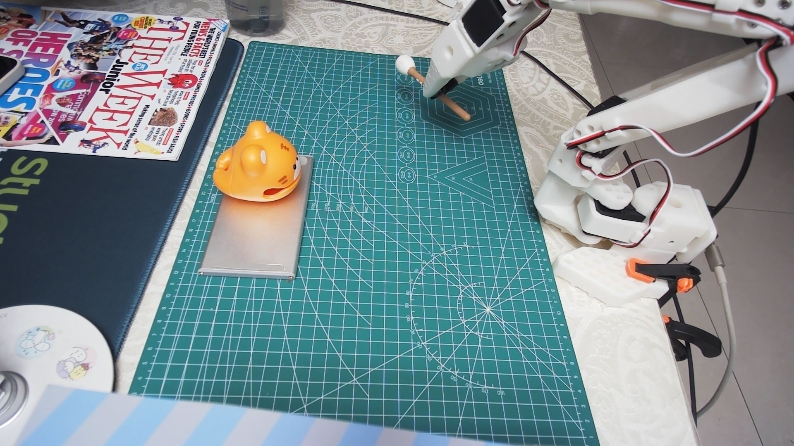
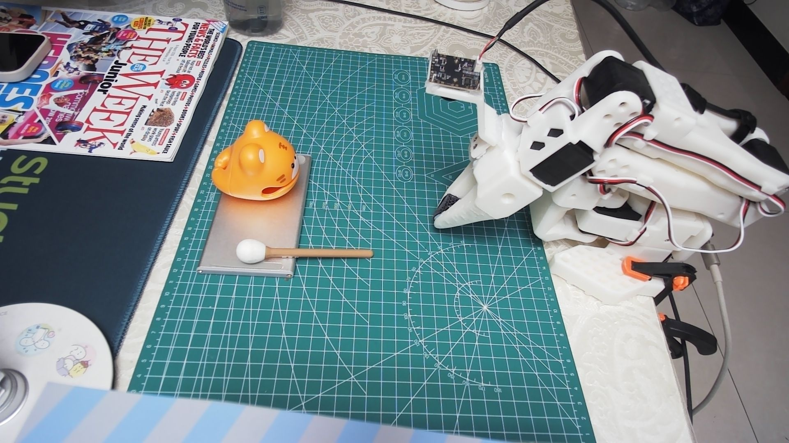
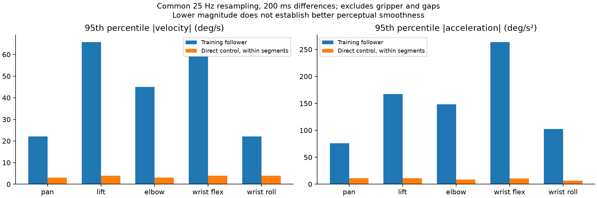
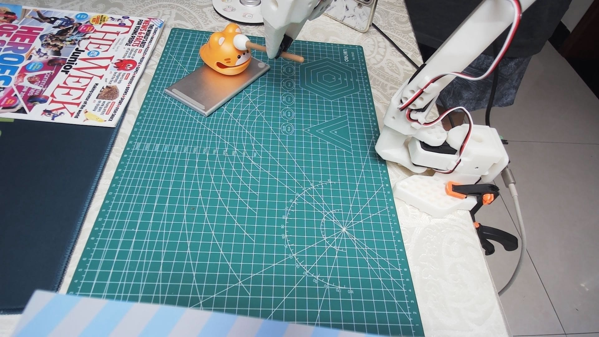
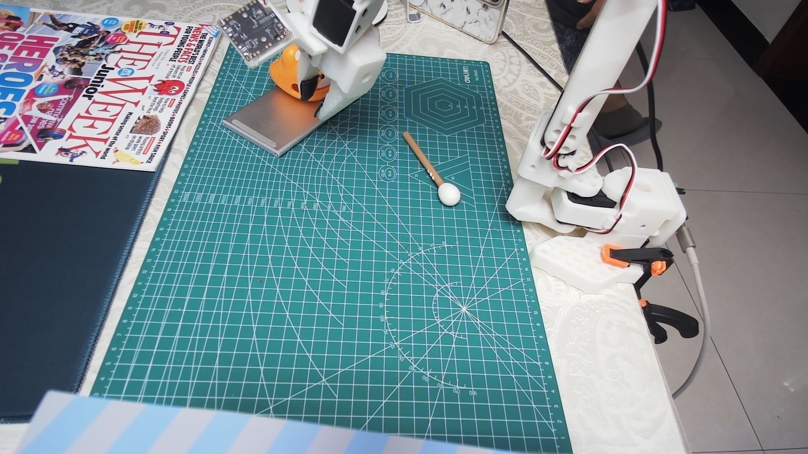
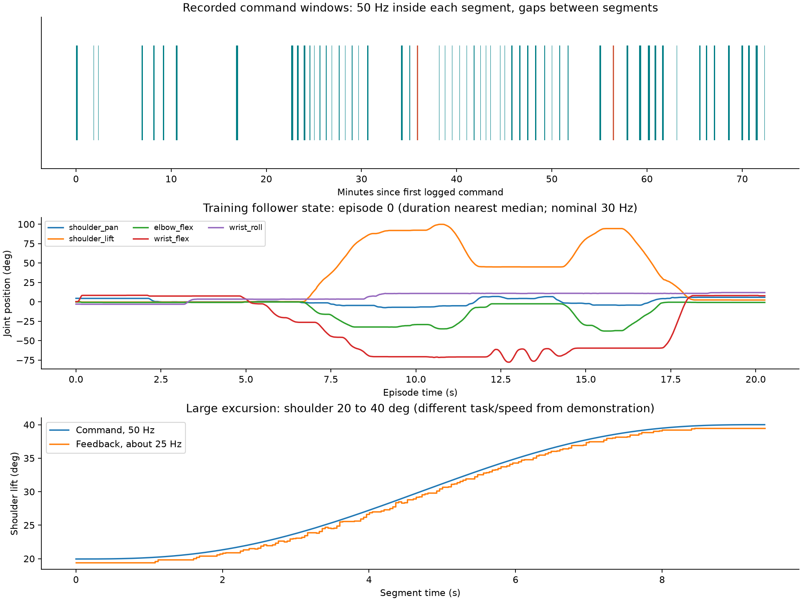

## 1. 实验目标与总体结果

本次实验要回答的是：**不运行已经训练好的机器人动作策略，让 GPT-6 Astra 在 Codex 中观察真实相机、理解用户要求、生成控制动作，能否直接驱动 SO-101 完成敲木鱼任务？**

目标流程为：检查机械臂和相机 → 寻找敲杆 → 夹住手柄中段 → 提起并搬运 → 用腕部敲木鱼三次 → 把敲杆放回银色盘面、与木鱼并列 → 回到零位。当天还穿插了图像新鲜度核查、归位、停止抖动、小幅和大幅往返等测试。

这里的“直接驱动”是 **Astra 做视觉判断和动作决策，Python / LeRobot 执行关节轨迹，舵机完成位置闭环**。没有运行 π0 等训练好的动作策略，也不是 Astra 逐条实时生成50 Hz舵机包。用户始终在现场观察，提供抓取位置、方向、高度、动作幅度和任务目标的纠正。因此本次是有人监督的通用模型工具控制实验，尚不是无人干预的自主技能验证。

| 实验目标 | 当天验证到的能力 | 仍未解决的部分 |
|---|---|---|
| 看场景并找目标 | 能结合侧面与腕部图像定位木鱼、敲杆和夹爪的相对位置 | 主要依赖看图估计，没有经过验证的三维位姿和稳定的坐标变换 |
| 抓取、提起、搬运 | 早期重启轮次和后期50 Hz轮次均有持杆、提起证据 | 多次空夹、滑脱、夹点偏移；抓取效率和重复性不足 |
| 执行敲击 | 从肩部参与动作逐步改成腕部摆动；后期记录三次腕部往返，有接触画面 | 出现未敲到、未对正；没有逐次声音或接触传感验证 |
| 按现场要求改变行为 | 能接受“夹中部”“幅度大些”“腕部扭转”“先回零”等自然语言纠正 | 语言要求能理解，不等于相应关节方向和末端位移算得准确 |
| 放回、回零 | 早期有部分杆身落在盘面上的证据；多次可执行回零 | 早期杆尾伸出盘外；后期放回落到垫面，重新拾取未完成 |
| 留存和分析 | 后期保存指令、位置、负载、温度、帧时间戳、独立命名的照片和视频 | 早期只有历史目标及图像，证据密度不一致 |

**整体结论：Astra已能通过工具把语言要求转成真实机械臂动作，并在反馈下完成若干关键环节；完整任务的重复成功、精确接触与顺畅执行尚未建立。** 不能把当天几轮尝试拼接成一次无干预、全部成功的演示，也不能只用最后一次放回失败否定已经实现的抓取、搬运和腕部控制。

本报告按实现、轮次、结果、训练数据比较和后续改进展开。50 Hz时序是执行层的一项测量，不是整篇实验的主题。报告整理期间没有重新驱动机械臂。

## 2. 实现：Astra 怎样把看图判断变成真实动作

### 2.1 从用户要求到电机的执行链路

```text
用户给出任务与现场纠正
        ↓
GPT-6 Astra / Codex
  读取双相机图像、上一段关节反馈与执行结果
  判断当前阶段、目标相对位置和下一组关节目标
        ↓ 工具调用 / SSH
DGX Spark 上的 Python 控制脚本
  读取校准与实测状态 → 检查目标 → 生成平滑轨迹
        ↓ LeRobot FeetechMotorsBus
串口位置指令 → SO-101 舵机内部位置控制 → 机械臂运动
        ↓
关节位置 / 负载 / 温度 + 新相机图像
        └──────── 返回 Astra，决定下一段动作
```

Astra承担任务分解、图像理解、相对位置估计、关节目标选择和异常后的重新判断；SSH只负责把命令和结果在Mac与工作站之间传递。工作站本地脚本负责时间敏感的轨迹插值、串口读写及保护。LeRobot提供校准、单位换算和总线接口，本次没有使用它的策略推理链路。

这一分工已经避免了每20 ms跨网络等待一次模型回答，但外层仍是“执行一段—停下来取图—看图—再决定”。段内有本地监测，**没有实现连续视觉伺服、在线目标跟踪或完整自动状态机**。运动过程的视频主要用于记录和回看，不能把它写成Astra实时处理每一帧。

### 2.2 观察与位姿估计怎样做

侧面相机提供机械臂、木鱼、盘面和敲杆的整体关系；腕部相机提供夹指附近的局部对准信息。每一步同时参考关节实测位置和新图像，再估计朝哪个方向移动、需要多大幅度、是否可以下降或闭合夹爪。

当天采用的是图像中的相对位置和经验性关节调整，并没有标定完成的相机外参、工具中心点或经过验证的逆运动学求解。用户提出“每一步估计位姿”后，实际增加的是逐段观察与纠偏，不能据此称为已有精确六维位姿估计器。

腕部旋转还会改变相机视角。画面里的左右、机械臂基座坐标和盘面左右没有统一映射，是“扭错边”“关节变化较大但目标没有靠近”的重要实现缺口。

### 2.3 动作如何表示与执行

每次上层提交部分关节目标，例如调整肩、肘或腕；其他关节沿用原目标。后期普通运动段采用五次插值，起止目标速度和加速度归零，工作站每20 ms下发一次全关节位置目标。普通段峰值关节速度约4°/s；腕部敲击使用单独的往返轨迹。

| 接口/关节 | 在任务中的作用 | 当天的重要经验 |
|---|---|---|
| shoulder_pan | 水平方向改变朝向 | 需要与肩肘位置一起解释，不能只依据腕部画面判断方向 |
| shoulder_lift + elbow_flex | 接近、抬升、搬运和回零 | 两者共同决定位置；各转一大段不等于末端就有大的有效位移 |
| wrist_flex | 改变俯仰、执行敲击 | 到达接触姿态后，尽量保持肩肘，用腕部完成短往返 |
| wrist_roll | 扭转敲杆和夹爪方向 | 与flex明确区分；需同时考虑视角随动 |
| gripper | 张开、夹持、释放 | 指令闭合不等于夹住；需要开度、负载和试抬图像联合判断 |

后期脚本限制单段目标相对实测变化不超过约25°/夹爪百分比单位，并检查各关节允许范围；位置跟踪误差超过12°、原始负载绝对值超过350或温度达到50°C时中止并尝试保持当前位置。这些是当时的脚本保护条件，不是完成了碰撞检测或经过认证的安全系统。

### 2.4 反馈与记录如何逐步补齐

最早的控制循环在通信操作后固定sleep 80 ms，后改为40 ms；后期换成基于单调时钟的20 ms deadline。位置约25 Hz、负载约24 Hz、温度约1 Hz轮询，避免每个tick都堆积多次读取。视频由独立线程约30 fps录制，动作后再采集两路静态图像。

用户提出保存控制信号和机械臂数据后，增加了逐次目标、实测位置、误差、负载、温度和时序日志。图像文件使用日期、时间、微秒及相机编号；视频另存帧时间戳。旧阶段的历史目标不能补出当时没有保存的逐帧轨迹。

## 3. 当天几轮尝试与现场修正

以下“轮次”按重启、测试和任务目的分组，不是事先设计好的独立重复试验。中间有人为反馈和场景变化，不能将它们直接当作成功率统计样本。

### 3.1 第一阶段：探索抓取，暴露视觉与动作映射问题

从设备、相机检查和场景描述开始，Astra尝试寻找敲杆、靠近手柄、下降并闭合夹爪。用户连续指出“夹的位置靠后”“现在太靠前”“离得远时步长可以大一些”，又允许左右、上下试探。这一阶段说明模型能够使用反馈继续探索，但没有把图像误差稳定转换成下一步末端位移。

两次抓取滑脱后曾提出垫高手柄，用户要求继续直接拾取；随后仍通过位置、角度和夹爪开度调整推进。旧图疑问促使每次截图独立命名。最后按用户要求放下、复位，等待明确的“开始”。这一阶段主要验证工具链和局部探索能力，未建立完整任务成功证据。

### 3.2 第二阶段：从零位重新执行，走到敲击与部分放回

20:15后重新开始接近；20:19附近完成闭合与提起，20:19:57照片可见敲杆被夹持。随后移动到木鱼附近。历史目标表明早期敲击调整包含肩部变化；用户要求改用腕部，后续出现肩肘保持、wrist_flex往返的动作。

放回位置经用户澄清为银色盘面的空白区域。20:29:39松爪和20:33:47回零后的照片显示：槌头和部分杆身位于盘面，杆尾伸出盘外。它比“未能搬运”前进了一步，但没有满足整根敲杆放好、与木鱼并列的严格目标；早期有效敲击次数也缺少连续证据。



图：20:19:57，敲杆处于夹持状态。这是当天早期轮次的抓取证据，不与后期轮次混用。



图：20:33:47，机械臂回零后，杆尾仍超出盘面。记录为部分放回，不记为完整放置成功。

### 3.3 第三阶段：根据现场体感，单独检查运动控制

用户观察到每次停顿末端抖动、归位不平滑，要求输出至少30 Hz，并保存控制与反馈。控制器因此迭代到50 Hz，并依次做零位保持、0→8→0°小幅往返和0→20→40→20→0°大幅往返。

这些测试的目的，是区分下发时序、跟踪误差和停止后的运动。它们验证了后期单段下发频率达标，但没有实现无停顿的完整任务轨迹，也没有在所有姿态下消除用户观察到的抖动。

### 3.4 第四阶段：再次抓取、腕部敲击、放回失败与恢复

20:53后再次执行任务，经历一次无效闭合和下降纠正后成功提起。接近木鱼后第一次浅敲被用户明确指出“没敲到，不够低”。降低姿态后，在21:19–21:21执行三次3秒腕部循环，保留了接触帧。

接着调整腕部扭转和放回方向；用户再次纠正“没对正”“扭转的那个电机”“对错边了”。21:27松爪后的图像显示敲杆落到绿色垫面。之后尝试重新拾取，旋转、平移和增大关节幅度均未形成成功抓取，还出现低位移动推动敲杆的情况。最后按用户指令结束拾取并回零。

这一轮较完整地覆盖了目标任务的各阶段，且有更密集的控制日志；结果是阶段性成功、放回失败，不能写作完成一次完整敲木鱼任务。

### 3.5 可核对的时间线


下表将“做过什么”和“验证到了什么”分开。早期无完整逐帧日志，不虚构精确的成功次数或运动频率。

| 阶段 / 时间 | 操作与现场反馈 | 结果与问题 |
|---|---|---|
| 早期定位、抓取 | 双视角寻找敲杆；用户先后指出夹得靠后、靠前、离目标远却幅度太小 | 夹取位置和深度估计不稳；出现滑脱，不能靠夹爪闭合就判定抓住 |
| 图像与记录纠正 | 用户质疑旧图，要求不同文件名；后续采用独立时间戳文件 | 可以追溯每次图像；历史上“显示类似画面”不足以证明相机缓存，仍需帧时间和内容核验 |
| 早期敲击和归位 | 用户要求腕部敲、指定银色台面空白区，反映停止时尾部抖动 | 肩部搬运与腕部敲击应分开；位置偏差及停止行为需要独立测试 |
| 控制迭代 | 旧脚本循环末尾 sleep 80 ms，后来 40 ms，再改成 20 ms deadline 调度 | 旧版理论上限分别低于 12.5 / 25 Hz，实际还要扣除通信时间；不能写成实测固定频率 |
| 20:36 零位保持 | 10 s 保持并记录指令、位置、负载、温度 | 实测约 50 Hz，建立新的日志基线 |
| 20:38 小幅往返 | 肩关节 0→8→0° | 下发 50.02 / 50.01 Hz；肩最大跟踪误差 1.34 / 1.14°；该姿态未重现明显停止振荡 |
| 20:43–20:46 大幅往返 | 肩 0→20→40→20→0°，肘、腕配合 | 每段约 9.4 s，中间停稳检查；肘最大误差约 3.26°，不是连续无停顿往返 |
| 20:53–21:05 再抓取 | 分段接近；一次闭合未有效夹住；再降低，夹手柄并试抬 | 后一次图像和夹爪反馈支持成功提起；过程耗时长、依赖反复修正 |
| 21:10–21:18 搬运、对准 | 调整肩、肘、腕接近木鱼；21:18 浅敲 | 用户指出“不够低”，本次浅敲不计入有效三次 |
| 21:19–21:21 腕部敲击 | 降低肩目标后，wrist_flex 做 -18→-5→-18°，每循环 3 s，共三段 | 肩肘目标保持，三次循环有日志；首段有可见接触帧；无音频，不能证明三声都清脆或每次接触质量相同 |
| 21:21–21:28 放回 | 转动 wrist_roll，调整敲杆方向，在盘边张开夹爪 | 最终照片显示敲杆在绿色垫面，放置失败；不能把“松开夹爪”当完成 |
| 21:31–21:44 重新拾取 | 多次旋转和平移、加大到约 20° 调整 | 未重新抓住，局部动作还推动了敲杆；关节大幅变化没有稳定转化为期望的末端位移 |
| 21:46–21:48 回零 | 按用户指令终止拾取，分段平滑回零 | 五个运动关节最终偏差均小于 0.7°；夹爪张开；结束后 3 s 采样未检测到位置变化 |

后期最后的零位照片里，敲杆已出现在盘面附近，但对应归位段没有夹持搬运证据；不把场景后续变化归功于机器人完成了放置。

## 4. 与训练示教比较：动作组织有何不同

这里比较的是今天Astra直接控制的实际轨迹，与训练集里人通过leader操作follower得到的示教轨迹，**不是Astra和π0推理结果的模型排名**。本次没有同条件运行π0。

| 比较维度 | 训练示教 | 今天的Astra直接控制 | 对平滑移动的启示 |
|---|---|---|---|
| 动作来源 | 人连续移动leader，产生一串相关联的目标 | Astra依据截图逐段选择关节终点 | 上层可以决定目标和阶段，连续轨迹应交给本地执行器 |
| 空间协调 | 人同时协调多个关节，使末端沿可行路线运动 | 主要依靠经验分别修改几个关节 | 应复用示教的协同关系，或用运动学规划末端路径 |
| 时间组织 | 接近、提起、搬运有连续过渡，抓取/敲击有必要停留 | 每个短运动段都重新起步和停下 | 平滑不等于永不停；应在接触检查点停，在空中搬运时连续通过路点 |
| 执行速度 | 示教中有明显较快的肩肘、腕部运动 | 普通段约4°/s的保守限速 | 要按阶段设计速度，并经受控测试提高，不能只增加更新频率 |
| 接触纠正 | 人可连续利用现场视觉和操作感觉调整 | 依靠截图、低频判断及用户补充反馈 | 抓取和敲击阶段需要本地、及时的成功/失败判断 |
| 场景适配 | 示教针对当时的敲杆、木鱼位置 | 当天位置、朝向、夹持和视角均有变化 | 示教适合作参考轨迹，不能不经定位就照搬绝对关节角 |

### 4.1 实际关节速度与阶段连续性


80条示教的单条轨迹时长范围为 **15.77–34.50 s**，中位数 **20.28 s**。这不是“80条全部任务成功”的证明，但足以显示记录中的动作周期与这次分段交互完全不同。

以下是实际状态在统一25 Hz网格上、200 ms差分所得的绝对速度P95。直接控制仅统计无异常且五个运动关节变化幅度超过0.5°的段，不把段外空档插值成运动。

| 关节 | 训练示教 P95（°/s） | 本次直接控制 P95（°/s） |
|---|---:|---:|
| shoulder_pan | 22.15 | 3.07 |
| shoulder_lift | 65.76 | 3.97 |
| elbow_flex | 45.01 | 3.07 |
| wrist_flex | 59.16 | 3.97 |
| wrist_roll | 22.15 | 3.95 |



示教肩部速度P95约为本次的16.6倍，腕部约14.9倍。人连续移动leader，多个关节随任务一起变化；本次则用保守速度反复重新定位。**训练动作更快、动作阶段更连贯，并不意味着它的绝对加速度更小。** 本次差分加速度P95反而更低，因此不能凭这个数值宣布本次更平滑。

另外，两组的单关节速度中位数都较低，因为许多阶段只有少数关节运动。五关节同时低于1°/s的窗口比例，在示教内约26.7%，在本次所选运动段内约29.0%。这说明示教也包含合理的停留，主要差异不能简化成“示教从不停”。本次最大的额外不连续发生在**运动段之外的长空档**。

本次未计算无滤波三阶差分来排名平滑度：它会强烈放大编码器量化和采样差异。若要给出可靠的平滑度改进百分比，需要同一路径、同样时长、同样负载的对照，以及统一滤波后的jerk、跟踪误差和末端视频测量。

## 5. 怎样让Astra直接驱动也能平滑移动

改进目标是保留Astra理解任务、处理现场纠正的能力，同时让机器人本地承担连续、可预测的运动执行。**需要一起解决路径正确、轨迹连续、速度合理和反馈及时四件事。** 仅把每段插值做平滑，无法弥补大量无效纠偏或段间等待。

### 5.1 将逐点指挥改成有条件的动作阶段

推荐的下一版结构如下；这些功能尚未在当天全部实现。

| 层次 | 应接收/输出什么 | 应负责什么 |
|---|---|---|
| Astra任务层 | 当前场景、阶段结果 → 抓取位置、放置区域、动作阶段或路径约束 | 理解目标、选择策略、处理失败；不承担每个tick的实时控制 |
| 本地视觉与状态层 | 带时间戳图像、关节反馈 → 目标位姿、夹持/接触状态、置信度 | 及时发现杆滑动、没夹住、目标偏移；观测失效时进入保持 |
| 本地轨迹层 | 末端路径或已验证的关节路点 → 带时间的连续关节轨迹 | 多关节同步、速度/加速度限制、路点平滑衔接、碰撞余量 |
| 固定周期执行层 | 轨迹 → 整数寄存器目标；反馈 → 误差和保护 | 保持稳定频率、检测队列耗尽、记录全部目标与实际反馈 |

例如“抓取”应包含预抓取位置、慢速下降、闭合、试抬和确认，而不是只有一个gripper目标；“敲三次”应包含接触姿态、腕部轨迹和逐次有效敲击计数。状态机只有确认阶段条件成立才前进，失败时抬升、重定位或退回检查点。

### 5.2 用训练数据提取动作规律，不盲目回放绝对角度

在不训练或运行新动作策略的前提下，也可以利用现有示教：先结合视频和follower state标记接近、闭合、提起、搬运、腕部敲击、放下和回位，再提取各阶段的持续时间、关节配合、停留点和路径形状。重点看实际follower状态，而不是把原leader action直接当机器人最终位姿。

空载验证可从一条已核验的示教路径开始：保留多关节之间的时间关系，先降低整体播放速度，确认单位、校准、起始姿态和空间余量，再与本次分段方案比较。用于真实抓取时，还必须根据当天目标位姿生成或修正路径；同一套绝对关节角不能保证覆盖变化后的桌面场景。

对轨迹做平滑时，保持抓取闭合、接触敲击和释放等事件的先后关系；不能把跨接触点的整段曲线一概低通滤波。移动段可拟合连续位置/速度/加速度的曲线并重新分配时间，敲击段保留需要的局部速度变化。这样学习的是示教的动作组织方式，而不仅是模仿“移动得快”。

### 5.3 按任务阶段安排速度、步长与停留

| 阶段 | 路径与速度原则 | 何时停下验证 |
|---|---|---|
| 远离物体的接近/搬运 | 使用较大、协调的末端位移和连续路点，逐级验证更高速度 | 进入目标附近或观测可信度降低时 |
| 手柄对准/下降 | 以标定后的毫米级误差驱动小修正；减少反复扭转和低位横扫 | 夹持前和试抬后 |
| 腕部敲击 | 肩肘保持在接触姿态，roll确定槌头方向，flex执行局部往返 | 逐次确认有效接触，避免把空敲计数 |
| 放置/释放 | 检查整根敲杆落点，低速下降到有支撑的位置 | 松爪后、撤离后分别确认稳定 |
| 回零 | 使用已验证的避障路径和连续轨迹衔接 | 最终检查反馈误差和停止运动 |

“距离远就增大幅度”应指有效末端位移，而不是同时把几个关节角改大；“慢一点”也不应变成对所有阶段统一使用极低速度。当前约4°/s的保守限速可作为已有基线，但训练速度P95不能直接当作下一轮的安全速度设置。

### 5.4 先验证平滑度，再评价任务成功率

下一轮先做同一路径、同样负载和总时长的A/B测试：A采用当前逐段起停，B采用本地连续轨迹。相机采集和日志异步运行；两者都记录浮点目标、真正写入的整数目标、反馈、队列状态和视频。这样才能区分路径衔接、时序和舵机跟踪各自的影响。

再逐级改变速度，比较跟踪误差、末端运动和停止后的反复过冲；不要把速度改变造成的加速度差误称为平滑度改进。高阶差分需统一滤波和采样口径，不直接对量化位置求三阶差分作排名。

接触任务则另做至少10次独立尝试，分别记录抓取、三次有效敲击、整杆放置和回零结果，以及人工纠正次数。建议下发间隔P99小于25 ms、无大于33.33 ms的间隔，非检查点不发生轨迹队列耗尽；这些是待验证目标，不是已经取得的性能。

## 6. 实验中的问题与已经积累的经验


| 问题 | 证据与影响 | 优先修正 |
|---|---|---|
| 位姿估计缺少校准 | 反复出现夹点靠前/靠后、下降不足、扭转方向误判；多个关节大幅变化却没有到目标 | 标定相机内外参、盘面坐标系和工具中心；用已知小位移建立图像误差到末端修正的关系 |
| 腕部视角在变化 | wrist_roll同时旋转夹爪和相机画面，“图中右侧”不固定等于机器人右侧 | 每帧带关节状态和坐标定义，统一转换到盘面或机器人坐标系 |
| 用关节增量代替末端路径 | 肩、肘、腕的变化会相互抵消或耦合；“加大20°”不保证更接近目标 | 用正运动学/雅可比或经过验证的局部映射，控制末端方向、距离和高度 |
| 抓取判据不足 | 空夹、滑脱，以及低位平移推动敲杆 | 手柄中段对准；闭合后检查开度与负载；小幅试抬并确认杆随夹爪一起运动 |
| 接触高度不可靠 | 用户指出浅敲未敲到 | 先估计槌头相对木鱼的接触高度，再以腕部小幅探索；每次敲击结合图像、力/负载或声音计数 |
| wrist_flex / roll角色混淆 | 用户多次纠正“扭转的那个电机” | flex承担敲击，roll承担敲杆方向；使用带方向标注的关节示意与小幅校验 |
| 放置目标只看夹爪位置 | 盘边松爪后杆落到垫面 | 检查整根杆的投影和支撑范围；降低到稳定支撑后再松爪、撤离并复查 |
| 温度保护与恢复 | 记录到58/51°C等异常读数，随后只读复查较低 | 保留中止；核查读取可靠性和持续温升，不因怀疑瞬态异常就提高阈值；恢复时重新核实夹持状态 |
| 图像新鲜度与追溯 | 历史上文件名和相近缩略图引发疑问 | 唯一run/frame ID、采集完成时间、图像哈希、相机编号、对应关节状态一起存档；唯一文件名本身不能证明曝光新鲜 |

## 7. 本次实验给出的能力边界

Astra可以在没有专门动作策略的条件下，理解“拿杆敲三下再放回”的任务，调用真实硬件接口，并根据图像和人的语言修正继续执行。当天的持杆、搬运、腕部动作、部分放回和回零证明了这条实现链路具备实际操作能力。

但完成稳定任务还需要比语言推理更细的空间与时间闭环：明确的坐标、可行的末端路径、连续执行器和接触判断。今天最有效的经验是把宏观决策与实时执行分开，并把用户多次提供的技巧变成可复用的检查条件。最需要避免的是依靠更多小步试探掩盖位姿映射缺失，或者用“命令执行成功”代替真实任务验收。

训练示教提供了有价值的动作参考：连续的多关节协调、适当的移动速度，以及明确的抓取和敲击停留。下一版应把这些规律落实到本地轨迹与动作阶段，Astra负责选目标、适配场景和处理异常；平滑移动与可靠完成任务才能一起改善。

## 8. 数据与复核附录

### 8.1 数据范围与比较口径


| 项目 | 本次记录 |
|---|---|
| 硬件与控制 | SO-101 follower；LeRobot / Feetech 总线；5 个运动关节使用角度，夹爪使用 0–100 量纲 |
| 视觉 | 腕部和侧面双相机，1920×1080；每次动作后生成带日期、时间、微秒的独立图片文件 |
| 实验日志 | 158条历史目标/结束状态记录；后期另有69份逐采样control JSONL，60段含控制下发，其中57段无记录到的控制异常、3段温度保护中止 |
| 日志覆盖 | 2026-09-17 20:36 至 21:48，工作站 CST（UTC+8）；更早过程只有历史目标、图像及会话反馈，不能补算早期逐帧频率 |
| 训练对照 | `qiaomuyu_search_dual_v1_80_fixed` 和 `qiaomuyu_search_dual_v1_80_follower_future4`；80 个 episode，50,596 帧，标称 30 fps |
| 数值比较 | 使用 follower 的 `observation.state`；五个运动关节分别比较；排除夹爪，不混合单位 |
| 时间处理 | 每个 episode / 运动段内部重采样到 25 Hz，用 200 ms 窗口差分；不跨 episode 或段间空档求导 |

训练时间戳主要反映数据集采样时间轴，不能替代当时的串口下发时间戳。本次控制日志使用单调时钟，可以检查真实写入间隔。两组数据的场景、速度、负载和路径不同，属于**描述性比较，不是控制变量实验**。

训练的 original action 与 follower state 也不能混作同一轨迹。例如原数据腕部 action/state 绝对差的 P95 约 65.89°；它说明指令与实际状态不一致，但不能只凭此认定某种标注错误或直接换算成控制延迟。本报告的运动比较始终使用 follower state。

对 future4 的全量重验结果：两份数据的 state 完全相同，且 `action[t] = state[min(t+4, episode_end)]` 的最大绝对误差为 0。future4 是未来约 133 ms 的状态重标注，**并没有把示教视频或原始实际运动重新平滑一遍**。

### 8.2 视频与接触证据


**训练示教：episode 0，20.3 s。** 这条在时长上接近 80 条的中位数，方便观察完整示教动作；不是挑选最高成功率或最平滑样本。视频为原数据重编码，非本次自主操作。

<video controls playsinline preload="metadata" style="width:100%;border-radius:12px" aria-label="训练示教 episode 0"><source src="assets/direct-control-20260917/20260917-training-episode-000.mp4" type="video/mp4"></video>

**本次大幅测试中的一段：肩目标 20→40°。** 保留段内原播放节奏，含约 3 s 停稳观察；未拼接相邻段，故视频本身看不到段与段间的几十秒等待。

<video controls playsinline preload="metadata" style="width:100%;border-radius:12px" aria-label="50 Hz 大幅运动测试"><source src="assets/direct-control-20260917/20260917-large-motion-204418.mp4" type="video/mp4"></video>

**降低后的首次腕部敲击。** 画面裁到实验区域；完整视频、帧时间戳和原始照片仍保留在实验档案。

<video controls playsinline preload="metadata" style="width:100%;border-radius:12px" aria-label="降低后的腕部敲击"><source src="assets/direct-control-20260917/20260917-wrist-tap-211942.mp4" type="video/mp4"></video>

侧面视频按 30 fps 写入；两段片长分别约 12.47 / 6.10 s，帧日志首尾跨度约 12.47 / 6.08 s，未人为加速。帧时间是软件读帧完成附近的时间，不是硬件曝光时间。



图：21:19:42 这段视频第 59 帧可见槌头与木鱼接触；不能用单帧验证全部三次声音。



图：21:27:52 松爪后，敲杆出现在垫面。放置失败是本轮必须保留的结果。


### 8.3 下发时序与段间空档

57 段无异常下发的实测频率范围为 **49.996–50.022 Hz**，最大下发间隔 **21.68 ms**，没有超过 33.33 ms 的间隔。这里“无异常”仅指控制脚本完成，不代表抓取、敲击、放置成功。

但60段有下发记录的整个覆盖区间约 **72.38 min**，段内下发时间合计只有 **404.15 s（6.74 min）**，占约 **9.31%**。段间空档中位数 **42.08 s**，P95 **210.72 s**。这个区间包括保持测试、人工反馈、只读检查和任务中断，9.31%不是纯任务效率，更不是舵机通电率。

空档期间舵机仍可保持最后目标，不能写成“完全没有控制”。但是连续的新轨迹确实没有在流动。拍照、重新打开相机、SSH 传视频、查看图片、推理与用户交互，都发生在运动段之间。



图上：绿色条为有指令下发的窗口，红色为发生保护异常的窗口，空白为段间空档。图中：示教 episode 0 的实际关节轨迹。图下：本次肩关节 20→40° 的目标与反馈。三个横轴范围不同，不能按图宽比较运动速度。

### 8.4 低速轨迹与位置量化

普通段使用五次插值 `s(u)=10u³−15u⁴+6u⁵`，时长按 `max(3 s, 最大关节差×1.875/4)` 计算。它能让单段两端的目标速度和加速度归零，但也让每次修正都经历一次“起步—刹停”。

按当前 LeRobot 的整数位置换算，一个位置刻度约为 `360/4095 = 0.0879°`；4°/s 在50 Hz时，每次最大变化约 `4/50 = 0.08°`。即使浮点目标每20 ms都变化，转换到整数寄存器后也不保证每次写入都有新位置；起步、收尾时重复值更多。

这为细小阶梯和迟滞提供了直接机制，但它**不等于已经证明每一次肉眼抖动都来自量化**。静摩擦、回差、负载、舵机内部速度限制、反馈采样精度仍可能参与。单纯再把频率提高到100 Hz，会使同样速度下的单次增量更小，不能单独解决该问题。

腕部敲击另有3 s往返轨迹，并非普通段4°/s限速；不能将普通段公式套到全部敲击动作。

### 8.5 跟踪偏差与目标接续

小幅测试肩关节误差达到约1°；大幅测试肘部达到约3.26°。相同目标从不同方向接近时，末端偏差并不相同，提示方向相关误差，尚不能单独确诊为齿隙。

早期控制从当前实测位置重新生成全关节轨迹时，会使本应保持的关节目标随测量误差变化。后续改成从上次目标接续，减少了这一类目标跳变；代价是如果实测状态已经落后于目标，起始跟踪误差仍然存在。合理做法是连续轨迹状态与实测反馈共同管理，而不是在两种起点之间随意切换。

脚本只在检测到所有关节未使能时写入 `Goal_Velocity=80`，已经使能时不重新设置。因此从脚本快照不能断言所有段的底层速度参数都被重新核验。下一轮应把实际寄存器值纳入每次运行元数据。

### 8.6 停稳采样的解释边界

小幅往返结束后采样位置极差为0–0.088°，大幅往返报告的最大极差约0.264°；这支持那些姿态下停稳较好，不能推翻用户在其他动作中观察到的抖动。25 Hz左右位置反馈和30 fps视频也无法排除更高频或亚像素振动。

敲击后腕部的3 s采样范围约4°，其中包含回程尚未完全跟上的运动，不能把整个范围都叫“振荡幅度”。需要对齐目标、反馈和末端视频，看是否有反复过冲再作判断。

### 8.7 工件、复现与限制


- [本页统计JSON](assets/direct-control-20260917/20260917-analysis-summary.json)
- [逐段统计、哈希清单、历史目标与控制器快照](https://github.com/oopslink/so-arm101/tree/main/reports/direct-control-20260917)
- [离线分析脚本](https://github.com/oopslink/so-arm101/blob/main/scripts/analyze_direct_control_20260917.py)
- [训练数据只读导出脚本](https://github.com/oopslink/so-arm101/blob/main/scripts/export_direct_control_training_20260917.py)
- [此前的训练与部署实验记录](02-experiment-log.html)

原始控制日志、照片、视频、帧时间戳和训练数据数值副本保存在本地实验档案，网页只发布报告所需的统计与精选证据，不把全部大体积视频或整个训练集放入Git。历史控制器以 `.py.txt` 留存作为审计快照，不是通用安全控制程序。

离线分析示例（不连接机械臂）：

```bash
uv run --with numpy --with matplotlib python scripts/analyze_direct_control_20260917.py \
  --logs /path/to/robot-logs/20260917-203612 \
  --training /path/to/training-comparison-20260917.npz \
  --out reports/direct-control-20260917 \
  --assets docs/assets/direct-control-20260917
```

本报告没有同场景的旧控制器对照，没有实时三维位姿真值，没有高频振动传感器，也没有敲击音频。因此可以明确指出长空档、保守速度、整数位置量化、跟踪误差和放置失败；不能声称抖动已全部定位或消除，也不能给出可靠的整体任务成功率。
